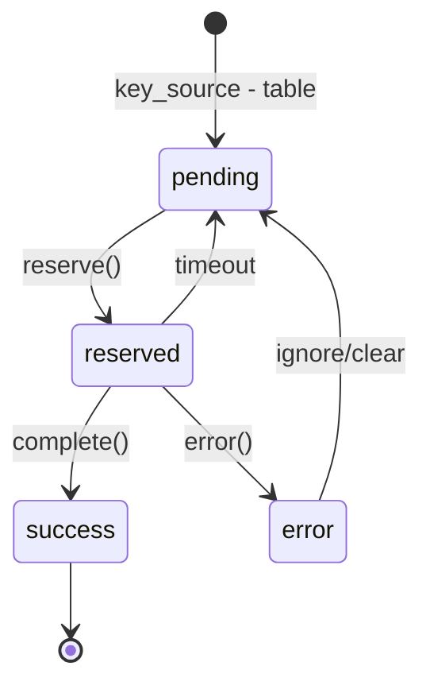

# Computation Model

DataJoint's computation model enables automated, reproducible data processing
through the `populate()` mechanism and Jobs 2.0 system.

## AutoPopulate: The Core Concept

Tables that inherit from `dj.Imported` or `dj.Computed` can automatically
populate themselves based on upstream data.

```python
@schema
class Segmentation(dj.Computed):
    definition = """
    -> Scan
    ---
    num_cells : int64
    cell_masks : <blob@>
    """

    def make(self, key):
        # key contains primary key of one Scan
        scan_data = (Scan & key).fetch1('image_data')

        # Your computation
        masks, num_cells = segment_cells(scan_data)

        # Insert result
        self.insert1({
            **key,
            'num_cells': num_cells,
            'cell_masks': masks
        })
```

## The `make()` Contract

The `make(self, key)` method:

1. **Receives** the primary key of one upstream entity
2. **Computes** results for that entity
3. **Inserts** results into the table

DataJoint guarantees:

- `make()` is called once per upstream entity
- Failed computations can be retried
- Parallel execution is safe

## Key Source

The **key source** determines what needs to be computed:

```python
# Default: all upstream keys not yet in this table
key_source = Scan - Segmentation

# Custom key source
@property
def key_source(self):
    return (Scan & 'quality > 0.8') - self
```

## Calling `populate()`

```python
# Populate all missing entries
Segmentation.populate()

# Populate specific subset
Segmentation.populate(restriction)

# Limit number of jobs
Segmentation.populate(limit=100)

# Show progress
Segmentation.populate(display_progress=True)

# Suppress errors, continue processing
Segmentation.populate(suppress_errors=True)
```

## Jobs 2.0: Distributed Computing

For parallel and distributed execution, Jobs 2.0 provides:

### Job States



### Job Table

Each auto-populated table has an associated jobs table:

```python
# View job status
Segmentation.jobs()

# View errors
Segmentation.jobs & "status = 'error'"

# Clear errors to retry
(Segmentation.jobs & "status = 'error'").delete()
```

### Parallel Execution

```python
# Multiple workers can run simultaneously
# Each reserves different keys

# Worker 1
Segmentation.populate(reserve_jobs=True)

# Worker 2 (different process/machine)
Segmentation.populate(reserve_jobs=True)
```

Jobs are reserved atomically—no two workers process the same key.

### Error Handling

```python
# Populate with error suppression
Segmentation.populate(suppress_errors=True)

# Check what failed
errors = (Segmentation.jobs & "status = 'error'").to_dicts()

# Clear specific error to retry
(Segmentation.jobs & error_key).delete()

# Clear all errors
(Segmentation.jobs & "status = 'error'").delete()
```

## Imported vs. Computed

| Aspect | `dj.Imported` | `dj.Computed` |
|--------|---------------|---------------|
| Data source | External (files, APIs) | Other tables |
| Typical use | Load raw data | Derive results |
| Diagram color | Blue | Red |

Both use the same `make()` mechanism.

## Workflow Integrity

The computation model maintains **workflow integrity**:

1. **Dependency order** — Upstream tables populate before downstream
2. **Cascade deletes** — Deleting upstream deletes downstream
3. **Recomputation** — Delete and re-populate to update results

```python
# Correct an upstream error
(Scan & problem_key).delete()  # Cascades to Segmentation

# Reinsert corrected data
Scan.insert1(corrected_data)

# Recompute
Segmentation.populate()
```

## Job Metadata (Optional)

Track computation metadata with hidden columns:

```python
dj.config['jobs.add_job_metadata'] = True
```

This adds to computed tables:

- `_job_start_time` — When computation started
- `_job_duration` — How long it took
- `_job_version` — Code version (if configured)

## The Three-Part Make Model

For long-running computations (hours or days), holding a database transaction
open for the entire duration causes problems:

- Database locks block other operations
- Transaction timeouts may occur
- Resources are held unnecessarily

The **three-part make pattern** solves this by separating the computation from
the transaction:

```python
@schema
class SignalAverage(dj.Computed):
    definition = """
    -> RawSignal
    ---
    avg_signal : float64
    """

    def make_fetch(self, key, **kwargs):
        """Step 1: Fetch input data (outside transaction).

        kwargs are passed from populate(make_kwargs={...}).
        """
        raw_signal = (RawSignal & key).fetch1("signal")
        return (raw_signal,)

    def make_compute(self, key, fetched):
        """Step 2: Perform computation (outside transaction)"""
        (raw_signal,) = fetched
        avg = raw_signal.mean()
        return (avg,)

    def make_insert(self, key, fetched, computed):
        """Step 3: Insert results (inside brief transaction)"""
        (avg,) = computed
        self.insert1({**key, "avg_signal": avg})
```

### How It Works

DataJoint executes the three parts with verification:

```
fetched = make_fetch(key)              # Outside transaction
computed = make_compute(key, fetched)  # Outside transaction

<begin transaction>
fetched_again = make_fetch(key)        # Re-fetch to verify
if fetched != fetched_again:
    <rollback>                         # Inputs changed—abort
else:
    make_insert(key, fetched, computed)
    <commit>
```

The key insight: **the computation runs outside any transaction**, but
referential integrity is preserved by re-fetching and verifying inputs before
insertion. If upstream data changed during computation, the job is cancelled
rather than inserting inconsistent results.

### Benefits

| Aspect | Standard `make()` | Three-Part Pattern |
|--------|-------------------|--------------------|
| Transaction duration | Entire computation | Only final insert |
| Database locks | Held throughout | Minimal |
| Suitable for | Short computations | Hours/days |
| Integrity guarantee | Transaction | Re-fetch verification |

### When to Use Each Pattern

| Computation Time | Pattern | Rationale |
|------------------|---------|-----------|
| Seconds to minutes | Standard `make()` | Simple, transaction overhead acceptable |
| Minutes to hours | Three-part | Avoid long transactions |
| Hours to days | Three-part | Essential for stability |

The three-part pattern trades off fetching data twice for dramatically reduced
transaction duration. Use it when computation time significantly exceeds fetch
time.

## Best Practices

### 1. Keep `make()` Focused

```python
def make(self, key):
    # Good: One clear computation
    data = (UpstreamTable & key).fetch1('data')
    result = process(data)
    self.insert1({**key, 'result': result})
```

### 2. Handle Large Data Efficiently

```python
def make(self, key):
    # Stream large data instead of loading all at once
    for row in (LargeTable & key):
        process_chunk(row['data'])
```

### 3. Use Transactions for Multi-Row Inserts

```python
def make(self, key):
    results = compute_multiple_results(key)

    # All-or-nothing insertion
    with dj.conn().transaction:
        self.insert(results)
```

### 4. Test with Single Keys First

```python
# Test make() on one key
key = (Scan - Segmentation).fetch1('KEY')
Segmentation().make(key)

# Then populate all
Segmentation.populate()
```

## Summary

1. **`make(key)`** — Computes one entity at a time
2. **`populate()`** — Executes `make()` for all missing entities
3. **Jobs 2.0** — Enables parallel, distributed execution
4. **Three-part make** — For long computations without long transactions
5. **Cascade deletes** — Maintain workflow integrity
6. **Error handling** — Robust retry mechanisms
