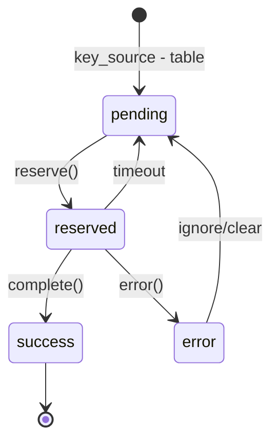

# Computation Model

DataJoint's computation model enables automated, reproducible data processing
through the `populate()` mechanism and Jobs 2.0 system.

## AutoPopulate: The Core Concept

Tables that inherit from `dj.Imported` or `dj.Computed` can automatically
populate themselves based on upstream data.

```python
@schema
class Segmentation(dj.Computed):
    definition = """
    -> Scan
    ---
    num_cells : int64
    cell_masks : <blob@>
    """

    def make(self, key):
        # key contains primary key of one Scan
        scan_data = (Scan & key).fetch1('image_data')

        # Your computation
        masks, num_cells = segment_cells(scan_data)

        # Insert result
        self.insert1({
            **key,
            'num_cells': num_cells,
            'cell_masks': masks
        })
```

## The `make()` Contract

The `make(self, key)` method:

1. **Receives** the primary key of one upstream entity
2. **Computes** results for that entity
3. **Inserts** results into the table

Those three steps are the basic mechanics. Beyond them, a well-behaved `make()`
observes the full **make() reproducibility contract** — five rules that keep every
result reproducible and `populate()` safely parallel:

1. **Populate-only** — rows are produced only by `make()` through `populate()`, never inserted directly.
2. **One entity per call, in isolation** — a `make(key)` computes exactly the entity named by `key` (plus its Part rows) and shares no state across calls.
3. **Read only the upstream cone** — fetch only declared ancestors, restricted to the current `key` (exposed as `self.upstream`).
4. **Write only to `self` and its Parts** — atomically, as one unit; any fan-out write elsewhere must record the source identity.
5. **No other result-affecting input** — anything that changes *what* is computed must enter through a declared upstream table.

The full contract — with rationale and the enforcement model — is specified in the
[AutoPopulate reference §4.3, "The make() reproducibility contract"](../reference/specs/autopopulate.md#43-the-make-reproducibility-contract).

DataJoint guarantees:

- `make()` is called once per upstream entity
- Failed computations can be retried
- Parallel execution is safe

### Why the contract matters

These guarantees hold because a well-behaved `make()` observes a small set of
rules — the **make() reproducibility contract** listed above.
The organizing idea is a single **read/write boundary**: a `make(key)` reads only
from its declared upstream dependencies, restricted to the current `key`, and
writes only to `self` and its Part tables. Because each call sees a fixed,
key-restricted slice of the pipeline and shares no state with other calls, every
computed row is *self-contained* — produced by one `make()` over a specific set
of declared inputs — which is exactly what makes results reproducible and
`populate()` safe to run in parallel.

This boundary is why the auto-populated tiers split into two:

- **Computed** tables derive entirely from other pipeline tables. Every input is
  itself tracked under referential integrity, so a Computed result is
  reproducible from within the pipeline alone — re-running `make()` on the same
  upstream data yields the same result.
- **Imported** tables read a source the pipeline does *not* track (a file, an
  instrument, an API). They cannot be reproduced from the pipeline alone, so an
  Imported `make()` is responsible for recording the source's identity (path,
  checksum, endpoint, external record ID) alongside the row.

**Manual** and **Lookup** tables are not auto-populated; they are the entry points
where a pipeline's data originates and where every downstream `make()` chain
ultimately begins.

## Key Source

The **key source** determines what needs to be computed:

```python
# Default: all upstream keys not yet in this table
key_source = Scan - Segmentation

# Custom key source
@property
def key_source(self):
    return (Scan & 'quality > 0.8') - self
```

## Calling `populate()`

```python
# Populate all missing entries
Segmentation.populate()

# Populate specific subset
Segmentation.populate(restriction)

# Limit number of jobs
Segmentation.populate(limit=100)

# Show progress
Segmentation.populate(display_progress=True)

# Suppress errors, continue processing
Segmentation.populate(suppress_errors=True)
```

## Jobs 2.0: Distributed Computing

For parallel and distributed execution, Jobs 2.0 provides:

### Job States


```mermaid
stateDiagram-v2
    [*] --> pending : key_source - table
    pending --> reserved : reserve()
    reserved --> success : complete()
    reserved --> error : error()
    reserved --> pending : timeout
    success --> [*]
    error --> pending : ignore/clear
```

### Job Table

Each auto-populated table has an associated jobs table:

```python
# View job status
Segmentation.jobs()

# View errors
Segmentation.jobs & "status = 'error'"

# Clear errors to retry
(Segmentation.jobs & "status = 'error'").delete()
```

### Parallel Execution

```python
# Multiple workers can run simultaneously
# Each reserves different keys

# Worker 1
Segmentation.populate(reserve_jobs=True)

# Worker 2 (different process/machine)
Segmentation.populate(reserve_jobs=True)
```

Jobs are reserved atomically—no two workers process the same key.

### Error Handling

```python
# Populate with error suppression
Segmentation.populate(suppress_errors=True)

# Check what failed
errors = (Segmentation.jobs & "status = 'error'").to_dicts()

# Clear specific error to retry
(Segmentation.jobs & error_key).delete()

# Clear all errors
(Segmentation.jobs & "status = 'error'").delete()
```

## Imported vs. Computed

| Aspect | `dj.Imported` | `dj.Computed` |
|--------|---------------|---------------|
| Data source | External (files, APIs) | Other tables |
| Typical use | Load raw data | Derive results |
| Diagram color | Blue | Red |

Both use the same `make()` mechanism.

## Workflow Integrity

The computation model maintains **workflow integrity**:

1. **Dependency order** — Upstream tables populate before downstream
2. **Cascade deletes** — Deleting upstream deletes downstream
3. **Recomputation** — Delete and re-populate to update results

```python
# Correct an upstream error
(Scan & problem_key).delete()  # Cascades to Segmentation

# Reinsert corrected data
Scan.insert1(corrected_data)

# Recompute
Segmentation.populate()
```

## Job Metadata (Optional)

Track computation metadata with hidden columns:

```python
dj.config['jobs.add_job_metadata'] = True
```

This adds to computed tables:

- `_job_start_time` — When computation started
- `_job_duration` — How long it took
- `_job_version` — Code version (if configured)

## The Three-Part Make Model

For long-running computations (hours or days), holding a database transaction
open for the entire duration causes problems:

- Database locks block other operations
- Transaction timeouts may occur
- Resources are held unnecessarily

The **three-part make pattern** solves this by separating the computation from
the transaction:

```python
@schema
class SignalAverage(dj.Computed):
    definition = """
    -> RawSignal
    ---
    avg_signal : float64
    """

    def make_fetch(self, key, **kwargs):
        """Step 1: Fetch input data (outside transaction).

        kwargs are passed from populate(make_kwargs={...}).
        """
        raw_signal = (RawSignal & key).fetch1("signal")
        return (raw_signal,)

    def make_compute(self, key, fetched):
        """Step 2: Perform computation (outside transaction)"""
        (raw_signal,) = fetched
        avg = raw_signal.mean()
        return (avg,)

    def make_insert(self, key, fetched, computed):
        """Step 3: Insert results (inside brief transaction)"""
        (avg,) = computed
        self.insert1({**key, "avg_signal": avg})
```

### How It Works

DataJoint executes the three parts with verification:

```
fetched = make_fetch(key)              # Outside transaction
computed = make_compute(key, fetched)  # Outside transaction

<begin transaction>
fetched_again = make_fetch(key)        # Re-fetch to verify
if fetched != fetched_again:
    <rollback>                         # Inputs changed—abort
else:
    make_insert(key, fetched, computed)
    <commit>
```

The key insight: **the computation runs outside any transaction**, but
referential integrity is preserved by re-fetching and verifying inputs before
insertion. If upstream data changed during computation, the job is cancelled
rather than inserting inconsistent results.

### Phase responsibilities

**The simple rule to follow: `make_fetch` only fetches, `make_compute` only
computes, and `make_insert` only inserts.** Keep each phase to its named job and
your table is always within the contract — no further reasoning needed.

These are part of the make() reproducibility contract: the framework does **not**
enforce them at runtime — they are rules the pipeline author must follow, and
against which a pipeline should be validated (at review or deploy time). The
precise requirements are narrower than the one-job-per-phase rule above, which
matters when a computation doesn't fit the clean split:

- **`make_fetch(key)` must not insert.** It fetches the entity's inputs — and may
  do some computation — then returns them. It runs *outside* the transaction and
  is re-run *inside* it to confirm the inputs have not changed, so it must be free
  of write side effects.
- **`make_compute(key, fetched)` must neither fetch nor insert.** It also runs
  outside the transaction, so it must be a pure function of the values
  `make_fetch` returned — reproducible from its arguments alone, with no database
  access at all.
- **`make_insert(key, fetched, computed)` inserts the result** into `self` and its
  Part tables. It *always* runs inside the transaction, so it may additionally
  fetch data or compute there — those reads and the write are covered by the same
  transaction, so this does not break the model.

So the two requirements the contract places on the split are **(a) `make_fetch`
must not insert** and **(b) `make_compute` must neither fetch nor insert**
(because it runs outside the transaction) — again, observed by the author and
checked by validation, not by the runtime. The make() reproducibility contract
still holds overall — reads come from the upstream cone and writes go only to
`self` and its Parts. And
because `make_fetch` performs no writes and `make_compute` touches no database,
both can be called and tested **directly and safely** (see
[Best Practices](#best-practices)).

### Benefits

| Aspect | Standard `make()` | Three-Part Pattern |
|--------|-------------------|--------------------|
| Transaction duration | Entire computation | Only final insert |
| Database locks | Held throughout | Minimal |
| Suitable for | Short computations | Hours/days |
| Integrity guarantee | Transaction | Re-fetch verification |

### When to Use Each Pattern

| Computation Time | Pattern | Rationale |
|------------------|---------|-----------|
| Seconds to minutes | Standard `make()` | Simple, transaction overhead acceptable |
| Minutes to hours | Three-part | Avoid long transactions |
| Hours to days | Three-part | Essential for stability |

The three-part pattern trades off fetching data twice for dramatically reduced
transaction duration. Use it when computation time significantly exceeds fetch
time.

## Best Practices

### 1. Keep `make()` Focused

```python
def make(self, key):
    # Good: One clear computation
    data = (UpstreamTable & key).fetch1('data')
    result = process(data)
    self.insert1({**key, 'result': result})
```

### 2. Handle Large Data Efficiently

```python
def make(self, key):
    # Stream large data instead of loading all at once
    for row in (LargeTable & key):
        process_chunk(row['data'])
```

### 3. Don't Open a Transaction Inside `make()`

`make()` already runs inside a transaction: `populate()` opens one per key before
calling `make()` and commits it only if `make()` returns without error. Everything
a `make()` inserts — multiple rows, and inserts into Part tables — is therefore
already atomic. It all commits together, or rolls back together if `make()` raises.
No explicit transaction is needed:

```python
def make(self, key):
    results = compute_multiple_results(key)
    # Already atomic — make() runs inside a transaction managed by populate()
    self.insert(results)
```

Do **not** open your own transaction inside `make()`. DataJoint does not support
nested transactions, so starting one while `make()`'s transaction is already active
raises an error:

```python
def make(self, key):
    # WRONG — a transaction is already in progress, so this raises an error
    with dj.conn().transaction:
        self.insert(compute_multiple_results(key))
```

### 4. Test on One Entity with `populate()`, Not `make()` Directly

To try a computation on a single entity, restrict `populate()` and cap the call
count. This runs the entity through the real machinery — the per-key transaction,
error handling, and (if enabled) job reservation:

```python
# Compute just one pending entity, end-to-end
key = (Scan - Segmentation).fetch1('KEY')
Segmentation.populate(key, max_calls=1, display_progress=True)
```

Do **not** call `make()` directly (e.g. `Segmentation().make(key)`) to test. It
bypasses `populate()`: it runs **outside** the per-key transaction, so a partial
or failed `make()` is not rolled back and can leave the table inconsistent; it
also skips job reservation and error capture, and writes to the database as an
uncontrolled side effect rather than as a managed, atomic unit.

If your table uses the [three-part make](#the-three-part-make-model), you *can*
test the fetch and compute steps directly and safely: `make_fetch(key)` performs
no inserts and `make_compute(key, fetched)` is pure, so neither writes to the
database. Reserve `populate()` for exercising the insert step (`make_insert`):

```python
# Safe: neither call writes to the database
fetched = MyTable().make_fetch(key)
computed = MyTable().make_compute(key, fetched)
# Then exercise the full path (including make_insert) through populate()
MyTable.populate(key, max_calls=1)
```

!!! note "Future: a no-insert debug mode"
    Calling `make()` directly could become a safe way to dry-run a computation
    once DataJoint adds a dedicated test/debug mode that runs `make()` without
    inserting. That is a planned future capability, not current behavior — today,
    a direct `make()` call really does write to the database.

## Summary

1. **`make(key)`** — Computes one entity at a time
2. **`populate()`** — Executes `make()` for all missing entities
3. **Jobs 2.0** — Enables parallel, distributed execution
4. **Three-part make** — For long computations without long transactions
5. **Cascade deletes** — Maintain workflow integrity
6. **Error handling** — Robust retry mechanisms

## See also

**Specifications**

- [AutoPopulate](../reference/specs/autopopulate.md) — normative spec for `key_source`, the [make() reproducibility contract](../reference/specs/autopopulate.md#43-the-make-reproducibility-contract), the tripartite pattern, and job reservation.
- [Cascade](../reference/specs/cascade.md) — restriction propagation and master–part integrity for cascading deletes.
- [Diagram](../reference/specs/diagram.md) — the dependency graph that `populate()` and `key_source` are computed from.

**How-to guides**

- [Run computations](../how-to/run-computations.md) — practical `populate()` usage, restrictions, and options.
- [Distributed computing](../how-to/distributed-computing.md) — parallel and multi-worker populate with job reservation.

**Related concepts**

- [Relational workflow model](relational-workflow-model.md) — how computation fits DataJoint's data model.
- [Data pipelines](data-pipelines.md) — the pipeline abstraction that auto-populated tables extend.
