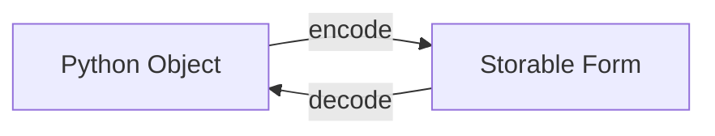
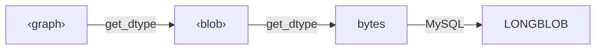

# Extending DataJoint with Custom Codecs

DataJoint's type system is extensible through **codecs**—plugins that define
how domain-specific Python objects are stored and retrieved. This enables
seamless integration of specialized data types without modifying DataJoint itself.

## Why Codecs?

Scientific computing involves diverse data types:

- **Neuroscience**: Spike trains, neural networks, connectivity graphs
- **Imaging**: Medical images, microscopy stacks, point clouds
- **Genomics**: Sequence alignments, phylogenetic trees, variant calls
- **Physics**: Simulation meshes, particle systems, field data

Rather than forcing everything into NumPy arrays or JSON, codecs let you work
with native data structures while DataJoint handles storage transparently.

## The Codec Contract

A codec defines two operations:



| Method | Input | Output | When Called |
|--------|-------|--------|-------------|
| `encode()` | Python object | bytes, dict, or another codec's input | On `insert()` |
| `decode()` | Stored data | Python object | On `fetch()` |

## Creating a Custom Codec

### Basic Structure

```python
import datajoint as dj

class MyCodec(dj.Codec):
    """Store custom objects."""
    name = "mytype"  # Used as <mytype> in definitions

    def get_dtype(self, is_store: bool) -> str:
        """Return storage type."""
        return "<blob>"  # Chain to blob serialization

    def encode(self, value, *, key=None, store_name=None):
        """Convert Python object to storable form."""
        return serialize(value)

    def decode(self, stored, *, key=None):
        """Convert stored form back to Python object."""
        return deserialize(stored)
```

### Auto-Registration

Codecs register automatically when the class is defined—no decorator needed:

```python
class GraphCodec(dj.Codec):
    name = "graph"  # Immediately available as <graph>
    ...

# Check registration
assert "graph" in dj.list_codecs()
```

## Example: NetworkX Graphs

```python
import networkx as nx
import datajoint as dj

class GraphCodec(dj.Codec):
    """Store NetworkX graphs as adjacency data."""
    name = "graph"

    def get_dtype(self, is_store: bool) -> str:
        # Store as blob (internal) or blob@ (external)
        return "<blob@>" if is_store else "<blob>"

    def encode(self, graph, *, key=None, store_name=None):
        """Serialize graph to dict."""
        return {
            'directed': graph.is_directed(),
            'nodes': list(graph.nodes(data=True)),
            'edges': list(graph.edges(data=True)),
        }

    def decode(self, stored, *, key=None):
        """Reconstruct graph from dict."""
        cls = nx.DiGraph if stored['directed'] else nx.Graph
        G = cls()
        G.add_nodes_from(stored['nodes'])
        G.add_edges_from(stored['edges'])
        return G
```

Usage:

```python
@schema
class Connectivity(dj.Computed):
    definition = """
    -> Neurons
    ---
    network : <graph>        # Small graphs in database
    full_network : <graph@>  # Large graphs in object storage
    """

    def make(self, key):
        # Build connectivity graph
        G = nx.DiGraph()
        G.add_edges_from(compute_connections(key))

        self.insert1({**key, 'network': G, 'full_network': G})

# Fetch returns NetworkX graph directly
graph = (Connectivity & key).fetch1('network')
print(f"Nodes: {graph.number_of_nodes()}")
```

## Example: Domain-Specific Formats

### Genomics: Pysam Alignments

```python
import pysam
import tempfile
from pathlib import Path

class BamCodec(dj.Codec):
    """Store BAM alignments."""
    name = "bam"

    def get_dtype(self, is_store: bool) -> str:
        if not is_store:
            raise dj.DataJointError("<bam> requires in-store storage: use <bam@>")
        return "<object@>"  # Path-addressed storage for file structure

    def encode(self, alignments, *, key=None, store_name=None):
        """Write alignments to BAM format."""
        # alignments is a pysam.AlignmentFile or list of reads
        # Storage handled by <object> codec
        return alignments

    def decode(self, stored, *, key=None):
        """Return ObjectRef for lazy BAM access."""
        return stored  # ObjectRef with .open() method
```

### Medical Imaging: SimpleITK

```python
import SimpleITK as sitk
import io

class MedicalImageCodec(dj.Codec):
    """Store medical images with metadata."""
    name = "medimg"

    def get_dtype(self, is_store: bool) -> str:
        return "<blob@>" if is_store else "<blob>"

    def encode(self, image, *, key=None, store_name=None):
        """Serialize SimpleITK image."""
        # Preserve spacing, origin, direction
        buffer = io.BytesIO()
        sitk.WriteImage(image, buffer, imageIO='NrrdImageIO')
        return {
            'data': buffer.getvalue(),
            'spacing': image.GetSpacing(),
            'origin': image.GetOrigin(),
        }

    def decode(self, stored, *, key=None):
        """Reconstruct SimpleITK image."""
        buffer = io.BytesIO(stored['data'])
        return sitk.ReadImage(buffer)
```

## Codec Chaining

Codecs can chain to other codecs via `get_dtype()`:



```python
class CompressedGraphCodec(dj.Codec):
    name = "cgraph"

    def get_dtype(self, is_store: bool) -> str:
        return "<graph>"  # Chain to graph codec

    def encode(self, graph, *, key=None, store_name=None):
        # Simplify before passing to graph codec
        return nx.to_sparse6_bytes(graph)

    def decode(self, stored, *, key=None):
        return nx.from_sparse6_bytes(stored)
```

## Storage Mode Support

### Internal Only

```python
class SmallDataCodec(dj.Codec):
    name = "small"

    def get_dtype(self, is_store: bool) -> str:
        if is_store:
            raise dj.DataJointError("<small> is internal-only")
        return "json"
```

### External Only

```python
class LargeDataCodec(dj.Codec):
    name = "large"

    def get_dtype(self, is_store: bool) -> str:
        if not is_store:
            raise dj.DataJointError("<large> requires @: use <large@>")
        return "<object@>"
```

### Both Modes

```python
class FlexibleCodec(dj.Codec):
    name = "flex"

    def get_dtype(self, is_store: bool) -> str:
        return "<blob@>" if is_store else "<blob>"
```

## Validation

Add validation to catch errors early:

```python
class StrictGraphCodec(dj.Codec):
    name = "strictgraph"

    def validate(self, value):
        """Called before encode()."""
        if not isinstance(value, nx.Graph):
            raise dj.DataJointError(
                f"Expected NetworkX graph, got {type(value).__name__}"
            )
        if value.number_of_nodes() == 0:
            raise dj.DataJointError("Graph must have at least one node")

    def encode(self, graph, *, key=None, store_name=None):
        self.validate(graph)
        return {...}
```

## Best Practices

### 1. Choose Appropriate Storage

| Data Size | Recommendation |
|-----------|----------------|
| < 1 KB | `json` or `<blob>` |
| 1 KB - 10 MB | `<blob>` or `<blob@>` |
| > 10 MB | `<blob@>` or `<object@>` |
| File structures | `<object@>` |

### 2. Preserve Metadata

```python
def encode(self, obj, *, key=None, store_name=None):
    return {
        'data': serialize(obj),
        'version': '1.0',  # For future compatibility
        'dtype': str(obj.dtype),
        'shape': obj.shape,
    }
```

### 3. Handle Versioning

```python
def decode(self, stored, *, key=None):
    version = stored.get('version', '0.9')
    if version == '1.0':
        return deserialize_v1(stored)
    else:
        return deserialize_legacy(stored)
```

### 4. Document Your Codec

```python
class WellDocumentedCodec(dj.Codec):
    """
    Store XYZ data structures.

    Supports both in-table (<xyz>) and in-store (<xyz@>) storage.

    Examples
    --------
    >>> @schema
    ... class Results(dj.Computed):
    ...     definition = '''
    ...     -> Experiment
    ...     ---
    ...     output : <xyz@>
    ...     '''
    """
    name = "xyz"
```

## Summary

Custom codecs enable:

1. **Domain-specific types** — Work with native data structures
2. **Transparent storage** — DataJoint handles serialization
3. **Flexible backends** — Internal, external, or both
4. **Composability** — Chain codecs for complex transformations
5. **Validation** — Catch errors before storage

The codec system makes DataJoint extensible to any scientific domain without
modifying the core framework.

## Before Creating Your Own

Check for existing plugin codecs that may already solve your needs:

- **[dj-zarr-codecs](https://github.com/datajoint/dj-zarr-codecs)** — General numpy arrays with Zarr storage
- **[dj-photon-codecs](https://github.com/datajoint/dj-photon-codecs)** — Photon-limited movies with Anscombe transformation and compression

See the [Use Plugin Codecs](../how-to/use-plugin-codecs.md/) guide for installation and usage of existing codec packages. Creating a custom codec is straightforward, but reusing existing ones saves time and ensures compatibility.
