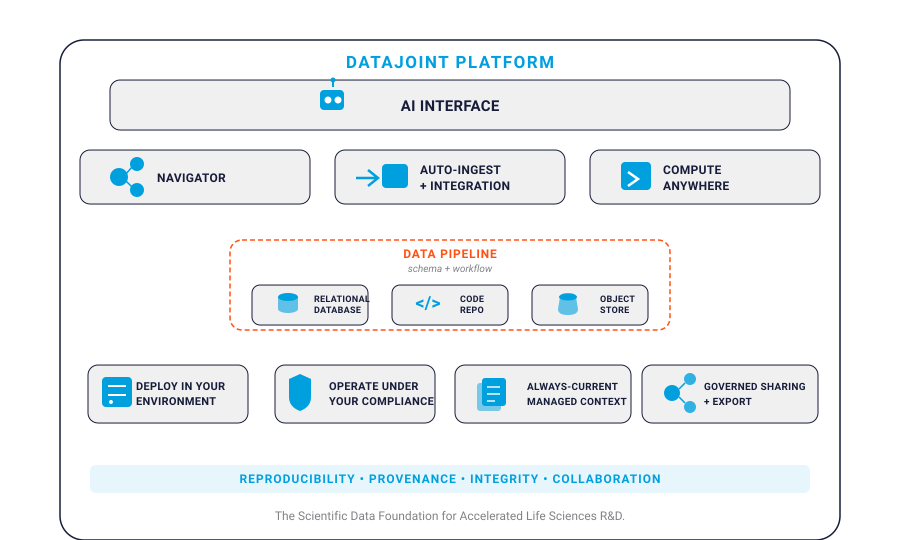
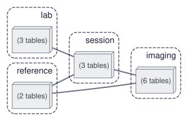
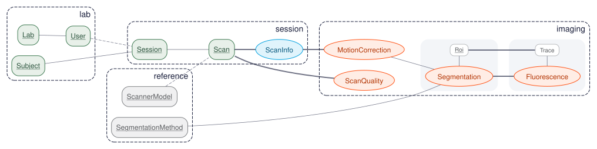
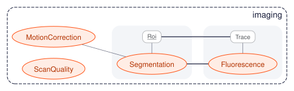

# Scientific Data Pipelines

A **scientific data pipeline** extends beyond a database with computations. It is a comprehensive system that:

- Manages the complete lifecycle of scientific data from acquisition to delivery
- Integrates diverse tools for data entry, visualization, and analysis
- Provides infrastructure for secure, scalable computation
- Enables collaboration across teams and institutions
- Supports reproducibility and data lineage throughout

## Pipeline Architecture

At the heart of every DataJoint pipeline is an **open-source core** of three components that handle schema, computation, and storage. The managed **DataJoint Platform** extends this core with services for AI access, data ingestion, exploration, security, collaboration, and visualization.



| Open-Source Core | Purpose |
|------------------|---------|
| **Code Repository** | Version-controlled pipeline definitions, `make` methods, configuration |
| **Relational Database** | System of record for metadata, relationships, and integrity enforcement |
| **Object Store** | Scalable storage for large scientific data (images, recordings, signals) |

These components work together: code defines the schema and computations, the database tracks all metadata and relationships, and object storage holds the large scientific data files.

## Pipeline as a DAG

A DataJoint pipeline forms a **Directed Acyclic Graph (DAG)** at two levels, and the same
pipeline can be viewed at either one.

**Module level — the collapsed view.** Each node is a Python module, which corresponds to a
database schema. Each edge represents a bundle of dependencies: the foreign key references
between tables of the two schemas, together with the Python import dependency between their
modules. A heavier edge carries a larger bundle — below, the `lab → session` and
`session → imaging` edges each bundle two separate foreign keys, and `reference` supplies
both `session` and `imaging`. Fourteen tables (including parts) collapse to four nodes.



**Table level — the expanded view.** Each node is a table; the dashed clusters group the
tables of each module. Each edge is an individual foreign key constraint — the two foreign
keys that cross the `session → imaging` boundary (`Scan → ScanQuality` and
`ScanInfo → MotionCorrection`) appear separately here, having collapsed into the single
bundled edge above; likewise `Subject → Session` and `User → Session` across
`lab → session`.



This dual structure ensures that both code dependencies and data dependencies flow in the
same direction: collapsing every module's tables into a single node must itself yield a DAG.

### DAG Constraints

> **All foreign key relationships within a schema MUST form a DAG.**
>
> **Dependencies between schemas (foreign keys + imports) MUST also form a DAG.**

This constraint is fundamental to DataJoint's design. It ensures:

- **Unidirectional data flow** — Data enters at the top and flows downstream
- **Clear lineage** — Every result traces back to its inputs
- **Safe deletion** — Cascading deletes follow the DAG without cycles
- **Predictable computation** — `populate()` can determine correct execution order

## The Relational Workflow Model

DataJoint pipelines are built on the [Relational Workflow Model](relational-workflow-model.md)—a paradigm that extends relational databases with native support for computational workflows. In this model:

- **Tables represent workflow steps**, not just data storage
- **Foreign keys encode dependencies**, prescribing the order of operations
- **Table tiers** (Lookup, Manual, Imported, Computed) classify how data enters the pipeline
- **The schema forms a DAG** that defines valid execution sequences

This model treats the database schema as an **executable workflow specification**—defining not just what data exists but when and how it comes into existence.

## Schema Organization

Each schema corresponds to a dedicated Python module, and the module import structure mirrors the foreign key dependencies between schemas. The pipeline above is organized as:

```
my_pipeline/
├── src/
│   └── my_pipeline/
│       ├── __init__.py
│       ├── lab.py        # lab schema (no dependencies)
│       ├── reference.py  # reference schema (no dependencies)
│       ├── session.py    # session schema (imports lab, reference)
│       └── imaging.py    # imaging schema (imports session, reference)
```

Within a schema, tables form their own DAG. Drilling into the `imaging` module: computed tables, including two masters with their part tables — `Segmentation` with `Segmentation.Roi`, and `Fluorescence` with `Fluorescence.Trace`, whose rows reference individual ROIs:



For practical guidance on organizing multi-schema pipelines, configuring repositories, and managing team access, see [Manage a Pipeline Project](../how-to/manage-pipeline-project.md/).

## Object-Augmented Schemas

Scientific data often includes large objects—images, recordings, time series, instrument outputs—that don't fit efficiently in relational tables. DataJoint addresses this through **Object-Augmented Schemas (OAS)**, a hybrid storage architecture that preserves relational semantics while handling arbitrarily large data.

### The OAS Philosophy

**1. The database remains the system of record.**

All metadata, relationships, and query logic live in the relational database. The schema defines what data exists, how entities relate, and what computations produce them. Queries operate on the relational structure; results are consistent and reproducible.

**2. Large objects live in object stores.**

Object storage (filesystems, S3, GCS, Azure Blob, MinIO) holds the actual bytes—arrays, images, files. The database stores only lightweight references (paths, checksums, metadata). This separation lets the database stay fast while data scales to terabytes.

**3. Transparent access through codecs.**

DataJoint's [type system](type-system.md) provides codec types that bridge Python objects and storage:

| Codec | Purpose |
|-------|---------|
| `<blob>` | Serialize Python objects (NumPy arrays, dicts) |
| `<blob@store>` | Same, but stored in object store |
| `<attach>` | Store files with preserved filenames |
| `<object@store>` | Path-addressed storage for complex structures (Zarr, HDF5) |
| `<filepath@store>` | References to user-managed files |

Users work with native Python objects; serialization and storage routing are invisible.

**4. Referential integrity extends to objects.**

When a database row is deleted, its associated stored objects are garbage-collected. Foreign key cascades work correctly—delete upstream data and downstream results (including their objects) disappear. The database and object store remain synchronized without manual cleanup.

**5. Multiple storage tiers support diverse access patterns.**

Different attributes can route to different stores:

```python
class ScanInfo(dj.Imported):
    definition = """
    -> Scan
    ---
    nframes : int32
    fps : float32
    raw_movie : <blob@fast>      # Hot storage for active analysis
    archive : <blob@cold>        # Cold storage for long-term retention
    """
```

Here the pipeline's `ScanInfo` table keeps its scalar metadata (`nframes`, `fps`) in the database while routing its payloads to two different stores.

This architecture lets teams work with terabyte-scale datasets while retaining the query power, integrity guarantees, and reproducibility of the relational model.

## Pipeline Workflow

A typical data pipeline workflow:

1. **Acquisition** — Data is collected from instruments, experiments, or external sources. Raw files land in object storage; metadata populates Manual tables (`Session`, `Scan`).

2. **Import** — Automated processes parse raw data, extract signals, and populate Imported tables with structured results (`ScanInfo`).

3. **Computation** — The `populate()` mechanism identifies new data and triggers downstream processing. Compute resources execute transformations and populate Computed tables (`MotionCorrection`, `Segmentation`, `Fluorescence`).

4. **Query & Analysis** — Users query results across the pipeline, combining data from multiple stages to generate insights, reports, or visualizations.

5. **Collaboration** — Team members access the same database concurrently, building on shared results. Foreign key constraints maintain consistency.

6. **Delivery** — Processed results are exported, integrated into downstream systems, or archived according to project requirements.

Throughout this process, the schema definition remains the single source of truth.

## Comparing Approaches

The pipeline approach requires upfront investment in schema design. Compared to a file-based approach where data structure is implicit in filenames, dependencies are encoded in scripts, and lineage must be tracked manually, a DataJoint pipeline makes all of those explicit in the schema — and pays the investment back in reproducibility, query power, and collaboration as projects scale.

For a detailed structural comparison against file-based workflow systems (CWL, Snakemake, Nextflow) and task orchestrators (Airflow, Argo, Prefect, Dagster), and for guidance on when the two layers complement rather than substitute each other, see [Comparison to Workflow Languages](comparison-to-workflow-languages.md).

## Summary

Scientific data pipelines extend the Relational Workflow Model into complete data operations systems:

- **Pipeline Architecture** — Code repository, relational database, and object store working together
- **DAG Structure** — Unidirectional flow of data and dependencies
- **Object-Augmented Schemas** — Scalable storage with relational semantics

The schema remains central—defining data structures, dependencies, and computational flow. This pipeline-centric approach lets teams focus on their science while the system handles data integrity, lineage, and reproducibility automatically.

## See Also

- [Relational Workflow Model](relational-workflow-model.md) — The conceptual foundation
- [Entity Integrity](entity-integrity.md) — Primary keys and dimensions
- [Type System](type-system.md) — Codec types and storage modes
- [Manage a Pipeline Project](../how-to/manage-pipeline-project.md/) — Practical project organization
