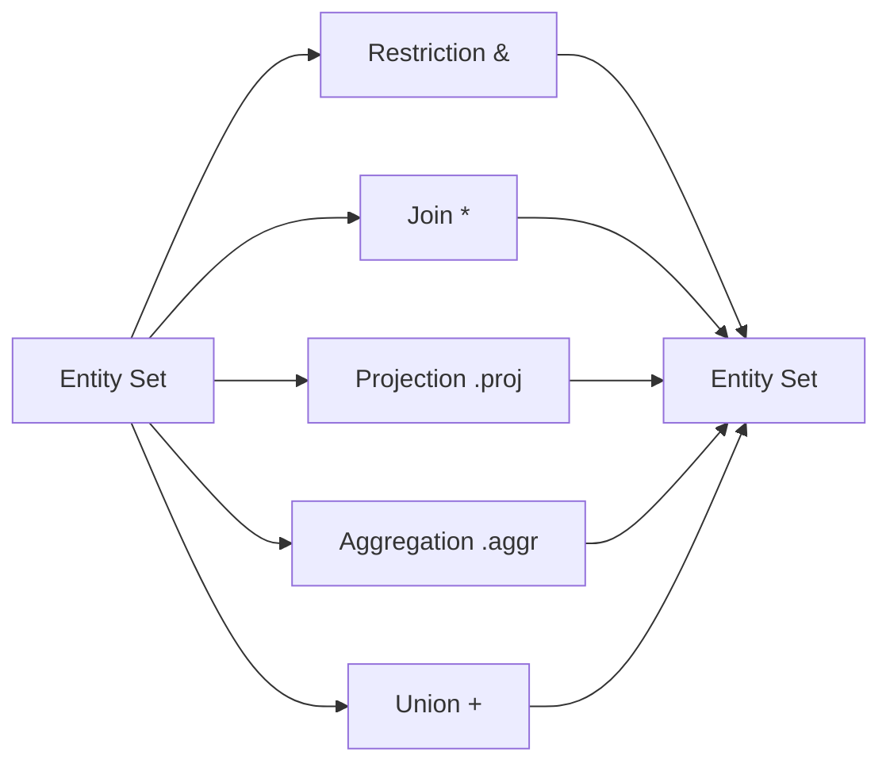

# Query Algebra

DataJoint provides a powerful query algebra with just five operators. These
operators work on **entity sets** (query expressions) and always return entity
sets, enabling arbitrary composition.

## The Five Operators



## Restriction (`&` and `-`)

Filter entities based on conditions.

### Include (`&`)

```python
# Mice born after 2024
Mouse & 'date_of_birth > "2024-01-01"'

# Sessions for a specific mouse
Session & {'mouse_id': 42}

# Sessions matching a query
Session & (Mouse & 'strain = "C57BL/6"')
```

### Exclude (`-`)

```python
# Mice NOT in the study
Mouse - StudyMouse

# Sessions without recordings
Session - Recording
```

## Join (`*`)

Combine entity sets along shared attributes.

```python
# All session-recording pairs
Session * Recording

# Chain through workflow
Mouse * Session * Scan * Segmentation
```

DataJoint joins are **natural joins** that:

- Match on attributes with the same name **and** lineage
- Respect declared dependencies (no accidental matches)
- Produce the intersection of matching entities

## Projection (`.proj()`)

Select and transform attributes.

### Select attributes

```python
# Only mouse_id and strain
Mouse.proj('strain')

# Rename attributes
Mouse.proj(animal_id='mouse_id')
```

### Compute new attributes

```python
# Calculate age
Mouse.proj(
    age='DATEDIFF(CURDATE(), date_of_birth)'
)

# Combine attributes
Session.proj(
    session_label='CONCAT(subject_id, "-", session_date)'
)
```

### Aggregate in projection

```python
# Count recordings per session
Session.aggr(Recording, n_recordings='COUNT(*)')
```

## Aggregation (`.aggr()`)

Summarize across groups.

```python
# Average spike rate per neuron
Neuron.aggr(
    SpikeTime,
    avg_rate='AVG(spike_rate)',
    total_spikes='COUNT(*)'
)

# Statistics per session
Session.aggr(
    Trial,
    n_trials='COUNT(*)',
    success_rate='AVG(success)'
)
```

## Union (`+`)

Combine entity sets with the same attributes.

```python
# All subjects from two studies
StudyA_Subjects + StudyB_Subjects

# Combine results from different analyses
AnalysisV1 + AnalysisV2
```

Requirements:

- Same primary key structure
- Compatible attribute types

## Operator Composition

Operators compose freely:

```python
# Complex query
result = (
    (Mouse & 'strain = "C57BL/6"')  # Filter mice
    * Session                        # Join sessions
    * Scan                           # Join scans
    .proj('scan_date', 'depth')      # Select attributes
    & 'depth > 200'                  # Filter by depth
)
```

## Workflow-Aware Joins

Unlike SQL's natural joins that match on **any** shared column name, DataJoint
joins match on **semantic lineage**. Two attributes match only if they:

1. Have the same name
2. Trace back to the same source definition

This prevents accidental joins on coincidentally-named columns.

## Fetching Results

Query expressions are lazy—they build SQL but don't execute until you fetch:

```python
# Fetch as NumPy recarray
data = query.fetch()

# Fetch as list of dicts
data = query.fetch(as_dict=True)

# Fetch as pandas DataFrame
df = query.fetch(format='frame')

# Fetch specific attributes
ids, dates = query.fetch('mouse_id', 'session_date')

# Fetch single row
row = (query & key).fetch1()
```

## Summary

| Operator | Symbol | Purpose |
|----------|--------|---------|
| Restriction | `&`, `-` | Filter entities |
| Join | `*` | Combine entity sets |
| Projection | `.proj()` | Select/transform attributes |
| Aggregation | `.aggr()` | Summarize groups |
| Union | `+` | Combine parallel sets |

These five operators, combined with workflow-aware join semantics, provide
complete query capability for scientific data pipelines.
