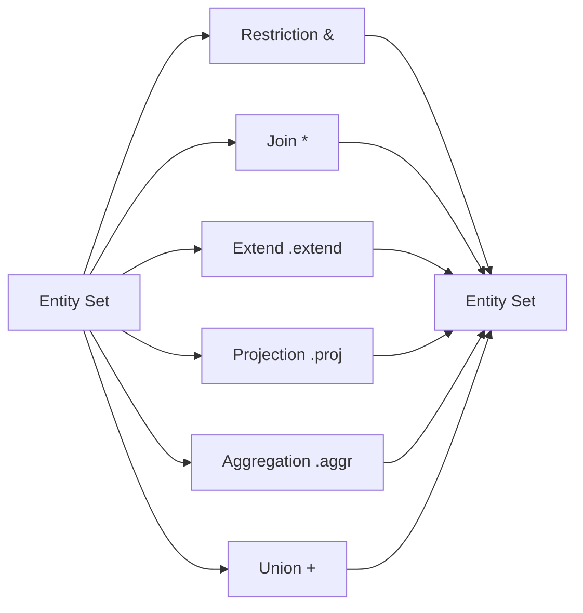

# Query Algebra

DataJoint provides a powerful query algebra built on five core operators: restriction, join, projection, aggregation, and union. These operators work on **entity sets** (query expressions) and always return entity sets, enabling arbitrary composition.

## Algebraic Closure

A fundamental property of DataJoint's query algebra is **algebraic closure**: every query result is itself a valid entity set with a well-defined **entity type** — you always know what kind of entity the result represents, identified by a specific primary key. Unlike SQL where query results are unstructured "bags of rows," DataJoint determines the entity type of each result based on the operator and the functional dependencies between operands.

This means operators can be chained indefinitely — the output of any operation is a valid input to any other operation. See [Primary Keys](../reference/specs/primary-keys.md) for the precise rules.

## Core Operators



## Restriction (`&` and `-`)

Filter entities based on conditions.

### Include (`&`)

```python
# Mice born after 2024
Mouse & 'date_of_birth > "2024-01-01"'

# Sessions for a specific mouse
Session & {'mouse_id': 42}

# Sessions matching a query
Session & (Mouse & 'strain = "C57BL/6"')
```

### Exclude (`-`)

```python
# Mice NOT in the study
Mouse - StudyMouse

# Sessions without recordings
Session - Recording
```

### Top N (`dj.Top`)

Select a limited number of entities with ordering:

```python
# Most recent 10 sessions
Session & dj.Top(10, 'session_date DESC')

# First session by primary key
Session & dj.Top()
```

The `order_by` parameter accepts attribute names with optional `DESC`/`ASC`. The special value `"KEY"` is an alias for all primary key attributes (e.g., `"KEY DESC"` for reverse primary key order).

## Join (`*`)

Combine entity sets along shared attributes.

```python
# All session-recording pairs
Session * Recording

# Chain through workflow
Mouse * Session * Scan * Segmentation
```

DataJoint joins are **natural joins** that:

- Match on attributes with the same name **and** lineage
- Respect declared dependencies (no accidental matches)
- Produce the intersection of matching entities

### Extend (`.extend()`)

Add attributes from another entity set while preserving all entities in the original set.

```python
# Add session info to each trial
Trial.extend(Session)  # Adds session_date, subject_id to Trial

# Add neuron properties to spike times
SpikeTime.extend(Neuron)  # Adds cell_type, depth to SpikeTime
```

**How it differs from join:**

- **Join (`*`)**: Returns only matching entities (inner join), primary key is the union of both PKs
- **Extend**: Returns all entities from the left side (left join), primary key stays as the left side's PK

**Primary key formation:**

```python
# Join: PK is union of both primary keys
result = Session * Trial
# PK: (session_id, trial_num)

# Extend: PK stays as left side's PK
result = Trial.extend(Session)
# PK: (session_id, trial_num) - same as Trial
# session_date is added as a non-primary attribute
```

**Requirement:** The left side must **determine** the right side. This means all primary key attributes from the right side must exist in the left side. This requirement ensures:

1. Every entity in the left side can match at most one entity in the right side
2. The left side's primary key uniquely identifies entities in the result
3. No NULL values appear in the result's primary key

```python
# Valid: Trial determines Session
# (session_id is in Trial's primary key)
Trial.extend(Session)  ✓
# Each trial belongs to exactly one session
# Result PK: (session_id, trial_num)

# Invalid: Session does NOT determine Trial
# (trial_num is not in Session)
Session.extend(Trial)  ✗  # Error: trial_num not in Session
# A session has multiple trials - PK would be ambiguous
```

**Why use extend?**

1. **Preserve all entities**: When you need attributes from a parent but want to keep all children (even orphans)
2. **Clear intent**: Expresses "add attributes" rather than "combine entity sets"
3. **No filtering**: Guarantees the same number of entities in the result

Think of extend as projection-like: it adds attributes to existing entities without changing which entities are present.

## Projection (`.proj()`)

Select and transform attributes.

### Select attributes

```python
# Only mouse_id and strain
Mouse.proj('strain')

# Rename attributes
Mouse.proj(animal_id='mouse_id')
```

### Compute new attributes

```python
# Calculate age
Mouse.proj(
    age='DATEDIFF(CURDATE(), date_of_birth)'
)

# Combine attributes
Session.proj(
    session_label='CONCAT(subject_id, "-", session_date)'
)
```

### Aggregate in projection

```python
# Count recordings per session
Session.aggr(Recording, n_recordings='COUNT(*)')
```

## Aggregation (`.aggr()`)

Summarize across groups.

```python
# Average spike rate per neuron
Neuron.aggr(
    SpikeTime,
    avg_rate='AVG(spike_rate)',
    total_spikes='COUNT(*)'
)

# Statistics per session
Session.aggr(
    Trial,
    n_trials='COUNT(*)',
    success_rate='AVG(success)'
)
```

## Union (`+`)

Combine entity sets with the same attributes.

```python
# All subjects from two studies
StudyA_Subjects + StudyB_Subjects

# Combine results from different analyses
AnalysisV1 + AnalysisV2
```

Requirements:

- Same primary key structure
- Compatible attribute types

## Operator Composition

Operators compose freely:

```python
# Complex query
result = (
    (Mouse & 'strain = "C57BL/6"')  # Filter mice
    * Session                        # Join sessions
    * Scan                           # Join scans
    .proj('scan_date', 'depth')      # Select attributes
    & 'depth > 200'                  # Filter by depth
)
```

## Semantic Matching

All binary operators in DataJoint rely on **semantic matching** of attributes. Unlike SQL's natural joins that match on any shared column name, DataJoint verifies that namesake attributes (those with the same name) are **homologous**—they trace back to the same original definition.

This prevents accidental matches on coincidentally-named columns, a pitfall that has been understood since the Entity-Relationship Model was introduced in the 1970s but was never addressed in SQL or traditional RDBMS implementations.

See [Semantic Matching](semantic-matching.md) for details.

These concepts were first introduced in Yatsenko et al., 2018[^1].

[^1]: Yatsenko D, Walker EY, Tolias AS (2018). DataJoint Elements: Data Workflows for Neurophysiology. [arXiv:1807.11104](https://doi.org/10.48550/arXiv.1807.11104)

## Fetching Results

Query expressions are lazy—they build SQL but don't execute until you fetch:

```python
# Fetch as NumPy recarray
data = query.to_arrays()

# Fetch as list of dicts
data = query.to_dicts()

# Fetch as pandas DataFrame
df = query.to_pandas()

# Fetch specific attributes
ids, dates = query.to_arrays('mouse_id', 'session_date')

# Fetch single row
row = (query & key).fetch1()
```

## Summary

| Operator | Symbol/Method | Purpose |
|----------|---------------|---------|
| Restriction | `&`, `-` | Filter entities |
| Join | `*` | Combine entity sets (inner join) |
| Extend | `.extend()` | Add attributes (left join) |
| Projection | `.proj()` | Select/transform attributes |
| Aggregation | `.aggr()` | Summarize groups |
| Union | `+` | Combine parallel sets |

These core operators, combined with workflow-aware join semantics, provide
complete query capability for scientific data pipelines.
