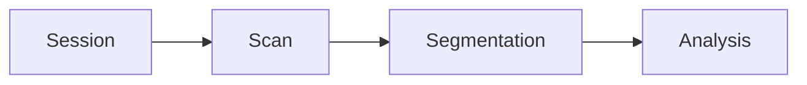
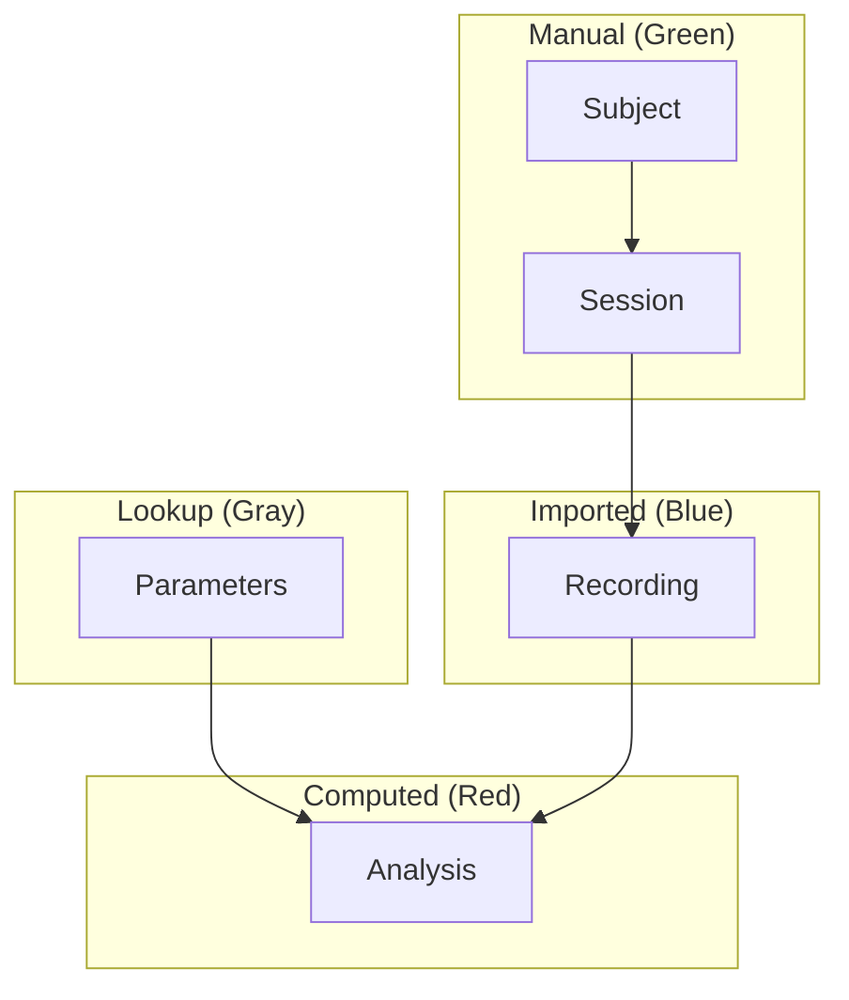

# The Relational Workflow Model

DataJoint implements the **Relational Workflow Model**—a paradigm that extends
relational databases with native support for computational workflows. This model
defines a new class of databases called **Computational Databases**, where
computational transformations are first-class citizens of the data model.

These concepts, along with DataJoint's schema definition language and query algebra,
were first formalized in [Yatsenko et al., 2018](https://doi.org/10.48550/arXiv.1807.11104).

## The Problem with Traditional Approaches

Traditional relational databases excel at storing and querying data but struggle
with computational workflows. They can store inputs and outputs, but:

- The database doesn't understand that outputs were *computed from* inputs
- It doesn't automatically recompute when inputs change
- It doesn't track provenance

**DataJoint solves these problems by treating your database schema as an
executable workflow specification.**

## Three Paradigms Compared

The relational data model has been interpreted through different conceptual
frameworks, each with distinct strengths and limitations:

| Aspect | Mathematical (Codd) | Entity-Relationship (Chen) | **Relational Workflow (DataJoint)** |
|--------|---------------------|----------------------------|-------------------------------------|
| **Core Question** | "What functional dependencies exist?" | "What entity types exist?" | **"When/how are entities created?"** |
| **Time Dimension** | Not addressed | Not central | **Fundamental** |
| **Implementation Gap** | High (abstract to SQL) | High (ERM to SQL) | **None (unified approach)** |
| **Workflow Support** | None | None | **Native workflow modeling** |

### Codd's Mathematical Foundation

Edgar F. Codd's original relational model is rooted in predicate calculus and
set theory. Tables represent logical predicates; rows assert true propositions.
While mathematically rigorous, this approach requires abstract reasoning that
doesn't map to intuitive domain thinking.

### Chen's Entity-Relationship Model

Peter Chen's Entity-Relationship Model (ERM) shifted focus to concrete domain
modeling—entities and relationships visualized in diagrams. However, ERM:

- Creates a gap between conceptual design and SQL implementation
- Lacks temporal dimension ("when" entities are created)
- Treats relationships as static connections, not dynamic processes

## The Relational Workflow Model

The Relational Workflow Model introduces four fundamental concepts:

### 1. Workflow Entities

Unlike traditional entities that exist independently, **workflow entities** are
artifacts of workflow execution—they represent the products of specific
operations. This temporal dimension allows us to understand not just *what*
exists, but *when* and *how* it came to exist.

### 2. Workflow Dependencies

**Workflow dependencies** extend foreign keys with operational semantics. They
don't just ensure referential integrity—they prescribe the order of operations.
Parent entities must be created before child entities.

### 3. Workflow Steps (Table Tiers)

Each table represents a distinct **workflow step** with a specific role:

| Tier | Role | Examples |
|------|------|----------|
| **Lookup** | Reference data, parameters | Species, analysis methods |
| **Manual** | Human-entered observations | Subjects, sessions |
| **Imported** | Automated data acquisition | Recordings, images |
| **Computed** | Derived results | Analyses, statistics |

### 4. Directed Acyclic Graph (DAG)

The schema forms a **DAG** that:

- Prohibits circular dependencies
- Ensures valid execution sequences
- Enables efficient parallel execution
- Supports resumable computation

## The Workflow Normalization Principle

> **"Every table represents an entity type that is created at a specific step
> in a workflow, and all attributes describe that entity as it exists at that
> workflow step."**

This principle extends entity normalization with temporal and operational
dimensions.

## Why This Matters

### Unified Design and Implementation

Unlike the ERM-SQL gap, DataJoint provides unified:

- **Diagramming** — Schema diagrams reflect actual structure
- **Definition** — Table definitions are executable code
- **Querying** — Operators understand workflow semantics

No translation needed between conceptual design and implementation.

### Temporal and Operational Awareness

The model captures the dynamic nature of workflows:

- Data processing sequences
- Computational dependencies
- Operation ordering

### Immutability and Provenance

Workflow artifacts are immutable once created:

- Preserves execution history
- Maintains data provenance
- Enables reproducible science

When you delete upstream data, dependent results cascade-delete automatically.
To correct errors, you delete, reinsert, and recompute—ensuring every result
represents a consistent computation from valid inputs.

### Workflow Integrity

The DAG structure guarantees:

- No circular dependencies
- Valid operation sequences
- Enforced temporal order
- Computational validity

## Query Algebra with Workflow Semantics

DataJoint's five operators provide a complete query algebra:

| Operator | Symbol | Purpose |
|----------|--------|---------|
| **Restriction** | `&` | Filter entities |
| **Join** | `*` | Combine from converging paths |
| **Projection** | `.proj()` | Select/compute attributes |
| **Aggregation** | `.aggr()` | Summarize groups |
| **Union** | `+` | Combine parallel branches |

These operators:

- Take entity sets as input, produce entity sets as output
- Preserve entity integrity
- Respect declared dependencies (no ambiguous joins)

## From Transactions to Transformations

The Relational Workflow Model represents a conceptual shift:

| Traditional View | Workflow View |
|------------------|---------------|
| Tables store data | Entity sets are workflow steps |
| Rows are records | Entities are execution instances |
| Foreign keys enforce consistency | Dependencies specify information flow |
| Updates modify state | Computations create new states |
| Schemas organize storage | Schemas specify pipelines |
| Queries retrieve data | Queries trace provenance |

This makes DataJoint feel less like a traditional database and more like a
**workflow engine with persistent state**—one that maintains computational
validity while supporting scientific flexibility.

## Summary

The Relational Workflow Model:

1. **Extends** relational theory (doesn't replace it)
2. **Adds** temporal and operational semantics
3. **Eliminates** the design-implementation gap
4. **Enables** reproducible computational workflows
5. **Maintains** mathematical rigor

It's not a departure from relational databases—it's their evolution for
computational workflows.
