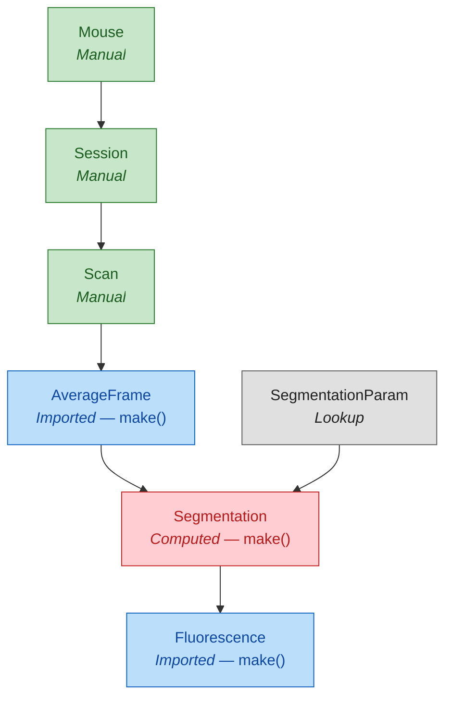

# The Relational Workflow Model

The relational model has historically admitted two interpretations. Codd's
mathematical foundation (1970) views tables as logical predicates and rows
as true propositions — rigorous but abstract. Chen's Entity-Relationship
Model (1976) views tables as entity types or relationships — intuitive for
domain modeling, but silent on how entities come into being. The
**Relational Workflow Model** introduces a third interpretation: tables
represent workflow steps, rows represent workflow artifacts, and foreign
keys prescribe execution order. The schema specifies not only *what* data
exists but *how* it is derived — a single formal system in which data
structure, computational dependencies, and integrity constraints are all
queryable, enforceable, and machine-readable.

This unification is what makes DataJoint a *computational substrate* rather
than a database in the conventional sense. Each surrounding category of
tools is good at part of the problem and silent on the rest. File-based
workflow systems (CWL, Snakemake, Nextflow) offer flexibility but fragment
provenance across the filesystem and configuration. Task-centric
orchestrators (Airflow, Argo, Prefect) manage execution but remain agnostic
to data structure. Data catalogs (DataHub, Atlan, Marquez) describe data
after it lands. Lakehouses (Delta, Iceberg, Hudi) optimize analytical
queries but treat computation as external. The Relational Workflow Model
is the deliberate trade-off: framework commitment in exchange for one
formal system that addresses all four concerns at once.

## Three interpretations of the relational model

| Aspect | Mathematical (Codd) | Entity-Relationship (Chen) | **Relational Workflow (DataJoint)** |
|--------|---------------------|----------------------------|-------------------------------------|
| **Core question** | What functional dependencies exist? | What entity types exist? | **When and how are entities created?** |
| **Table semantics** | Logical predicate | Entity or relationship | **Workflow step** |
| **Row semantics** | True proposition | Entity instance | **Workflow artifact** |
| **Foreign keys** | Referential integrity | Relationship | **Execution order** |
| **Computation** | Not addressed | Not addressed | **Declared in schema** |
| **Provenance** | Not addressed | Not addressed | **Structural** |
| **Implementation gap** | High | High | **None** |

## Four shifts from the classical relational model

- **Tables represent workflow steps**, not merely categories of records.
- **Rows represent workflow artifacts**, each with provenance to its inputs.
- **Foreign keys prescribe execution order**, not only referential integrity — the dependency graph *is* the pipeline DAG, enforced by the database.
- **Computed and Imported tables carry their own `make()` methods**, declaring derivation logic in the schema itself, not in an external workflow file.

The schema is therefore *active*, not passive. A row exists in a Computed
table if and only if its upstream key exists, its `make()` has run, and its
result satisfies the declared constraints. The schema is the executable
specification of the work.

## A worked example

```mermaid
graph TD
    Mouse["Mouse<br/><i>Manual</i>"]:::manual
    Session["Session<br/><i>Manual</i>"]:::manual
    Scan["Scan<br/><i>Manual</i>"]:::manual
    SegParam["SegmentationParam<br/><i>Lookup</i>"]:::lookup
    AvgFrame["AverageFrame<br/><i>Imported</i> &mdash; make()"]:::imported
    Segmentation["Segmentation<br/><i>Computed</i> &mdash; make()"]:::computed
    Fluorescence["Fluorescence<br/><i>Imported</i> &mdash; make()"]:::imported

    Mouse --> Session --> Scan --> AvgFrame --> Segmentation --> Fluorescence
    SegParam --> Segmentation

    classDef manual    fill:#c8e6c9,stroke:#2e7d32,color:#1b5e20;
    classDef lookup    fill:#e0e0e0,stroke:#616161,color:#212121;
    classDef imported  fill:#bbdefb,stroke:#1565c0,color:#0d47a1;
    classDef computed  fill:#ffcdd2,stroke:#c62828,color:#b71c1c;
```

`Mouse`, `Session`, and `Scan` are **Manual** tables entered by the
experimenter. `SegmentationParam` is a **Lookup** table holding reference
parameter sets. `AverageFrame` is **Imported** — its `make()` reads the
TIFF identified by `Scan` and stores the mean fluorescence frame.
`Segmentation` is **Computed** — its primary key fans in from both
`AverageFrame` and `SegmentationParam`, so every average frame is
segmented with every parameter set automatically. `Fluorescence` then
extracts per-ROI time-series traces from each segmentation. No external
scheduler is consulted: the foreign-key graph dictates what may run, what
must run first, and what already exists. The pipeline DAG and the database
schema are the same object.

## The deliberate trade-off

Decoupled architectures have legitimate advantages. File-based workflow
systems optimize for portability — any tool that reads files works.
Orchestrators evolve independently of the data model. Lakehouses give
analytics teams a layer that doesn't bind them to upstream pipeline
choices. These are the right trade-offs for many use cases.

DataJoint accepts tighter coupling deliberately. The cost is framework
commitment. The benefit is one system that knows the data structure, the
data, the computation that produced it, the dependencies between
computations, and the integrity constraints that govern all of it.
Everything an analyst, an engineer, or an AI agent might ask about the
work — *what is this, where did it come from, what depends on it, what
must hold for it to be valid, what would change if I touched the input* —
is answerable by query against a single formal model. For scientific
workflows where the data and the computation cannot be cleanly separated
without losing the science, this is the right trade-off.

## Substrate consequences

Because dependencies are declared before any computation runs, provenance
and lineage become **properties of the substrate**, not artifacts assembled
after the fact. Every row in `Segmentation` is reachable by foreign key
from the exact `AverageFrame` and `SegmentationParam` that produced it;
cascade deletes remove dependent results when their inputs become invalid.
Reproducibility is structural rather than retrofitted by audit: a computed
result cannot exist without its upstream entities, and the declared types
and constraints must hold. The model enforces what other systems merely
log. The lineage graph is already in the schema; mapping it to external
standards such as W3C PROV or OpenLineage is a translation, not a
reconstruction.

The same property makes the schema a shared contract between humans and
the machines that increasingly collaborate with them. The schema is
**self-describing**: an agent can introspect table structure, dependencies,
and state programmatically. Operations are **safe by default**: invalid
joins, type mismatches, and referential violations fail cleanly rather
than corrupting data silently. The dependency graph is **explicit**:
agents reason about execution order without implicit knowledge. Core
operations are **idempotent**: retries on failure are without side effects.
And all state — job status, computation progress, errors — is
**queryable**, so the work is observable as it happens. These are the
properties that let agents participate in scientific workflows with the
same transactional guarantees that protect human-initiated work.

## Beneath the model

The remaining sections detail the structural elements that make the model
work in practice.

### Workflow steps and table tiers

Tables are classified into tiers by data-entry mode:

| Tier | Role | `make()` |
|------|------|----------|
| **Manual** | Receive direct user entry | No |
| **Lookup** | Hold reference data | No |
| **Imported** | Reach out to data sources outside DataJoint (instruments, ELNs, external databases) | Yes |
| **Computed** | Derive their contents entirely from upstream DataJoint tables | Yes |

Imported and Computed tables define computations via `make()` methods. The
`make()` method specifies how each entity is derived — declared within the
table definition, not in an external workflow file.

### Master-part relationships

Master-part relationships declare transactional grouping directly in the
schema. The master table represents the workflow step; part tables hold
the items produced together. Insertions and deletions cascade as a unit,
enforcing transactional semantics without application code.

### Workflow normalization

> "Every table represents an entity type created at a specific workflow
> step, and all attributes describe that entity as it exists at that
> step."

Classical normalization theory decomposes tables to eliminate redundancy
through normal forms based on functional dependencies. Entity normalization
asks whether each attribute describes the entity identified by the primary
key. **Workflow normalization** extends these principles with a temporal
dimension: each table's attributes must describe its entity *as it exists
at the workflow step the table represents*. A `Session` table holds
attributes known when the session is entered (date, experimenter,
subject); analysis parameters determined later belong in Computed tables
that depend on `Session`. The discipline prevents tables that accumulate
attributes from different workflow stages, obscuring provenance and
complicating updates.

### Entity integrity

All data is represented as well-formed entity sets with primary keys
identifying each entity uniquely. When upstream data is deleted, dependent
results cascade-delete automatically — including associated objects in
external storage. To correct errors, you delete, reinsert, and recompute,
ensuring every result represents a consistent computation from valid
inputs.

### Query algebra and algebraic closure

DataJoint provides a five-operator algebra:

| Operator | Symbol | Purpose |
|----------|--------|---------|
| **Restrict** | `&` | Filter entities by attribute values or membership in other relations |
| **Project** | `.proj()` | Select and rename attributes, compute derived values |
| **Join** | `*` | Combine related entities across relations |
| **Aggregate** | `.aggr()` | Group entities and compute summary statistics |
| **Union** | `+` | Combine entity sets with compatible structure |

The algebra achieves *algebraic closure*: every operator produces a valid
entity set with a well-defined primary key, enabling unlimited composition.
This preservation of entity integrity — every query result is itself a
proper entity set with clear identity — distinguishes DataJoint's algebra
from SQL, where query results lack both a well-defined primary key and a
clear entity type.

## From transactions to transformations

| Traditional view | Workflow view |
|------------------|---------------|
| Tables store data | Tables represent workflow steps |
| Rows are records | Rows are workflow artifacts |
| Foreign keys enforce consistency | Foreign keys prescribe execution order |
| Updates modify state | Computations create new states |
| Schemas organize storage | Schemas specify pipelines |
| Queries retrieve data | Queries trace provenance |

## Further reading

The Relational Workflow Model and its technical innovations are formally
defined in [Yatsenko & Nguyen, 2026](https://arxiv.org/abs/2602.16585),
which also introduces the further substrate elements that build on it:
object-augmented schemas, semantic matching by attribute lineage, an
extensible type system, and distributed job coordination. DataJoint's
schema definition language and query algebra were first formalized in
[Yatsenko et al., 2018](https://doi.org/10.48550/arXiv.1807.11104).

### See also

- [Data Pipelines](data-pipelines.md) — table tiers, schema organization, and the DAG in practice
- [Computation Model](computation-model.md) — the `make()` contract, `populate()`, and the key source
- [Entity Integrity](entity-integrity.md) — primary keys and the three questions every table answers
- [Normalization](normalization.md) — entity normalization extended with a temporal dimension
- [Query Algebra](query-algebra.md) — the five-operator algebra with algebraic closure
- [Semantic Matching](semantic-matching.md) — lineage-based join resolution
- [Type System](type-system.md) — extensible types with pluggable codecs
- [Define Tables](../how-to/define-tables.md) and [Run Computations](../how-to/run-computations.md) — declaring steps and executing them
