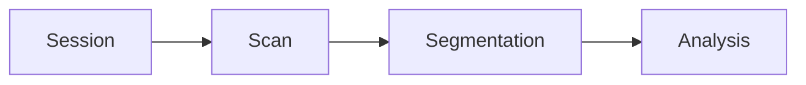

# The Relational Workflow Model

The relational data model has historically been interpreted through two
conceptual frameworks: Codd's mathematical foundation, which views tables as
logical predicates, and Chen's Entity-Relationship Model, which views tables
as entity types and relationships. The relational workflow model introduces a
third paradigm: **tables represent workflow steps, rows represent workflow
artifacts, and foreign key dependencies prescribe execution order.** This
adds an operational dimension absent from both predecessors—the schema
specifies not only what data exists but how it is derived.

The relational workflow model and its technical innovations are formally
defined in [Yatsenko & Nguyen, 2026](https://arxiv.org/abs/2602.16585).
DataJoint's schema definition language and query algebra were first
formalized in [Yatsenko et al., 2018](https://doi.org/10.48550/arXiv.1807.11104).

## Three Paradigms Compared

| Aspect | Mathematical (Codd) | Entity-Relationship (Chen) | **Relational Workflow (DataJoint)** |
|--------|---------------------|----------------------------|-------------------------------------|
| **Core question** | What functional dependencies exist? | What entity types exist? | **When/how are entities created?** |
| **Table semantics** | Logical predicate | Entity or relationship | **Workflow step** |
| **Row semantics** | True proposition | Entity instance | **Workflow artifact** |
| **Foreign keys** | Referential integrity | Relationship | **Execution order** |
| **Computation** | Not addressed | Not addressed | **Declared in schema** |
| **Provenance** | Not addressed | Not addressed | **Structural** |
| **Implementation gap** | High | High | **None** |

### Codd's Mathematical Foundation

Codd's mathematical foundation views tables as logical predicates and rows as
true propositions—rigorous but abstract.

### Chen's Entity-Relationship Model

Chen's Entity-Relationship Model shifted focus to domain modeling with
entities, attributes, and relationships—more intuitive, but lacking any
workflow or computational dimension.

## Core Concepts

### Workflow Steps and Artifacts

Tables are classified into tiers by data entry mode:

| Tier | Role | `make()` |
|------|------|----------|
| **Manual** | Receive direct user entry | No |
| **Lookup** | Hold reference data | No |
| **Imported** | Reach out to data sources outside the DataJoint system (instruments, electronic lab notebooks, external databases) | Yes |
| **Computed** | Derive their contents entirely from upstream DataJoint tables | Yes |

Imported and Computed tables define computations via `make()` methods. The
`make()` method specifies how each entity is derived—this computation logic is
declared within the table definition, making it part of the schema itself
rather than an external workflow specification.

### Dependencies as Foreign Keys

Foreign keys define computational dependencies, not only referential integrity.
The dependency graph is explicit, queryable, and enforced by the database.

```mermaid
graph LR
    A[Session] --> B[Scan]
    B --> C[Segmentation]
    C --> D[Analysis]
```

### Master-Part Relationships

Master-part relationships declare transactional grouping directly in the
schema: the master table represents the workflow step, while part tables hold
the individual items. Insertions and deletions cascade as a unit, enforcing
transactional semantics without application code.

### Directed Acyclic Graph

Dependencies between tables form a directed acyclic graph (DAG); aggregated
dependencies between schemas likewise form a DAG. Unlike task DAGs in
workflow managers, these are *relational schema* DAGs—they define data
structure and relationships, not just execution steps.

## Active Schemas

The key distinction from classical models: traditional schemas are
*passive*—containers for data produced by external processes. In the
relational workflow model, the schema is *active*—Computed tables declare how
their contents are derived, making the schema itself the workflow
specification. Schemas are defined as Python classes, and entire pipelines are
organized as self-contained code repositories—version-controlled, testable,
and deployable using standard software engineering practices.

A useful analogy: electronic spreadsheets unified data and computation—cells
with values alongside cells with formulas. Yet this integration never
penetrated relational databases in their 50+ years of history. The relational
workflow model brings to databases what spreadsheets brought to tabular
calculation: the recognition that data and the computations that produce it
belong together. The analogy has limits: spreadsheets' coupling is also the
source of their well-known fragility. DataJoint addresses this through formal
schema constraints and explicit dependency declaration rather than ad-hoc cell
references.

## Workflow Normalization

> **"Every table represents an entity type created at a specific workflow
> step, and all attributes describe that entity as it exists at that step."**

Database normalization decomposes data into tables to eliminate redundancy.
Classical normalization theory achieves this through normal forms based on
functional dependencies. Entity normalization asks whether each attribute
describes the entity identified by the primary key. Workflow normalization
extends these principles with a temporal dimension.

A Session table contains attributes known when the session is entered (date,
experimenter, subject). Analysis parameters determined later belong in
Computed tables that depend on Session. This discipline prevents tables that
accumulate attributes from different workflow stages, obscuring provenance and
complicating updates.

## Entity Integrity

All data is represented as well-formed entity sets with primary keys
identifying each entity uniquely. This eliminates redundancy and ensures
consistent updates.

When upstream data is deleted, dependent results cascade-delete
automatically—including associated objects in external storage. To correct
errors, you delete, reinsert, and recompute, ensuring every result represents
a consistent computation from valid inputs.

## Query Algebra

DataJoint provides a five-operator algebra:

| Operator | Symbol | Purpose |
|----------|--------|---------|
| **Restrict** | `&` | Filter entities by attribute values or membership in other relations |
| **Project** | `.proj()` | Select and rename attributes, compute derived values |
| **Join** | `*` | Combine related entities across relations |
| **Aggregate** | `.aggr()` | Group entities and compute summary statistics |
| **Union** | `+` | Combine entity sets with compatible structure |

The algebra achieves *algebraic closure*: every operator produces a valid
entity set with a well-defined primary key, enabling unlimited composition.
This preservation of entity integrity—every query result is itself a proper
entity set with clear identity—distinguishes DataJoint's algebra from SQL,
where query results lack both a well-defined primary key and a clear entity
type.

## From Transactions to Transformations

| Traditional View | Workflow View |
|------------------|---------------|
| Tables store data | Tables represent workflow steps |
| Rows are records | Rows are workflow artifacts |
| Foreign keys enforce consistency | Foreign keys prescribe execution order |
| Updates modify state | Computations create new states |
| Schemas organize storage | Schemas specify pipelines |
| Queries retrieve data | Queries trace provenance |

## Summary

The relational workflow model offers a new way to understand relational
databases—not merely as storage systems but as computational substrates. By
interpreting tables as workflow steps and foreign keys as execution
dependencies, the schema becomes a complete specification of how data is
derived, not just what data exists.
