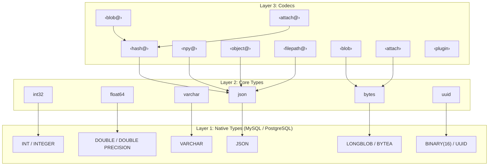

# Type System

DataJoint's type system provides a three-layer architecture that balances
database efficiency with Python convenience.

!!! version-added "New in 2.1"
    PostgreSQL support was added in DataJoint 2.1. Core types work identically on both MySQL and PostgreSQL backends.

## Three-Layer Architecture



Core types provide **portability** — the same table definition works on both MySQL and PostgreSQL. For example, `bytes` maps to `LONGBLOB` on MySQL but `BYTEA` on PostgreSQL; `uuid` maps to `BINARY(16)` on MySQL but native `UUID` on PostgreSQL. Native types can be used directly but sacrifice cross-backend compatibility.

## Layer 1: Native Database Types

Backend-specific types. **Can be used directly at the cost of portability.**

```python
# Native types — work but not portable
column : TINYINT UNSIGNED   # MySQL only
column : MEDIUMBLOB         # MySQL only (use BYTEA on PostgreSQL)
column : SERIAL             # PostgreSQL only
```

| MySQL | PostgreSQL | Portable Alternative |
|-------|------------|---------------------|
| `LONGBLOB` | `BYTEA` | `bytes` |
| `BINARY(16)` | `UUID` | `uuid` |
| `SMALLINT` | `SMALLINT` | `int16` |
| `DOUBLE` | `DOUBLE PRECISION` | `float64` |

## Layer 2: Core DataJoint Types

Standardized, scientist-friendly types that work identically across backends.

### Numeric Types

| Type | Description | Range |
|------|-------------|-------|
| `int8` | 8-bit signed | -128 to 127 |
| `int16` | 16-bit signed | -32,768 to 32,767 |
| `int32` | 32-bit signed | ±2 billion |
| `int64` | 64-bit signed | ±9 quintillion |
| `float32` | 32-bit float | ~7 significant digits |
| `float64` | 64-bit float | ~15 significant digits |
| `decimal(n,f)` | Fixed-point | Exact decimal |

Unsigned integer types are not provided. Choose a signed type with sufficient range for your data.

### String Types

| Type | Description |
|------|-------------|
| `char(n)` | Fixed-length string |
| `varchar(n)` | Variable-length string |
| `enum(...)` | Enumeration of string labels |

### Other Types

| Type | Description |
|------|-------------|
| `bool` | True/False |
| `date` | Date only |
| `datetime` | Date and time (UTC) |
| `json` | JSON document |
| `uuid` | Universally unique identifier |
| `bytes` | Raw binary |

## Layer 3: Codec Types

Codecs provide `encode()`/`decode()` semantics for complex Python objects.

### Syntax

Codec types use angle bracket notation:

- **Angle brackets**: `<blob>`, `<attach>`, `<object@store>`
- **`@` indicates object store**: `<blob@>` stores in the object store
- **Store name**: `<blob@cold>` uses named store "cold"

### Built-in Codecs

| Codec | Database | Object Store | Addressing | Returns |
|-------|----------|--------------|------------|---------|
| `<blob>` | ✅ | ✅ `<blob@>` | Hash | Python object |
| `<attach>` | ✅ | ✅ `<attach@>` | Hash | Local file path |
| `<npy@>` | ❌ | ✅ | Schema | NpyRef (lazy) |
| `<object@>` | ❌ | ✅ | Schema | ObjectRef |
| `<hash@>` | ❌ | ✅ | Hash | bytes |
| `<filepath@>` | ❌ | ✅ | User-managed | ObjectRef |

### Plugin Codecs

Additional schema-addressed codecs are available as separately installed packages. This ecosystem is actively expanding—new codecs are added as community needs arise.

| Package | Codec | Description | Repository |
|---------|-------|-------------|------------|
| `dj-zarr-codecs` | `<zarr@>` | Schema-addressed Zarr arrays with lazy chunked access | [datajoint/dj-zarr-codecs](https://github.com/datajoint/dj-zarr-codecs) |
| `dj-figpack-codecs` | `<figpack@>` | Schema-addressed interactive browser visualizations | [datajoint/dj-figpack-codecs](https://github.com/datajoint/dj-figpack-codecs) |
| `dj-photon-codecs` | `<photon@>` | Schema-addressed photon imaging data formats | [datajoint/dj-photon-codecs](https://github.com/datajoint/dj-photon-codecs) |

**Installation and discovery:**

Plugin codecs use Python's entry point mechanism for automatic registration. Install the package and DataJoint discovers the codec automatically:

```bash
pip install dj-zarr-codecs
```

```python
import datajoint as dj

# Codec is available immediately after install
@schema
class Analysis(dj.Computed):
    definition = """
    -> Recording
    ---
    data : <zarr@store>
    """
```

Packages declare their codecs in `pyproject.toml` under the `datajoint.codecs` entry point group:

```toml
[project.entry-points."datajoint.codecs"]
zarr = "dj_zarr_codecs:ZarrCodec"
```

DataJoint loads these entry points on first use, making third-party codecs indistinguishable from built-ins.

### `<blob>` — Serialized Python Objects

Stores NumPy arrays, dicts, lists, and other Python objects using DataJoint's custom binary serialization format. The blob type has been in continuous use in DataJoint pipelines for 15+ years and maintains full backward compatibility. It provides an efficient way to serialize complex objects into an opaque binary string.

!!! note "Modern alternatives"
    Schema-addressed codecs introduced in DataJoint 2.0 (`<npy@>`, `<object@>`, and plugin codecs) offer modern high-performance accessibility with transparent formats, lazy loading, and browsable storage paths—while maintaining rigorous data integrity and consistency. Consider these for new pipelines where interoperability and direct data access are priorities.

**Serialization format:**

- **Protocol headers**:
  - `mYm` — MATLAB-compatible format (see [mYm on MATLAB FileExchange](https://www.mathworks.com/matlabcentral/fileexchange/81208-mym) and [mym on GitHub](https://github.com/datajoint/mym))
  - `dj0` — Python-extended format supporting additional types
- **Optional compression**: zlib compression for data > 1KB
- **Type-specific encoding**: Each Python type has a specific serialization code
- **Version detection**: Protocol header embedded in blob enables format detection

**Supported types:**

- NumPy arrays (numeric, structured, recarrays)
- Collections (dict, list, tuple, set)
- Scalars (int, float, bool, complex, str, bytes)
- Date/time objects (datetime, date, time)
- UUID, Decimal

```python
class Results(dj.Computed):
    definition = """
    -> Analysis
    ---
    spike_times : <blob>        # In database
    waveforms : <blob@>         # Object store, default store
    raw_data : <blob@archive>   # Object store, 'archive' store
    """
```

**Storage modes:**

- `<blob>` — Stored in database as LONGBLOB (up to ~1GB depending on MySQL config)
- `<blob@>` — Stored in object store via `<hash@>` with MD5 deduplication

### `<attach>` — File Attachments

Stores files with filename preserved.

```python
class Config(dj.Manual):
    definition = """
    config_id : int
    ---
    settings : <attach>         # Small config file in database
    data_file : <attach@>       # Large file in object store
    """
```

### `<npy@>` — NumPy Arrays as .npy Files

Schema-addressed storage for NumPy arrays as standard `.npy` files. Returns `NpyRef` which provides metadata access (shape, dtype) without downloading.

```python
class Recording(dj.Computed):
    definition = """
    -> Session
    ---
    waveform : <npy@>           # Default store
    spectrogram : <npy@archive> # Named store
    """
```

**Lazy access:**

```python
ref = (Recording & key).fetch1('waveform')
ref.shape   # (1000, 32) — no download
ref.dtype   # float64 — no download

# Explicit load
arr = ref.load()

# Transparent numpy integration
result = np.mean(ref)  # Downloads automatically
```

**Key features:**

- **Portable format**: Standard `.npy` readable by NumPy, MATLAB, etc.
- **Lazy loading**: Shape/dtype available without I/O
- **Safe bulk fetch**: Fetching many rows doesn't download until needed
- **Memory mapping**: `ref.load(mmap_mode='r')` for random access to large arrays

### `<object@>` — Schema-Addressed Storage

Schema-addressed storage for files and folders. Path mirrors the database structure: `{schema}/{table}/{pk}/{attribute}`.

```python
class ProcessedData(dj.Computed):
    definition = """
    -> Recording
    ---
    results : <object@>       # Stored at {schema}/{table}/{pk}/results/
    """
```

Accepts files, folders, or bytes. Returns `ObjectRef` for lazy access.

### `<filepath@store>` — Portable References

References to independently-managed files with portable paths.

```python
class RawData(dj.Manual):
    definition = """
    session_id : int
    ---
    recording : <filepath@raw>  # Relative to 'raw' store
    """
```

## Storage Modes

Object store codecs use one of two addressing schemes:

**Hash-addressed** — Path derived from content hash (e.g., `_hash/ab/cd/abcd1234...`). Provides automatic deduplication—identical content stored once. Used by `<blob@>`, `<attach@>`, `<hash@>`.

**Schema-addressed** — Path mirrors database structure: `{schema}/{table}/{pk}/{attribute}`. Human-readable, browsable paths that reflect your data organization. No deduplication. Used by `<object@>`, `<npy@>`, and plugin codecs (`<zarr@>`, `<figpack@>`, `<photon@>`).

| Mode | Database | Object Store | Deduplication | Use Case |
|------|----------|--------------|---------------|----------|
| Database | Data | — | — | Small data |
| Hash-addressed | Metadata | Content hash path | ✅ Automatic | Large/repeated data |
| Schema-addressed | Metadata | Schema-mirrored path | ❌ None | Complex files, browsable storage |

## Custom Codecs

Extend the type system for domain-specific data:

```python
class GraphCodec(dj.Codec):
    """Store NetworkX graphs."""
    name = "graph"

    def get_dtype(self, is_store):
        return "<blob>"

    def encode(self, graph, *, key=None, store_name=None):
        return {
            'nodes': list(graph.nodes()),
            'edges': list(graph.edges())
        }

    def decode(self, stored, *, key=None):
        import networkx as nx
        G = nx.Graph()
        G.add_nodes_from(stored['nodes'])
        G.add_edges_from(stored['edges'])
        return G
```

Usage:

```python
class Network(dj.Computed):
    definition = """
    -> Analysis
    ---
    connectivity : <graph>
    """
```

## Choosing Types

| Data | Recommended Type |
|------|------------------|
| Small scalars | Core types (`int32`, `float64`) |
| Short strings | `varchar(n)` |
| NumPy arrays (small) | `<blob>` |
| NumPy arrays (large) | `<npy@>` or `<blob@>` |
| Files to attach | `<attach>` or `<attach@>` |
| Zarr arrays | `<zarr@>` (plugin) |
| Complex file structures | `<object@>` |
| Interactive visualizations | `<figpack@>` (plugin) |
| File references (in-store) | `<filepath@store>` |
| Custom objects | Custom codec |

## Summary

1. **Core types** for simple data — `int32`, `varchar`, `datetime`
2. **`<blob>`** for Python objects — NumPy arrays, dicts
3. **`@` suffix** for object store — `<blob@>`, `<object@>`
4. **Custom codecs** for domain-specific types

## See Also

**How-to Guides:**

- [Choose a Storage Type](../how-to/choose-storage-type.md) — Decision guide for selecting the right type
- [Configure Object Storage](../how-to/configure-storage.md) — Setting up stores for external data
- [Use Object Storage](../how-to/use-object-storage.md) — Working with `<blob@>`, `<attach@>`, `<object@>`
- [Use the npy Codec](../how-to/use-npy-codec.md) — Storing NumPy arrays as `.npy` files
- [Use Plugin Codecs](../how-to/use-plugin-codecs.md) — Installing and using third-party codecs
- [Create a Custom Codec](../how-to/create-custom-codec.md) — Building your own codec

**Reference:**

- [Type System Specification](../reference/specs/type-system.md) — Complete type reference
- [Codec API](../reference/specs/codec-api.md) — Codec class interface
- [npy Codec Specification](../reference/specs/npy-codec.md) — NpyRef and NpyCodec details
- [Object Store Configuration](../reference/specs/object-store-configuration.md) — Store settings reference
