# Type System

DataJoint's type system provides a three-layer architecture that balances
database efficiency with Python convenience.

## Three-Layer Architecture

```mermaid
graph TB
    subgraph "Layer 3: Codecs"
        blob["‹blob›"]
        attach["‹attach›"]
        object["‹object@›"]
        hash["‹hash@›"]
        custom["‹custom›"]
    end
    subgraph "Layer 2: Core Types"
        int32
        float64
        varchar
        json
        bytes
    end
    subgraph "Layer 1: Native"
        INT["INT"]
        DOUBLE["DOUBLE"]
        VARCHAR["VARCHAR"]
        JSON_N["JSON"]
        BLOB["LONGBLOB"]
    end

    blob --> bytes
    attach --> bytes
    object --> json
    hash --> json
    bytes --> BLOB
    json --> JSON_N
    int32 --> INT
    float64 --> DOUBLE
    varchar --> VARCHAR
```



## Layer 1: Native Database Types

Backend-specific types (MySQL, PostgreSQL). **Discouraged for direct use.**

```python
# Native types (avoid)
column : TINYINT UNSIGNED
column : MEDIUMBLOB
```

## Layer 2: Core DataJoint Types

Standardized, scientist-friendly types that work identically across backends.

### Numeric Types

| Type | Description | Range |
|------|-------------|-------|
| `int8` | 8-bit signed | -128 to 127 |
| `int16` | 16-bit signed | -32,768 to 32,767 |
| `int32` | 32-bit signed | ±2 billion |
| `int64` | 64-bit signed | ±9 quintillion |
| `int16` | 8-bit unsigned | 0 to 255 |
| `int32` | 16-bit unsigned | 0 to 65,535 |
| `int64` | 32-bit unsigned | 0 to 4 billion |
| `int64` | 64-bit unsigned | 0 to 18 quintillion |
| `float32` | 32-bit float | ~7 significant digits |
| `float64` | 64-bit float | ~15 significant digits |
| `decimal(n,f)` | Fixed-point | Exact decimal |

### String Types

| Type | Description |
|------|-------------|
| `char(n)` | Fixed-length string |
| `varchar(n)` | Variable-length string |
| `enum(...)` | Enumeration of string labels |

### Other Types

| Type | Description |
|------|-------------|
| `bool` | True/False |
| `date` | Date only |
| `datetime` | Date and time (UTC) |
| `json` | JSON document |
| `uuid` | Universally unique identifier |
| `bytes` | Raw binary |

## Layer 3: Codec Types

Codecs provide `encode()`/`decode()` semantics for complex Python objects.

### Syntax

- **Angle brackets**: `<blob>`, `<attach>`, `<object@store>`
- **`@` indicates external storage**: `<blob@>` stores externally
- **Store name**: `<blob@cold>` uses named store "cold"

### Built-in Codecs

| Codec | Internal | External | Returns |
|-------|----------|----------|---------|
| `<blob>` | ✅ | ✅ `<blob@>` | Python object |
| `<attach>` | ✅ | ✅ `<attach@>` | Local file path |
| `<object@>` | ❌ | ✅ | ObjectRef |
| `<hash@>` | ❌ | ✅ | bytes |
| `<filepath@>` | ❌ | ✅ | ObjectRef |

### `<blob>` — Serialized Python Objects

Stores NumPy arrays, dicts, lists, and other Python objects using DataJoint's custom binary serialization format.

**Serialization format:**
- **Protocol headers**:
  - `mYm` — MATLAB-compatible format (see [mYm on MATLAB FileExchange](https://www.mathworks.com/matlabcentral/fileexchange/81208-mym) and [mym on GitHub](https://github.com/datajoint/mym))
  - `dj0` — Python-extended format supporting additional types
- **Optional compression**: zlib compression for data > 1KB
- **Type-specific encoding**: Each Python type has a specific serialization code
- **Version detection**: Protocol header embedded in blob enables format detection

**Supported types:**
- NumPy arrays (numeric, structured, recarrays)
- Collections (dict, list, tuple, set)
- Scalars (int, float, bool, complex, str, bytes)
- Date/time objects (datetime, date, time)
- UUID, Decimal

```python
class Results(dj.Computed):
    definition = """
    -> Analysis
    ---
    spike_times : <blob>        # In database
    waveforms : <blob@>         # External, default store
    raw_data : <blob@archive>   # External, 'archive' store
    """
```

**Storage modes:**
- `<blob>` — Stored in database as LONGBLOB (up to ~1GB depending on MySQL config)
- `<blob@>` — Stored externally via `<hash@>` with MD5 deduplication

### `<attach>` — File Attachments

Stores files with filename preserved.

```python
class Config(dj.Manual):
    definition = """
    config_id : int
    ---
    settings : <attach>         # Small config file
    data_file : <attach@>       # Large file, external
    """
```

### `<object@>` — Path-Addressed Storage

For large/complex file structures (Zarr, HDF5). Path derived from primary key.

```python
class ProcessedData(dj.Computed):
    definition = """
    -> Recording
    ---
    zarr_data : <object@>       # Stored at {schema}/{table}/{pk}/
    """
```

### `<filepath@store>` — Portable References

References to externally-managed files with portable paths.

```python
class RawData(dj.Manual):
    definition = """
    session_id : int
    ---
    recording : <filepath@raw>  # Relative to 'raw' store
    """
```

## Storage Modes

| Mode | Database Storage | External Storage | Use Case |
|------|------------------|------------------|----------|
| Internal | Yes | No | Small data |
| External | Metadata only | Yes | Large data |
| Hash-addressed | Metadata only | Deduplicated | Repeated data |
| Path-addressed | Metadata only | PK-based path | Complex files |

## Custom Codecs

Extend the type system for domain-specific data:

```python
class GraphCodec(dj.Codec):
    """Store NetworkX graphs."""
    name = "graph"

    def get_dtype(self, is_external):
        return "<blob>"

    def encode(self, graph, *, key=None, store_name=None):
        return {
            'nodes': list(graph.nodes()),
            'edges': list(graph.edges())
        }

    def decode(self, stored, *, key=None):
        import networkx as nx
        G = nx.Graph()
        G.add_nodes_from(stored['nodes'])
        G.add_edges_from(stored['edges'])
        return G
```

Usage:

```python
class Network(dj.Computed):
    definition = """
    -> Analysis
    ---
    connectivity : <graph>
    """
```

## Choosing Types

| Data | Recommended Type |
|------|------------------|
| Small scalars | Core types (`int32`, `float64`) |
| Short strings | `varchar(n)` |
| NumPy arrays (small) | `<blob>` |
| NumPy arrays (large) | `<blob@>` |
| Files to attach | `<attach>` or `<attach@>` |
| Zarr/HDF5 | `<object@>` |
| External file refs | `<filepath@store>` |
| Custom objects | Custom codec |

## Summary

1. **Core types** for simple data — `int32`, `varchar`, `datetime`
2. **`<blob>`** for Python objects — NumPy arrays, dicts
3. **`@` suffix** for external storage — `<blob@>`, `<object@>`
4. **Custom codecs** for domain-specific types
