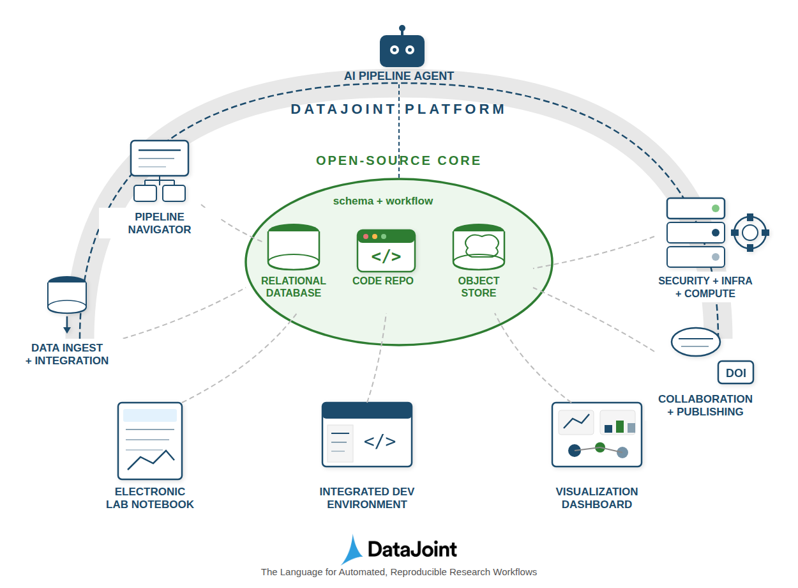
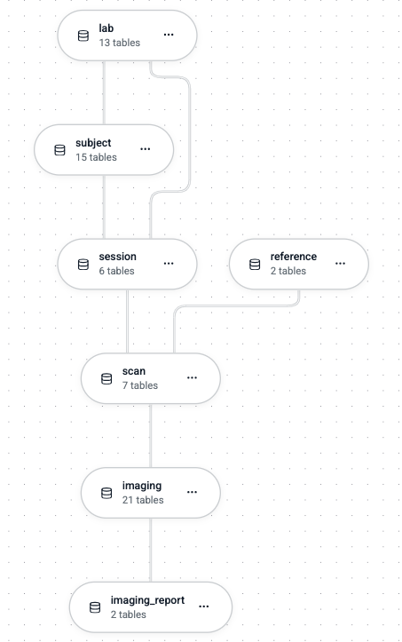
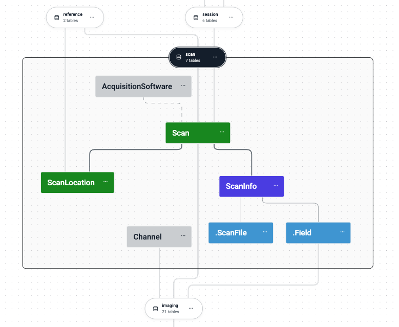

# Manage a Pipeline Project

Organize multi-schema pipelines for team collaboration.

## Overview

A production DataJoint pipeline typically involves:

- **Multiple schemas** — Organized by experimental modality or processing stage
- **Team of users** — With different roles and access levels
- **Shared infrastructure** — Database server, object storage, code repository
- **Coordination** — Between code, database, and storage permissions

This guide outlines the key considerations. For a fully managed solution, [request a DataJoint Platform account](https://www.datajoint.com/sign-up).

## Pipeline Architecture

A DataJoint pipeline integrates three core components:



**Core components:**

- **Code Repository** — Version-controlled pipeline definitions, analysis code, configuration
- **Relational Database** — Metadata store, system of record, integrity enforcement
- **Object Store** — Scalable storage for large scientific data (images, recordings, videos)

## Pipeline as a DAG

A DataJoint pipeline forms a **Directed Acyclic Graph (DAG)** at two levels:



**Nodes** represent Python modules, which correspond to database schemas.

**Edges** represent:

- Python import dependencies between modules
- Bundles of foreign key references between schemas

This dual structure ensures that both code dependencies and data dependencies flow in the same direction.

## Schema Organization

Each schema corresponds to a dedicated Python module:



### Project Structure

Use a modern Python project layout with source code under `src/`:

```
my_pipeline/
├── datajoint.json          # Shared settings (committed)
├── .secrets/               # Local credentials (gitignored)
│   ├── database.password
│   └── storage.credentials
├── .gitignore
├── pyproject.toml          # Package metadata and dependencies
├── README.md
├── src/
│   └── my_pipeline/
│       ├── __init__.py
│       ├── subject.py      # subject schema
│       ├── session.py      # session schema
│       ├── ephys.py        # ephys schema
│       ├── imaging.py      # imaging schema
│       ├── analysis.py     # analysis schema
│       └── utils/
│           └── __init__.py
├── tests/
│   ├── conftest.py
│   └── test_ephys.py
└── docs/
    └── ...
```

### One Module Per Schema

Each module defines and binds to its schema:

```python
# src/my_pipeline/ephys.py
import datajoint as dj
from . import session  # Import dependency

schema = dj.Schema('ephys')

@schema
class Probe(dj.Lookup):
    definition = """
    probe_type : varchar(32)
    ---
    num_channels : uint16
    """

@schema
class Recording(dj.Imported):
    definition = """
    -> session.Session
    -> Probe
    ---
    recording_path : varchar(255)
    """
```

### Import Dependencies Mirror Foreign Keys

Module imports reflect the schema DAG:

```python
# analysis.py depends on both ephys and imaging
from . import ephys
from . import imaging

schema = dj.Schema('analysis')

@schema
class MultiModalAnalysis(dj.Computed):
    definition = """
    -> ephys.Recording
    -> imaging.Scan
    ---
    correlation : float64
    """
```

### DAG Constraints

> **All foreign key relationships within a schema MUST form a DAG.**
>
> **Dependencies between schemas (foreign keys + imports) MUST also form a DAG.**

This ensures unidirectional flow of data and computational dependencies throughout the pipeline.

## Repository Configuration

### Shared Settings

Store non-secret configuration in `datajoint.json` at the project root:

**datajoint.json** (committed):
```json
{
  "database": {
    "host": "db.example.com",
    "port": 3306
  },
  "stores": {
    "main": {
      "protocol": "s3",
      "endpoint": "s3.example.com",
      "bucket": "my-org-data",
      "location": "my_pipeline"
    }
  }
}
```

### Credentials Management

Credentials are stored locally and never committed:

**Option 1: `.secrets/` directory**
```
.secrets/
├── database.user
├── database.password
├── storage.access_key
└── storage.secret_key
```

**Option 2: Environment variables**
```bash
export DJ_USER=alice
export DJ_PASS=alice_password
export DJ_STORES__MAIN__ACCESS_KEY=...
export DJ_STORES__MAIN__SECRET_KEY=...
```

### Essential `.gitignore`

```gitignore
# Credentials
.secrets/

# Python
__pycache__/
*.pyc
*.egg-info/
dist/
build/

# Environment
.env
.venv/

# IDE
.idea/
.vscode/
```

### `pyproject.toml` Example

```toml
[project]
name = "my-pipeline"
version = "1.0.0"
requires-python = ">=3.10"
dependencies = [
    "datajoint>=2.0",
    "numpy",
]

[project.optional-dependencies]
dev = ["pytest", "pytest-cov"]

[tool.setuptools.packages.find]
where = ["src"]
```

## Database Access Control

### The Complexity

Multi-user database access requires:

1. **User accounts** — Individual credentials per team member
2. **Schema permissions** — Which users can access which schemas
3. **Operation permissions** — SELECT, INSERT, UPDATE, DELETE, CREATE, DROP
4. **Role hierarchy** — Admin, developer, analyst, viewer
5. **Audit trail** — Who modified what and when

### Basic MySQL Grants

```sql
-- Create user
CREATE USER 'alice'@'%' IDENTIFIED BY 'password';

-- Grant read-only on specific schema
GRANT SELECT ON ephys.* TO 'alice'@'%';

-- Grant read-write on specific schema
GRANT SELECT, INSERT, UPDATE, DELETE ON analysis.* TO 'alice'@'%';

-- Grant full access (developers)
GRANT ALL PRIVILEGES ON my_pipeline_*.* TO 'bob'@'%';
```

### Role-Based Access Patterns

| Role | Permissions | Typical Use |
|------|-------------|-------------|
| Viewer | SELECT | Browse data, run queries |
| Analyst | SELECT, INSERT on analysis | Add analysis results |
| Operator | SELECT, INSERT, DELETE on data schemas | Run pipeline |
| Developer | ALL on development schemas | Schema changes |
| Admin | ALL + GRANT | User management |

### Considerations

- Users need SELECT on parent schemas to INSERT into child schemas (FK validation)
- Cascading deletes require DELETE on all dependent schemas
- Schema creation requires CREATE privilege
- Coordinating permissions across many schemas becomes complex

## Object Storage Access Control

### The Complexity

Object storage permissions must align with database permissions:

1. **Bucket/prefix policies** — Map to schema access
2. **Read vs write** — Match SELECT vs INSERT/UPDATE
3. **Credential distribution** — Per-user or shared service accounts
4. **Cross-schema objects** — When computed tables reference multiple inputs

### Hierarchical Storage Structure

A DataJoint project creates a structured storage pattern:

```
📁 project_name/
├── 📁 schema_name1/
├── 📁 schema_name2/
├── 📁 schema_name3/
│   ├── objects/
│   │   └── table1/
│   │       └── key1-value1/
│   └── fields/
│       └── table1-field1/
└── ...
```

### S3/MinIO Policy Example

```json
{
  "Version": "2012-10-17",
  "Statement": [
    {
      "Effect": "Allow",
      "Action": ["s3:GetObject"],
      "Resource": "arn:aws:s3:::my-lab-data/datajoint/ephys/*"
    },
    {
      "Effect": "Allow",
      "Action": ["s3:GetObject", "s3:PutObject"],
      "Resource": "arn:aws:s3:::my-lab-data/datajoint/analysis/*"
    }
  ]
}
```

### Considerations

- Object paths include schema name: `{project}/{schema}/{table}/...`
- Users need read access to fetch blobs from upstream schemas
- Content-addressed storage (`<blob@>`) shares objects across tables
- Garbage collection requires coordinated delete permissions

## Pipeline Initialization

### Schema Creation Order

Initialize schemas in dependency order:

```python
# src/my_pipeline/__init__.py
from . import subject   # No dependencies
from . import session   # Depends on subject
from . import ephys     # Depends on session
from . import imaging   # Depends on session
from . import analysis  # Depends on ephys, imaging

def initialize():
    """Create all schemas in dependency order."""
    # Schemas are created when modules are imported
    # and tables are first accessed
    subject.Subject()
    session.Session()
    ephys.Recording()
    imaging.Scan()
    analysis.MultiModalAnalysis()
```

### Version Coordination

Track schema versions with your code:

```python
# src/my_pipeline/version.py
__version__ = "1.2.0"

SCHEMA_VERSIONS = {
    'subject': '1.0.0',
    'session': '1.1.0',
    'ephys': '1.2.0',
    'imaging': '1.2.0',
    'analysis': '1.2.0',
}
```

## Team Workflows

### Development vs Production

```
┌─────────────────┐     ┌─────────────────┐
│   Development   │     │   Production    │
├─────────────────┤     ├─────────────────┤
│ dev_subject     │     │ subject         │
│ dev_session     │     │ session         │
│ dev_ephys       │     │ ephys           │
└─────────────────┘     └─────────────────┘
        │                       │
        │    Schema promotion   │
        └───────────────────────┘
```

### Branching Strategy

```
main ────────────────────────────────────▶
       │              │
       │ feature/     │ hotfix/
       ▼              ▼
    ephys-v2      fix-recording
       │              │
       └──────────────┴──▶ main
```

## Summary of Complexities

Managing a team pipeline requires coordinating:

| Component | Challenges |
|-----------|------------|
| **Code** | Module dependencies, version control, deployment |
| **Database** | User accounts, schema permissions, role hierarchy |
| **Object Storage** | Bucket policies, credential distribution, path alignment |
| **Compute** | Worker deployment, job distribution, resource allocation |
| **Monitoring** | Progress tracking, error alerting, audit logging |

These challenges grow with team size and pipeline complexity. The [DataJoint Platform](https://www.datajoint.com/sign-up) provides integrated management for all these concerns.

## See Also

- [Configure Object Storage](configure-storage.md) — Storage setup
- [Distributed Computing](distributed-computing.md) — Multi-worker pipelines
- [Model Relationships](model-relationships.md) — Foreign key patterns
