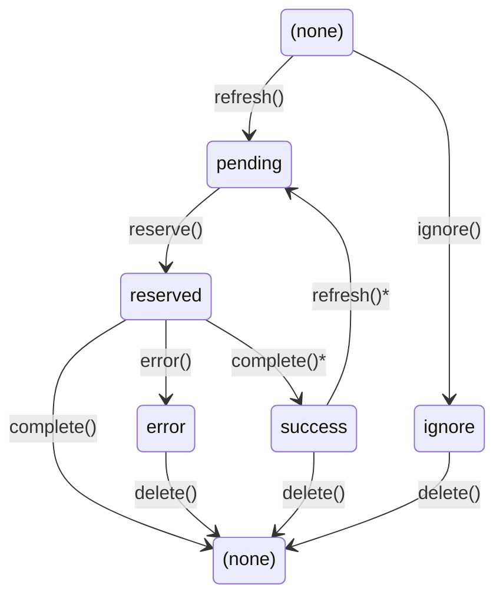

# AutoPopulate Specification

## Overview

AutoPopulate is DataJoint's mechanism for automated computation. Tables that inherit from `dj.Computed` or `dj.Imported` automatically populate themselves by executing a `make()` method for each entry defined by their dependencies.

This specification covers:
- The populate process and key source calculation
- Transaction management and atomicity
- The `make()` method and tripartite pattern
- Part tables in computed results
- Distributed computing with job reservation

---

## 1. Auto-Populated Tables

### 1.1 Table Types

| Type | Base Class | Purpose |
|------|------------|---------|
| Computed | `dj.Computed` | Results derived from other DataJoint tables |
| Imported | `dj.Imported` | Data ingested from external sources (files, instruments) |

Both types share the same AutoPopulate mechanism. The distinction is semantic—`Imported` indicates external data sources while `Computed` indicates derivation from existing tables.

### 1.2 Basic Structure

```python
@schema
class FilteredImage(dj.Computed):
    definition = """
    -> RawImage
    ---
    filtered : <blob>
    """

    def make(self, key):
        # Fetch source data
        raw = (RawImage & key).fetch1('image')

        # Compute result
        filtered = apply_filter(raw)

        # Insert result
        self.insert1({**key, 'filtered': filtered})
```

### 1.3 Primary Key Constraint

Auto-populated tables must have primary keys composed entirely of foreign key references:

```python
# Correct: all PK attributes from foreign keys
@schema
class Analysis(dj.Computed):
    definition = """
    -> Session
    -> AnalysisMethod
    ---
    result : float64
    """

# Error: non-FK primary key attribute
@schema
class Analysis(dj.Computed):
    definition = """
    -> Session
    method : varchar(32)   # Not allowed - use FK to lookup table
    ---
    result : float64
    """
```

**Rationale:** This ensures each computed entry is uniquely determined by its upstream dependencies, enabling automatic key source calculation and precise job tracking.

---

## 2. Key Source Calculation

### 2.1 Definition

The `key_source` property defines which entries should exist in the table—the complete set of primary keys that `make()` should be called with.

### 2.2 Automatic Key Source

By default, DataJoint automatically calculates `key_source` as the join of all tables referenced by foreign keys in the primary key:

```python
@schema
class SpikeDetection(dj.Computed):
    definition = """
    -> Recording
    -> DetectionMethod
    ---
    spike_times : <blob>
    """
    # Automatic key_source = Recording * DetectionMethod
```

**Calculation rules:**
1. Identify all foreign keys in the primary key section
2. Join the referenced tables: `Parent1 * Parent2 * ...`
3. Project to primary key attributes only

For a table with definition:
```python
-> Session
-> Probe
-> SortingMethod
---
units : <blob>
```

The automatic `key_source` is:
```python
Session * Probe * SortingMethod
```

This produces all valid combinations of (session, probe, method) that could be computed.

### 2.3 Custom Key Source

Override `key_source` to customize which entries to compute:

```python
@schema
class QualityAnalysis(dj.Computed):
    definition = """
    -> Session
    ---
    score : float64
    """

    @property
    def key_source(self):
        # Only process sessions marked as 'good'
        return Session & "quality = 'good'"
```

**Common customizations:**

```python
# Filter by condition
@property
def key_source(self):
    return Session & "status = 'complete'"

# Restrict to specific combinations
@property
def key_source(self):
    return Recording * Method & "method_name != 'deprecated'"

# Add complex logic
@property
def key_source(self):
    # Only sessions with enough trials
    good_sessions = dj.U('session_id').aggr(
        Trial, n='count(*)') & 'n >= 100'
    return Session & good_sessions
```

### 2.4 Pending Entries

Entries to be computed = `key_source - self`:

```python
# Entries that should exist but don't yet
pending = table.key_source - table

# Check how many entries need computing
n_pending = len(table.key_source - table)
```

---

## 3. The Populate Process

### 3.1 Basic Populate

The `populate()` method iterates through pending entries and calls `make()` for each:

```python
# Populate all pending entries
FilteredImage.populate()
```

**Execution flow (direct mode):**

```
1. Calculate pending keys: key_source - self
2. Apply restrictions: pending & restrictions
3. For each key in pending:
   a. Start transaction
   b. Call make(key)
   c. Commit transaction (or rollback on error)
4. Return summary
```

### 3.2 Method Signature

```python
def populate(
    self,
    *restrictions,
    suppress_errors: bool = False,
    return_exception_objects: bool = False,
    reserve_jobs: bool = False,
    max_calls: int = None,
    display_progress: bool = False,
    processes: int = 1,
    make_kwargs: dict = None,
    priority: int = None,
    refresh: bool = None,
) -> dict
```

### 3.3 Parameters

| Parameter | Default | Description |
|-----------|---------|-------------|
| `*restrictions` | — | Filter `key_source` to subset of entries |
| `suppress_errors` | `False` | Continue on errors instead of raising |
| `return_exception_objects` | `False` | Return exception objects vs strings |
| `reserve_jobs` | `False` | Enable job reservation for distributed computing |
| `max_calls` | `None` | Maximum number of `make()` calls |
| `display_progress` | `False` | Show progress bar |
| `processes` | `1` | Number of parallel worker processes |
| `make_kwargs` | `None` | Additional kwargs passed to `make()` |
| `priority` | `None` | Process only jobs at this priority or more urgent |
| `refresh` | `None` | Refresh jobs queue before processing |

### 3.4 Common Usage Patterns

```python
# Populate everything
Analysis.populate()

# Populate specific subjects
Analysis.populate(Subject & "subject_id < 10")

# Populate with progress bar
Analysis.populate(display_progress=True)

# Populate limited batch
Analysis.populate(max_calls=100)

# Populate with error collection
errors = Analysis.populate(suppress_errors=True)

# Parallel populate (single machine)
Analysis.populate(processes=4)
```

### 3.5 Return Value

```python
result = Analysis.populate()
# {
#     'success': 150,    # Entries successfully computed
#     'error': 3,        # Entries that failed
#     'skip': 0,         # Entries skipped (already exist)
# }
```

---

## 4. The make() Method

### 4.1 Basic Pattern

The `make()` method computes and inserts one entry:

```python
def make(self, key):
    """
    Compute and insert one entry.

    Parameters
    ----------
    key : dict
        Primary key values identifying which entry to compute.
    """
    # 1. Fetch source data
    source_data = (SourceTable & key).fetch1()

    # 2. Compute result
    result = compute(source_data)

    # 3. Insert result
    self.insert1({**key, **result})
```

### 4.2 Requirements

- **Must insert**: `make()` must insert exactly one row matching the key
- **Idempotent**: Same input should produce same output
- **Atomic**: Runs within a transaction—all or nothing
- **Self-contained**: Should not depend on external state that changes

### 4.3 Accessing Source Data

```python
def make(self, key):
    # Fetch single row
    data = (SourceTable & key).fetch1()

    # Fetch specific attributes
    image, timestamp = (Recording & key).fetch1('image', 'timestamp')

    # Fetch multiple rows (e.g., trials for a session)
    trials = (Trial & key).to_dicts()

    # Join multiple sources
    combined = (TableA * TableB & key).to_dicts()
```

**Upstream-only convention:** Inside `make()`, fetch only from tables that are strictly upstream in the pipeline—tables referenced by foreign keys in the definition, their ancestors, and their part tables. This ensures reproducibility: computed results depend only on their declared dependencies.

This convention is not currently enforced programmatically but is critical for pipeline integrity. Some pipelines violate this rule for operational reasons, which makes them non-reproducible. A future release may programmatically enforce upstream-only fetches inside `make()`.

### 4.4 Tripartite Make Pattern

For long-running computations, use the tripartite pattern to separate fetch, compute, and insert phases. This enables better transaction management for jobs that take minutes or hours.

**Method-based tripartite:**

```python
@schema
class HeavyComputation(dj.Computed):
    definition = """
    -> Recording
    ---
    result : <blob>
    """

    def make_fetch(self, key, **kwargs):
        """Fetch all required data (runs in transaction).

        kwargs are passed from populate(make_kwargs={...}).
        """
        return (Recording & key).fetch1('raw_data')

    def make_compute(self, key, data):
        """Perform computation (runs outside transaction)."""
        # Long-running computation - no database locks held
        return heavy_algorithm(data)

    def make_insert(self, key, result):
        """Insert results (runs in transaction)."""
        self.insert1({**key, 'result': result})
```

**Generator-based tripartite:**

```python
def make(self, key):
    # Phase 1: Fetch (in transaction)
    data = (Recording & key).fetch1('raw_data')

    yield  # Exit transaction, release locks

    # Phase 2: Compute (outside transaction)
    result = heavy_algorithm(data)  # May take hours

    yield  # Re-enter transaction

    # Phase 3: Insert (in transaction)
    self.insert1({**key, 'result': result})
```

**When to use tripartite:**
- Computation takes more than a few seconds
- You want to avoid holding database locks during computation
- Working with external resources (files, APIs) that may be slow

### 4.5 Additional make() Arguments

Pass extra arguments via `make_kwargs`:

```python
@schema
class ConfigurableAnalysis(dj.Computed):
    definition = """
    -> Session
    ---
    result : float64
    """

    def make(self, key, threshold=0.5, method='default'):
        data = (Session & key).fetch1('data')
        result = analyze(data, threshold=threshold, method=method)
        self.insert1({**key, 'result': result})

# Call with custom parameters
ConfigurableAnalysis.populate(make_kwargs={'threshold': 0.8})
```

**Tripartite pattern:** When using the method-based tripartite pattern, `make_kwargs` are passed to `make_fetch()`:

```python
def make_fetch(self, key, verbose=False, **kwargs):
    if verbose:
        print(f"Fetching {key}")
    return (Source & key).fetch1('data')
```

**Anti-pattern warning:** Passing arguments that affect the computed result breaks reproducibility—all inputs should come from `fetch` calls inside `make()`. If a parameter affects results, it should be stored in a lookup table and referenced via foreign key.

**Acceptable use:** Directives that don't affect results, such as:
- `verbose=True` for logging
- `gpu_id=0` for device selection
- `n_workers=4` for parallelization

---

## 5. Transaction Management

### 5.1 Automatic Transactions

Each `make()` call runs within an automatic transaction:

```python
# Pseudocode for populate loop
for key in pending_keys:
    connection.start_transaction()
    try:
        self.make(key)
        connection.commit()
    except Exception:
        connection.rollback()
        raise  # or log if suppress_errors=True
```

### 5.2 Atomicity Guarantees

- **All or nothing**: If `make()` fails, no partial data is inserted
- **Isolation**: Concurrent workers see consistent state
- **Rollback on error**: Any exception rolls back the transaction

```python
def make(self, key):
    # If this succeeds...
    self.insert1({**key, 'step1': result1})

    # But this fails...
    self.Part.insert(part_data)  # Raises exception

    # Both inserts are rolled back - table unchanged
```

### 5.3 Transaction Scope

**Simple make (single transaction):**
```
BEGIN TRANSACTION
  └── make(key)
       ├── fetch source data
       ├── compute
       └── insert result
COMMIT
```

**Tripartite make (single transaction):**
```
[No transaction]
  ├── make_fetch(key)           # Fetch source data
  └── make_compute(key, data)   # Long-running computation

BEGIN TRANSACTION
  ├── make_fetch(key)           # Repeat fetch, verify unchanged
  └── make_insert(key, result)  # Insert computed result
COMMIT
```

This pattern allows long computations without holding database locks, while ensuring data consistency by verifying the source data hasn't changed before inserting.

### 5.4 Nested Operations

Inserts within `make()` share the same transaction:

```python
def make(self, key):
    # Main table insert
    self.insert1({**key, 'summary': summary})

    # Part table inserts - same transaction
    self.Part1.insert(part1_data)
    self.Part2.insert(part2_data)

    # All three inserts commit together or roll back together
```

### 5.5 Manual Transaction Control

For complex scenarios, use explicit transactions:

```python
def make(self, key):
    # Fetch outside transaction
    data = (Source & key).to_dicts()

    # Explicit transaction for insert
    with dj.conn().transaction:
        self.insert1({**key, 'result': compute(data)})
        self.Part.insert(parts)
```

---

## 6. Part Tables

### 6.1 Part Tables in Computed Tables

Computed tables can have Part tables for detailed results:

```python
@schema
class SpikeSorting(dj.Computed):
    definition = """
    -> Recording
    ---
    n_units : int
    """

    class Unit(dj.Part):
        definition = """
        -> master
        unit_id : int
        ---
        waveform : <blob>
        spike_times : <blob>
        """

    def make(self, key):
        # Compute spike sorting
        units = sort_spikes((Recording & key).fetch1('data'))

        # Insert master entry
        self.insert1({**key, 'n_units': len(units)})

        # Insert part entries
        self.Unit.insert([
            {**key, 'unit_id': i, **unit}
            for i, unit in enumerate(units)
        ])
```

### 6.2 Transaction Behavior

Master and part inserts share the same transaction:

```python
def make(self, key):
    self.insert1({**key, 'summary': s})  # Master
    self.Part.insert(parts)               # Parts

    # If Part.insert fails, master insert is also rolled back
```

### 6.3 Fetching Part Data

```python
# Fetch master with parts
master = (SpikeSorting & key).fetch1()
parts = (SpikeSorting.Unit & key).to_dicts()

# Join master and parts
combined = (SpikeSorting * SpikeSorting.Unit & key).to_dicts()
```

### 6.4 Key Source with Parts

The key source is based on the master table's primary key only:

```python
# key_source returns master keys, not part keys
SpikeSorting.key_source  # Recording keys
```

### 6.5 Deleting Computed Parts

Deleting master entries cascades to parts:

```python
# Deletes SpikeSorting entry AND all SpikeSorting.Unit entries
(SpikeSorting & key).delete()
```

---

## 7. Progress and Monitoring

### 7.1 Progress Method

Check computation progress:

```python
# Simple progress
remaining, total = Analysis.progress()
print(f"{remaining}/{total} entries remaining")

# With display
Analysis.progress(display=True)
# Analysis: 150/200 (75%) [===========>    ]
```

### 7.2 Display Progress During Populate

```python
Analysis.populate(display_progress=True)
# [################----] 80% 160/200 [00:15<00:04]
```

---

## 8. Direct Mode vs Distributed Mode

### 8.1 Direct Mode (Default)

When `reserve_jobs=False` (default):

```python
Analysis.populate()  # Direct mode
```

**Characteristics:**
- Calculates `key_source - self` on each call
- No job tracking or status persistence
- Simple and efficient for single-worker scenarios
- No coordination overhead

**Best for:**
- Interactive development
- Single-worker pipelines
- Small to medium datasets

### 8.2 Distributed Mode

When `reserve_jobs=True`:

```python
Analysis.populate(reserve_jobs=True)  # Distributed mode
```

**Characteristics:**
- Uses per-table jobs queue for coordination
- Workers reserve jobs before processing
- Full status tracking (pending, reserved, error, success)
- Enables monitoring and recovery

**Best for:**
- Multi-worker distributed computing
- Long-running pipelines
- Production environments with monitoring needs

---

## 9. Per-Table Jobs System

### 9.1 Jobs Table

Each auto-populated table has an associated jobs table:

```
Table: Analysis
Jobs:  ~~analysis
```

Access via the `.jobs` property:

```python
Analysis.jobs              # Jobs table
Analysis.jobs.pending      # Pending jobs
Analysis.jobs.errors       # Failed jobs
Analysis.jobs.progress()   # Status summary
```

### 9.2 Jobs Table Structure

```
# Job queue for Analysis
<primary key attributes from FK references>
---
status : enum('pending', 'reserved', 'success', 'error', 'ignore')
priority : int16                    # Lower = more urgent (0 = highest)
created_time : timestamp
scheduled_time : timestamp          # Process on or after this time
reserved_time : timestamp           # When reserved
completed_time : timestamp          # When completed
duration : float64                  # Execution time in seconds
error_message : varchar(2047)       # Truncated error
error_stack : <blob>                # Full traceback
user : varchar(255)                 # Database user
host : varchar(255)                 # Worker hostname
pid : int64                        # Process ID
connection_id : int64              # MySQL connection ID
version : varchar(255)              # Code version
```

### 9.3 Job Statuses

| Status | Description |
|--------|-------------|
| `pending` | Queued and ready to process |
| `reserved` | Currently being processed by a worker |
| `success` | Completed successfully (when `jobs.keep_completed=True`) |
| `error` | Failed with error details |
| `ignore` | Manually marked to skip |



**Transitions:**

| Method | Description |
|--------|-------------|
| `refresh()` | Adds new jobs as `pending`; re-pends `success` jobs if key is in `key_source` but not in target |
| `ignore()` | Marks a key as `ignore` (can be called on keys not yet in jobs table) |
| `reserve()` | Marks a `pending` job as `reserved` before calling `make()` |
| `complete()` | Deletes job (default) or marks as `success` (when `jobs.keep_completed=True`) |
| `error()` | Marks `reserved` job as `error` with message and stack trace |
| `delete()` | Removes job entry; use `(jobs & condition).delete()` pattern |

**Notes:**

- `ignore` is set manually via `jobs.ignore(key)` and skipped by `populate()` and `refresh()`
- To reset an ignored job: `jobs.ignored.delete(); jobs.refresh()`

### 9.4 Jobs API

```python
# Refresh job queue (sync with key_source)
Analysis.jobs.refresh()

# Status queries
Analysis.jobs.pending       # Pending jobs
Analysis.jobs.reserved      # Currently processing
Analysis.jobs.errors        # Failed jobs
Analysis.jobs.ignored       # Skipped jobs
Analysis.jobs.completed     # Success jobs (if kept)

# Progress summary
Analysis.jobs.progress()
# {'pending': 150, 'reserved': 3, 'success': 847, 'error': 12, 'total': 1012}

# Manual control
Analysis.jobs.ignore(key)                    # Skip a job
(Analysis.jobs & condition).delete()         # Remove jobs
Analysis.jobs.errors.delete()                # Clear errors
```

---

## 10. Priority and Scheduling

### 10.1 Priority

Lower values = higher priority (0 is most urgent):

```python
# Urgent jobs (priority 0)
Analysis.jobs.refresh(priority=0)

# Normal jobs (default priority 5)
Analysis.jobs.refresh()

# Background jobs (priority 10)
Analysis.jobs.refresh(priority=10)

# Urgent jobs for specific data
Analysis.jobs.refresh(Subject & "priority='urgent'", priority=0)
```

### 10.2 Scheduling

Delay job availability using server time:

```python
# Available in 2 hours
Analysis.jobs.refresh(delay=2*60*60)

# Available tomorrow
Analysis.jobs.refresh(delay=24*60*60)
```

Jobs with `scheduled_time > now` are not processed by `populate()`.

---

## 11. Distributed Computing

### 11.1 Basic Pattern

Multiple workers can run simultaneously:

```python
# Worker 1
Analysis.populate(reserve_jobs=True)

# Worker 2 (different machine/process)
Analysis.populate(reserve_jobs=True)

# Worker 3
Analysis.populate(reserve_jobs=True)
```

### 11.2 Execution Flow (Distributed)

```
1. Refresh jobs queue (if auto_refresh=True)
2. Fetch pending jobs ordered by (priority, scheduled_time)
3. For each job:
   a. Mark as 'reserved'
   b. Start transaction
   c. Call make(key)
   d. Commit transaction
   e. Mark as 'success' or delete job
   f. On error: mark as 'error' with details
```

### 11.3 Conflict Resolution

When two workers reserve the same job simultaneously:

1. Both reservations succeed (optimistic, no locking)
2. Both call `make()` for the same key
3. First worker's transaction commits
4. Second worker gets duplicate key error (silently ignored)
5. First worker marks job complete

This is acceptable because:
- The `make()` transaction guarantees data integrity
- Conflicts are rare with job reservation
- Wasted computation is minimal vs locking overhead

---

## 12. Error Handling

### 12.1 Default Behavior

Errors stop populate and raise the exception:

```python
Analysis.populate()  # Stops on first error
```

### 12.2 Suppressing Errors

Continue processing despite errors:

```python
errors = Analysis.populate(
    suppress_errors=True,
    return_exception_objects=True
)
# errors contains list of (key, exception) tuples
```

### 12.3 Error Recovery (Distributed Mode)

```python
# View errors
for err in Analysis.jobs.errors.to_dicts():
    print(f"Key: {err}, Error: {err['error_message']}")

# Clear and retry
Analysis.jobs.errors.delete()
Analysis.jobs.refresh()
Analysis.populate(reserve_jobs=True)
```

### 12.4 Stale and Orphaned Jobs

**Stale jobs**: Keys no longer in `key_source` (upstream deleted)
```python
Analysis.jobs.refresh(stale_timeout=3600)  # Clean up after 1 hour
```

**Orphaned jobs**: Reserved jobs whose worker crashed
```python
Analysis.jobs.refresh(orphan_timeout=3600)  # Reset after 1 hour
```

---

## 13. Configuration

```python
dj.config['jobs.auto_refresh'] = True       # Auto-refresh on populate
dj.config['jobs.keep_completed'] = False    # Retain success records
dj.config['jobs.stale_timeout'] = 3600      # Seconds before stale cleanup
dj.config['jobs.default_priority'] = 5      # Default priority (lower=urgent)
dj.config['jobs.version'] = None            # Version string ('git' for auto)
dj.config['jobs.add_job_metadata'] = False  # Add hidden metadata columns
```

---

## 14. Hidden Job Metadata

When `config['jobs.add_job_metadata'] = True`, auto-populated tables receive hidden columns:

| Column | Type | Description |
|--------|------|-------------|
| `_job_start_time` | `datetime(3)` | When computation began |
| `_job_duration` | `float64` | Duration in seconds |
| `_job_version` | `varchar(64)` | Code version |

```python
# Fetch with job metadata
Analysis().to_arrays('result', '_job_duration')

# Query slow computations
slow = Analysis & '_job_duration > 3600'
```

---

## 15. Migration from Legacy DataJoint

DataJoint 2.0 replaces the schema-level `~jobs` table with per-table `~~table_name` jobs tables. See the [Migration Guide](../../how-to/migrate-to-v20.md) for details.

---

## 16. Quick Reference

### 16.1 Common Operations

```python
# Basic populate (direct mode)
Table.populate()
Table.populate(restriction)
Table.populate(max_calls=100, display_progress=True)

# Distributed populate
Table.populate(reserve_jobs=True)

# Check progress
remaining, total = Table.progress()
Table.jobs.progress()  # Detailed status

# Error handling
Table.populate(suppress_errors=True)
Table.jobs.errors.to_dicts()
Table.jobs.errors.delete()

# Priority control
Table.jobs.refresh(priority=0)  # Urgent
Table.jobs.refresh(delay=3600)  # Scheduled
```

### 16.2 make() Patterns

```python
# Simple make
def make(self, key):
    data = (Source & key).fetch1()
    self.insert1({**key, 'result': compute(data)})

# With parts
def make(self, key):
    self.insert1({**key, 'summary': s})
    self.Part.insert(parts)

# Tripartite (generator)
def make(self, key):
    data = (Source & key).fetch1()
    yield  # Release transaction
    result = heavy_compute(data)
    yield  # Re-acquire transaction
    self.insert1({**key, 'result': result})

# Tripartite (methods) - kwargs passed to make_fetch
def make_fetch(self, key, **kwargs): return data
def make_compute(self, key, data): return result
def make_insert(self, key, result): self.insert1(...)
```
