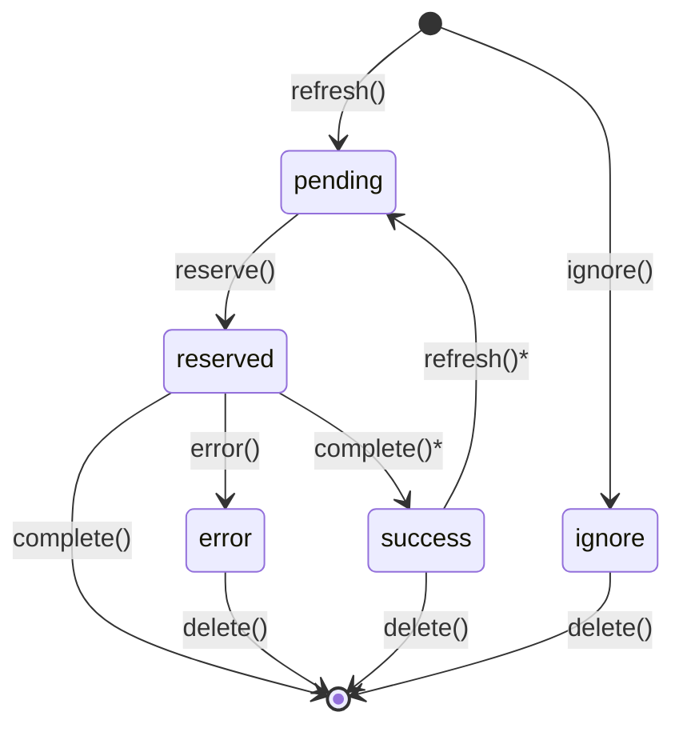

# AutoPopulate Specification

Version: 2.0
Status: Draft
Last Updated: 2025-01-05

## Overview

AutoPopulate is DataJoint's mechanism for automated computation. Tables that inherit from `dj.Computed` or `dj.Imported` automatically populate themselves by executing a `make()` method for each entry defined by their dependencies.

This specification describes the AutoPopulate system including the per-table job management for distributed computing.

---

## 1. Auto-Populated Tables

### 1.1 Table Types

| Type | Base Class | Purpose |
|------|------------|---------|
| Computed | `dj.Computed` | Results derived from other DataJoint tables |
| Imported | `dj.Imported` | Data ingested from external sources (files, instruments) |

Both types share the same AutoPopulate mechanism.

### 1.2 Basic Structure

```python
@schema
class FilteredImage(dj.Computed):
    definition = """
    -> RawImage
    ---
    filtered : <blob>
    """

    def make(self, key):
        # Fetch source data
        raw = (RawImage & key).fetch1('image')

        # Compute result
        filtered = apply_filter(raw)

        # Insert result
        self.insert1({**key, 'filtered': filtered})
```

### 1.3 The make() Method

The `make()` method defines how to compute one entry:

```python
def make(self, key):
    """
    Compute and insert one entry.

    Parameters
    ----------
    key : dict
        Primary key values identifying which entry to compute.
    """
```

**Requirements:**
- Must insert exactly one row matching the key
- Should be idempotent (same input → same output)
- Runs within a transaction (rollback on error)

### 1.4 Primary Key Constraint

Auto-populated tables must have primary keys composed entirely of foreign key references:

```python
# Correct: all PK attributes from foreign keys
@schema
class Analysis(dj.Computed):
    definition = """
    -> Session
    -> AnalysisMethod
    ---
    result : float64
    """

# Error: non-FK primary key attribute
@schema
class Analysis(dj.Computed):
    definition = """
    -> Session
    method : varchar(32)   # Not allowed
    ---
    result : float64
    """
```

**Rationale:** This ensures 1:1 correspondence between jobs and target rows, enabling precise job tracking.

---

## 2. Key Source

### 2.1 Definition

The `key_source` property defines which entries should exist in the table:

```python
@property
def key_source(self):
    return Parent1 * Parent2  # Default: join of all parents
```

### 2.2 Default Key Source

By default, `key_source` is the natural join of all tables referenced in the primary key:

```python
@schema
class Analysis(dj.Computed):
    definition = """
    -> Session
    -> Method
    ---
    result : float64
    """
    # Default key_source = Session * Method
```

### 2.3 Custom Key Source

Override `key_source` to customize which entries to compute:

```python
@schema
class QualityAnalysis(dj.Computed):
    definition = """
    -> Session
    ---
    score : float64
    """

    @property
    def key_source(self):
        # Only process sessions marked as 'good'
        return Session & "quality = 'good'"
```

### 2.4 Pending Entries

Entries to be computed = `key_source - self`:

```python
# Entries that should exist but don't yet
pending = table.key_source - table
```

---

## 3. Populate Method

### 3.1 Basic Usage

```python
# Populate all pending entries
FilteredImage.populate()

# Populate with restrictions
FilteredImage.populate(Session & "session_date > '2024-01-01'")

# Limit number of entries
FilteredImage.populate(max_calls=100)

# Show progress
FilteredImage.populate(display_progress=True)
```

### 3.2 Method Signature

```python
def populate(
    self,
    *restrictions,
    suppress_errors: bool = False,
    return_exception_objects: bool = False,
    reserve_jobs: bool = False,
    max_calls: int = None,
    display_progress: bool = False,
    processes: int = 1,
    make_kwargs: dict = None,
    priority: int = None,
    refresh: bool = None,
) -> dict
```

### 3.3 Parameters

| Parameter | Default | Description |
|-----------|---------|-------------|
| `*restrictions` | — | Filter `key_source` |
| `suppress_errors` | `False` | Continue on errors instead of raising |
| `return_exception_objects` | `False` | Return exception objects vs strings |
| `reserve_jobs` | `False` | Enable job reservation for distributed computing |
| `max_calls` | `None` | Maximum `make()` calls |
| `display_progress` | `False` | Show progress bar |
| `processes` | `1` | Number of parallel processes |
| `make_kwargs` | `None` | Additional kwargs for `make()` |
| `priority` | `None` | Only process jobs at this priority or lower |
| `refresh` | `None` | Refresh jobs queue (default from config) |

### 3.4 Operating Modes

**Direct Mode** (`reserve_jobs=False`, default):
- Computes `key_source - self` directly
- No job tracking
- Suitable for single-worker scenarios

**Distributed Mode** (`reserve_jobs=True`):
- Uses per-table jobs queue
- Workers reserve jobs before processing
- Full status tracking and monitoring

---

## 4. Per-Table Jobs

### 4.1 Jobs Table

Each auto-populated table has an associated jobs table for tracking computation status:

```
Table: FilteredImage
Jobs:  ~~filtered_image
```

Access via the `.jobs` property:

```python
FilteredImage.jobs              # Jobs table
FilteredImage.jobs.pending      # Pending jobs
FilteredImage.jobs.errors       # Failed jobs
FilteredImage.jobs.progress()   # Status summary
```

### 4.2 Jobs Table Structure

```python
# Job queue for FilteredImage
subject_id : int
session_id : int
# ... (FK-derived primary key attributes only)
---
status : enum('pending', 'reserved', 'success', 'error', 'ignore')
priority : uint8                    # Lower = more urgent (0 = highest)
created_time : timestamp
scheduled_time : timestamp          # Process on or after this time
reserved_time : timestamp           # When reserved
completed_time : timestamp          # When completed
duration : float64                  # Execution time in seconds
error_message : varchar(2047)       # Truncated error
error_stack : <blob>                # Full traceback
user : varchar(255)                 # Database user
host : varchar(255)                 # Worker hostname
pid : uint32                        # Process ID
connection_id : uint64              # MySQL connection ID
version : varchar(255)              # Code version
```

### 4.3 Job Statuses

| Status | Description |
|--------|-------------|
| `pending` | Queued and ready to process |
| `reserved` | Currently being processed |
| `success` | Completed successfully (optional retention) |
| `error` | Failed with error |
| `ignore` | Manually marked to skip |

### 4.4 Status Transitions



- `complete()` deletes job by default
- `complete()*` keeps as `success` when `keep_completed=True`
- `refresh()*` re-pends `success` if key in `key_source` but not in table

---

## 5. Jobs API

### 5.1 Refresh

Synchronize the jobs queue with `key_source`:

```python
result = FilteredImage.jobs.refresh(
    *restrictions,           # Filter key_source
    delay=0,                 # Seconds until jobs available
    priority=None,           # Priority for new jobs
    stale_timeout=None,      # Cleanup threshold
    orphan_timeout=None,     # Orphan cleanup threshold
)
# Returns: {'added': N, 'removed': N, 'orphaned': N, 're_pended': N}
```

**Operations performed:**
1. Add new jobs: `(key_source & restrictions) - target - jobs` → `pending`
2. Re-pend success jobs if key in `key_source` but not in target
3. Remove stale jobs (keys no longer in `key_source`)
4. Remove orphaned jobs (reserved jobs past timeout)

### 5.2 Status Queries

```python
FilteredImage.jobs.pending      # Pending jobs
FilteredImage.jobs.reserved     # Reserved jobs
FilteredImage.jobs.errors       # Failed jobs
FilteredImage.jobs.ignored      # Ignored jobs
FilteredImage.jobs.completed    # Success jobs (if kept)
```

### 5.3 Progress

```python
FilteredImage.jobs.progress()
# {
#     'pending': 150,
#     'reserved': 3,
#     'success': 847,
#     'error': 12,
#     'ignore': 5,
#     'total': 1017
# }
```

### 5.4 Manual Status Control

```python
# Mark job to skip
FilteredImage.jobs.ignore(key)

# Delete specific jobs
(FilteredImage.jobs & condition).delete()

# Clear all errors
FilteredImage.jobs.errors.delete()

# Re-add deleted jobs
FilteredImage.jobs.refresh()
```

---

## 6. Priority and Scheduling

### 6.1 Priority

Lower values = higher priority (0 is most urgent):

```python
# Urgent jobs
FilteredImage.jobs.refresh(priority=0)

# Normal jobs (default priority=5)
FilteredImage.jobs.refresh()

# Background jobs
FilteredImage.jobs.refresh(priority=10)

# Urgent jobs for specific data
FilteredImage.jobs.refresh(Subject & "priority='urgent'", priority=0)
```

### 6.2 Scheduling

Delay job availability:

```python
# Available in 2 hours
FilteredImage.jobs.refresh(delay=2*60*60)

# Available tomorrow
FilteredImage.jobs.refresh(delay=24*60*60)

# Urgent but delayed
FilteredImage.jobs.refresh(priority=0, delay=3600)
```

Jobs with `scheduled_time > now` are not processed.

---

## 7. Distributed Computing

### 7.1 Basic Pattern

```python
# Multiple workers can run simultaneously
# Worker 1
FilteredImage.populate(reserve_jobs=True)

# Worker 2
FilteredImage.populate(reserve_jobs=True)

# Worker 3
FilteredImage.populate(reserve_jobs=True)
```

### 7.2 Execution Flow

1. `refresh()` syncs jobs queue (if `auto_refresh=True`)
2. Fetch pending jobs ordered by `(priority, scheduled_time)`
3. For each job:
   - Mark as `reserved`
   - Call `make(key)`
   - On success: mark `success` or delete
   - On error: mark `error` with details

### 7.3 Conflict Resolution

When two workers reserve the same job:

1. Both reservations succeed (no locking)
2. Both call `make()` for the same key
3. First worker's transaction commits
4. Second worker gets duplicate key error (ignored)
5. First worker marks job complete

This is acceptable because:
- `make()` transaction guarantees data integrity
- Conflicts are rare with job reservation
- Wasted computation is minimal vs locking overhead

### 7.4 Pre-Partitioning

For batch schedulers (Slurm, PBS), pre-partition jobs:

```python
# Orchestrator divides work
all_pending = FilteredImage.jobs.pending.fetch("KEY")
n_workers = 4

for worker_id in range(n_workers):
    worker_keys = all_pending[worker_id::n_workers]
    # Send to worker via scheduler

# Each worker processes assigned keys
for key in assigned_keys:
    FilteredImage.populate(key)  # Direct mode
```

---

## 8. Error Handling

### 8.1 Error Recovery

```python
# View errors
for err in FilteredImage.jobs.errors.fetch(as_dict=True):
    print(f"Key: {err}, Error: {err['error_message']}")

# Fix and retry
(FilteredImage.jobs & problem_key).delete()
FilteredImage.jobs.refresh()
FilteredImage.populate(reserve_jobs=True)
```

### 8.2 Suppress Errors

Continue processing despite errors:

```python
errors = FilteredImage.populate(
    reserve_jobs=True,
    suppress_errors=True,
    return_exception_objects=True
)
```

### 8.3 Stale Jobs

Jobs whose keys no longer exist in `key_source`:

```python
# Cleaned automatically by refresh()
FilteredImage.jobs.refresh(stale_timeout=3600)
```

### 8.4 Orphaned Jobs

Reserved jobs whose worker crashed:

```python
# Manual cleanup
(FilteredImage.jobs.reserved &
 "reserved_time < NOW() - INTERVAL 2 HOUR").delete()
FilteredImage.jobs.refresh()

# Or automatic with timeout
FilteredImage.jobs.refresh(orphan_timeout=3600)
```

---

## 9. Schema-Level Access

### 9.1 All Jobs Tables

```python
# List all jobs tables in schema
schema.jobs
# [FilteredImage.jobs, Analysis.jobs, ...]

# Pipeline-wide status
for jobs in schema.jobs:
    print(f"{jobs.table_name}: {jobs.progress()}")

# Refresh all
for jobs in schema.jobs:
    jobs.refresh()
```

### 9.2 Dashboard Queries

```python
def pipeline_status(schema):
    return {
        jt.table_name: jt.progress()
        for jt in schema.jobs
    }

# All errors across pipeline
all_errors = [
    {**err, '_table': jt.table_name}
    for jt in schema.jobs
    for err in jt.errors.fetch(as_dict=True)
]
```

---

## 10. Configuration

```python
dj.config['jobs.auto_refresh'] = True       # Auto-refresh on populate
dj.config['jobs.keep_completed'] = False    # Retain success records
dj.config['jobs.stale_timeout'] = 3600      # Seconds before stale cleanup
dj.config['jobs.default_priority'] = 5      # Default priority (lower=urgent)
dj.config['jobs.version'] = None            # Version string ('git' for auto)
```

Method parameters override config values when explicitly set.

---

## 11. Hidden Job Metadata

When `config['jobs.add_job_metadata'] = True`, auto-populated tables receive hidden columns:

| Column | Type | Description |
|--------|------|-------------|
| `_job_start_time` | `datetime(3)` | When computation began |
| `_job_duration` | `float64` | Duration in seconds |
| `_job_version` | `varchar(64)` | Code version |

These columns are:
- Automatically populated during `make()`
- Hidden from default fetch (prefix `_`)
- Queryable with explicit reference

```python
# Fetch with job metadata
FilteredImage.fetch('_job_duration', '_job_version')

# Query by duration
slow_jobs = FilteredImage & '_job_duration > 3600'
```

---

## 12. Implementation Details

### 12.1 Table Naming

Jobs tables use the `~~` prefix:
- Table: `filtered_image`
- Jobs: `~~filtered_image`

### 12.2 No Foreign Key Constraints

Jobs tables omit FK constraints for performance:
- High-traffic operations (reserve, complete)
- Stale cleanup via `refresh()` is more efficient
- Batch operations vs per-row FK checks

### 12.3 Lazy Creation

Jobs tables are created on first use:

```python
# Creates ~~filtered_image if needed
FilteredImage.populate(reserve_jobs=True)

# Or explicitly
FilteredImage.jobs.refresh()
```

### 12.4 Drop and Alter

```python
# Dropping table drops its jobs table
FilteredImage.drop()

# Altering PK drops jobs table (recreate via refresh)
FilteredImage.alter()
FilteredImage.jobs.refresh()
```

---

## 13. Migration from Earlier Versions

### 13.1 Changes from DataJoint 1.x

DataJoint 2.0 replaces the schema-level `~jobs` table with per-table jobs:

| Feature | 1.x | 2.0 |
|---------|-----|-----|
| Jobs table | Schema-level `~jobs` | Per-table `~~table_name` |
| Key storage | Hashed | Native (readable) |
| Statuses | `reserved`, `error`, `ignore` | + `pending`, `success` |
| FK constraints | None | None (same) |
| Progress tracking | Limited | Full lifecycle |

### 13.2 Migration Steps

1. **Complete or clear pending work** in the old system
2. **Export error records** if needed for reference
3. **Drop legacy `~jobs` table** (optional, no longer used)
4. **Use new system**: `populate(reserve_jobs=True)` creates new jobs tables

```python
# Export legacy errors (optional)
legacy_errors = schema.jobs.fetch(as_dict=True)

# Drop legacy table (optional)
schema.jobs.drop()

# New system auto-creates jobs tables
FilteredImage.populate(reserve_jobs=True)
```

### 13.3 API Changes

```python
# Legacy (1.x)
schema.jobs                    # Single ~jobs table
schema.jobs & 'table_name="x"' # Filter by table

# Current (2.0)
FilteredImage.jobs             # Per-table access
schema.jobs                    # List of all jobs tables
```

### 13.4 Backward Compatibility

- `reserve_jobs=False` (default) bypasses job tracking entirely
- Legacy tables with non-FK primary keys work with degraded granularity
- No parallel operation of old/new systems—migrate cleanly

---

## 14. Quick Reference

### 14.1 Common Operations

```python
# Populate (single worker)
Table.populate()

# Populate (distributed)
Table.populate(reserve_jobs=True)

# Check progress
Table.jobs.progress()

# View errors
Table.jobs.errors.fetch()

# Clear and retry errors
Table.jobs.errors.delete()
Table.jobs.refresh()

# Add urgent jobs
Table.jobs.refresh(priority=0)

# Schedule future jobs
Table.jobs.refresh(delay=3600)
```

### 14.2 Status Properties

| Property | Query |
|----------|-------|
| `.pending` | `status='pending'` |
| `.reserved` | `status='reserved'` |
| `.completed` | `status='success'` |
| `.errors` | `status='error'` |
| `.ignored` | `status='ignore'` |
