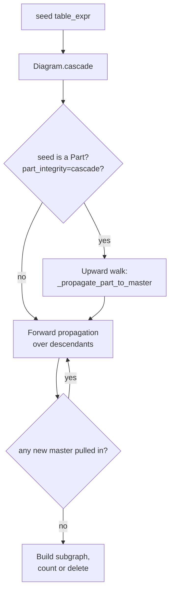

# Cascade Specification

This document specifies how DataJoint propagates restrictions across the foreign-key (FK) graph for **cascade delete** and **cascade preview** operations. It defines the propagation rules, the role of `part_integrity`, and the Part-to-Master upward propagation that handles renamed FKs and Part-of-Part chains.

For the user-facing entry points, see [Delete Data](../../how-to/delete-data.md). For dependent concepts, see [Master-Part](master-part.md), [Diagram](diagram.md), and [Data Manipulation](data-manipulation.md).

## Overview

A *cascade* starts at a (possibly restricted) **seed** table and propagates the restriction to every table that depends on it via foreign keys, so that a delete or preview affects all dependents consistently. Cascade is invoked by:

- `Table.delete(part_integrity=...)` — executes the cascade as a delete.
- `Diagram.cascade(table_expr, part_integrity=...).counts()` — preview, no mutation.

Both follow the same propagation rules; only the terminal step (delete vs. count) differs.

## Dependency graph

DataJoint loads its FK structure into a directed acyclic graph (`Connection.dependencies`, a `networkx.DiGraph`). The graph encodes two kinds of structure:

| Element | Encodes |
|---|---|
| **Node** | A table, named by its fully-qualified SQL identifier (e.g. ``` `schema`.`table_name` ```). The graph stores the table's primary key set as node data. |
| **Edge `parent → child`** | An FK constraint from `child` to `parent`. Edge data: `attr_map` (dict mapping child's FK columns → parent's referenced columns), `aliased` (true iff any column was renamed), `primary` (true iff the FK is in the child's primary key). |
| **Parallel edges** | A child can reference the same parent through more than one foreign key — for example two renamed (`.proj()`) references — so the same `parent → child` pair may be connected by multiple edges, each carrying its own `attr_map`/`aliased`/`primary`. |

The cascade engine operates on a copy of this graph (the `Diagram` class), recording per-table restrictions in `_cascade_restrictions` and the set of restricted attributes in `_restriction_attrs`.

## Restriction propagation rules

When propagating a restriction across an edge `parent → child`, one of three rules applies. The rule depends on whether the FK renames columns (`aliased`) and on whether the parent's currently-restricted attributes (`parent_attrs`) are contained in the child's primary key (`child_pk`).

### Forward propagation (parent → child)

| Rule | Trigger | Effect on child |
|---|---|---|
| **F1. Copy** | `not aliased and parent_attrs` **non-empty** `and parent_attrs ⊆ child_pk` | Child inherits the parent's restriction directly (same attribute names; literal restriction values copy as-is). An empty attribute set takes rule 3. |
| **F2. Aliased rename** | `aliased` | Child's restriction is `parent.proj(**{fk_col: parent_col for fk_col, parent_col in attr_map.items()})` — the parent expression with columns renamed to match the child's column names. |
| **F3. Project** | `not aliased and parent_attrs ⊄ child_pk` | Child's restriction is `parent.proj()` — the parent projected to its primary key. |

After applying the rule, the child's restricted-attributes set is updated to track what's now constrained on it. The child becomes a propagation source for its own children in the next pass.

### Upward propagation (child → parent)

Symmetric inverses of the forward rules. Used by `part_integrity="cascade"` to propagate a Part's restriction up to its Master through the FK chain. Edge metadata is the same; the direction of travel is reversed.

| Rule | Trigger | Effect on parent |
|---|---|---|
| **U1. Copy** | `not aliased and child_attrs` **non-empty** `and child_attrs ⊆ parent_pk` | Parent inherits the child's restriction directly (shared attribute names). An empty attribute set takes rule 3. |
| **U2. Aliased reverse-rename** | `aliased` | Parent's restriction is `child.proj(**{parent_col: fk_col for fk_col, parent_col in attr_map.items()})` — the child expression with FK columns renamed back to the parent's column names. |
| **U3. Project** | `not aliased and child_attrs ⊄ parent_pk` | Parent's restriction is `child.proj(*attr_map.keys())` — the child projected onto its FK columns (which, when non-aliased, share names with the parent's PK) so the parent restriction joins on the right columns. |

## Cascade flow



The engine performs **multiple passes** when `part_integrity="cascade"` is in effect: each pass forward-propagates over all `allowed_nodes`, and a pass may pull in a new master (with its descendants) that requires another pass. The loop terminates because the graph is a DAG and only finitely many nodes can be added.

## `part_integrity` modes

Master-Part integrity reflects the contract that a Master row exists for every Part row that references it. Three modes govern how cascade enforces or relaxes that contract:

| Mode | Behavior |
|---|---|
| `"enforce"` (default) | If a delete would remove a Part row without removing the corresponding Master row, the entire delete is rolled back with `DataJointError`. The Master row is checked **after** the delete; the integrity violation is detected post-hoc and reversed. The *intent* is row-level (each deleted Part row should have its Master deleted), but the shipped post-check is **table-level** — see [Limitations](#limitations) for the resulting rare false negatives and false positives. |
| `"ignore"` | No upward propagation; no post-check. Use when the Master row is intentionally preserved and the user has accepted that Part rows may be orphaned. Caller is responsible for the consequences. |
| `"cascade"` | **Upward propagation enabled.** When cascade reaches a Part, the Master is also restricted (via the upward rules below), and the Master then forward-cascades back down to **all** its Parts (siblings of the originating Part included). Used when the user wants the master-part group treated atomically. |

This document focuses on the `"cascade"` mode; the `"enforce"` and `"ignore"` modes do not change the propagation graph.

## Part-to-Master upward propagation

When `part_integrity="cascade"` and the cascade reaches (or starts at) a Part node, the engine triggers an **upward walk** of the FK graph from the Part to its Master, applying the upward rules (U1, U2, U3) at each edge.

### Identifying the Master

The Master is identified by **naming convention** via `dependencies.extract_master`: a Part table's SQL name ends in `master__partname`, and the Master is the prefix before the `__`. The graph must contain a node with that Master name; otherwise the upward walk is skipped.

### Walking the FK path

The walk uses `nx.shortest_path(master, part)` to find the FK chain from Master to Part:

```
Master → [intermediate Part(s)] → Part
```

Each edge along the path fires one upward rule (U1, U2, or U3) per the edge's metadata (`attr_map`, `aliased`). **Intermediate Parts in a Part-of-Part chain are restricted along the way** — not only the Master.

### Materialization at the Master

After the upward walk completes, the Master's accumulated restrictions are **materialized** to a literal value tuple via `(master_ft & restrictions).proj().to_arrays()` and stored as a single condition. Subsequent forward propagation from the Master back down to its other Parts then generates `WHERE pk IN (literal-list)` rather than `WHERE pk IN (SELECT ... FROM <originating-part>)`.

**Why materialization matters.** This is required for correctness on **every backend**, not merely to satisfy MySQL. `Table.delete` executes per-table deletes in reverse-topological order (leaves first — see [Data Manipulation](data-manipulation.md)), so the originating Part is deleted *before* the Master. If the Master's restriction were left as a `QueryExpression` referencing that Part, the Master's own DELETE — issued last — would find the Part already emptied, match zero rows, and silently strand the Master (the very compositional-integrity violation the upward walk exists to prevent). Materializing the Master's primary keys to a literal value set at plan time, before any rows are deleted, captures them while the Part still exists.

A secondary consequence: the literal set also avoids a self-referential subquery. Left as a query, the Master forward-cascading back to the originating Part would generate a DELETE whose subquery targets the table being modified — which MySQL rejects ("error 1093: You can't specify target table 'T' for update in FROM clause"). PostgreSQL permits that self-reference, but the reverse-topological ordering above means materialization is required on **both** backends regardless — so this must not be treated as a MySQL-only concern.

Intermediate Parts in the chain are **not** materialized — they appear only as restrictions on the path, not as forward-cascade sources, so the self-reference issue doesn't arise there.

## Seed-is-Part case

When `Table.delete(part_integrity="cascade")` is invoked on a Part directly (e.g. `Master.PartB.delete(part_integrity="cascade")`), the cascade seed is the Part itself. A leaf Part has no out-edges, so the main propagation loop — which fires the `part_integrity` block from inside the `out_edges` iteration — would not trigger.

The engine handles this case by invoking the upward walk explicitly for the seed before the main loop runs. After the walk pulls in the Master and any intermediate Parts, the main loop then forward-cascades from the Master to its remaining descendants in the usual way.

## Worked examples

### Example 1: Part-of-Part with renamed FK

```python
import datajoint as dj

schema = dj.Schema("imaging")

@schema
class Subject(dj.Manual):
    definition = """
    subject_id : int32
    """

    class Session(dj.Part):
        definition = """
        -> master
        session_id : int32
        """

    class Recording(dj.Part):
        definition = """
        -> Subject.Session.proj(src_subject='subject_id', src_session='session_id')
        recording_id : int32
        """
```

`Recording`'s columns are `{src_subject, src_session, recording_id}` — none of them are named `subject_id`. The FK from `Subject.Session → Subject.Recording` is aliased.

When `(Subject.Recording & {"recording_id": 5}).delete(part_integrity="cascade")` runs:

1. **Seed-is-Part check.** `extract_master(Recording) == Subject`. Trigger the upward walk.
2. **FK path.** `shortest_path(Subject, Recording) = [Subject, Subject.Session, Subject.Recording]`.
3. **Walk reversed.**
   - Edge `Subject.Session → Subject.Recording`: `aliased=True`. Apply **U2** — `Subject.Session` is restricted by `Subject.Recording.proj(subject_id='src_subject', session_id='src_session')`.
   - Edge `Subject → Subject.Session`: `aliased=False`, `child_attrs={subject_id, session_id} ⊆ parent_pk={subject_id}`? No (`session_id` not in parent pk). Apply **U3** — `Subject` is restricted by `Subject.Session.proj(*attr_map.keys())`, projecting the child onto its FK columns; for this primary FK those columns are just `subject_id`, so this is equivalent to `Subject.Session.proj()` projected to `subject_id`.
4. **Materialize Master.** `Subject`'s restriction is fetched into a value tuple; replaces the chained `QueryExpression`.
5. **Forward pass.** Master forward-cascades back down to `Subject.Session` and `Subject.Recording` (and any sibling Parts not on the original path), now with the materialized restriction.

Without the FK walk (the pre-fix behavior), the engine joined `subject_ft.proj() & recording_ft.proj()` on shared attribute names. `Subject` has `subject_id`; `Recording` has `src_subject`. No shared columns → empty restriction → Master not restricted. This is the failure mode from [#1429](https://github.com/datajoint/datajoint-python/issues/1429) Case 1.

### Example 2: Part-of-Part with no Master reference in PartB

```python
@schema
class Master(dj.Manual):
    definition = """
    master_id : int32
    """

    class PartA(dj.Part):
        definition = """
        -> master
        part_a_id : int32
        """

    class PartB(dj.Part):
        definition = """
        -> Master.PartA
        part_b_id : int32
        """
```

`PartB`'s definition references `Master.PartA`, not `master` directly. The FK chain Master → PartA → PartB still exists in the dependency graph (PartA's FK to Master is `aliased=False`; PartA → PartB is also `aliased=False`).

For `(Master.PartB & {"master_id": 1}).delete(part_integrity="cascade")`:

1. Upward walk: PartB → PartA → Master.
   - Edge PartA → PartB: `aliased=False`, `child_attrs ⊆ parent_pk`? `child_attrs = {master_id}`, `parent_pk = {master_id, part_a_id}`. Yes ⊆. Apply **U1** — `PartA` inherits `PartB`'s restriction directly.
   - Edge Master → PartA: `aliased=False`, `child_attrs = {master_id} ⊆ parent_pk = {master_id}`. Apply **U1** — `Master` inherits `PartA`'s restriction.
2. Materialize Master.
3. Forward cascade Master → PartA → PartB picks up all sibling rows under `master_id=1`.

Without the FK walk (the pre-fix behavior), the engine jumped directly from PartB to Master via `master_ft.proj() & partB_ft.proj()`. PartA was never restricted, and the chain semantics were silently incorrect. This is [#1429](https://github.com/datajoint/datajoint-python/issues/1429) Case 2.

## Algorithmic complexity

For a cascade subgraph with N nodes and E edges, propagation runs in at most O(N · E) edge visits per pass, with at most one pass per master pulled in by upward propagation. For typical schemas (small Master-Part groups, shallow chains), the cost is dominated by the materialization fetch at the Master — one `SELECT ... FROM master_ft` over the restricted master rows.

## What is not part of this specification

- **`Diagram.trace()`** for general upstream restriction propagation: a related but distinct feature that **shipped in 2.3** and reuses the same upward rules (U1/U2/U3) defined above. `trace()` exposes upstream propagation as a first-class operator; the cascade engine's upward walk in this document is the same machinery applied inside `part_integrity="cascade"`. See the [Upstream Trace Specification](trace.md) for `trace`'s API and semantics.
- **Custom propagation rules** (user-defined): not supported. The three forward and three upward rules cover the cases the FK graph can produce.
- **Cross-schema cascade**: handled by `dependencies.load_all_downstream()` called from `Diagram.cascade()`; orthogonal to the propagation rules described here.

## Limitations

The following are known, documented behaviors of the cascade engine as shipped:

- **Single FK path (part→master walk).** The upward walk uses `nx.shortest_path` to find the FK chain from a Part to its Master. If a Part reaches its Master through multiple distinct FK chains, restrictions carried by the non-shortest paths are not applied. Workaround: use `part_integrity="ignore"` and perform the additional deletes manually.
- **Materialization memory cost.** The master restriction is materialized via `to_arrays()` (required by the reverse-topological delete order — not merely MySQL error 1093; see [Materialization at the Master](#materialization-at-the-master)). The cost is bounded by the number of distinct master rows referenced by the matching parts. Cascade **preview** (`Diagram.cascade(...).counts()`) pays the same materialization cost as an actual delete.
- **Empty-match sentinel.** When no master rows match, the master carries an always-false restriction and appears with zero rows in `counts()` and iteration. This is by design, not an error.
- **Enforce granularity.** The `part_integrity="enforce"` post-check is **table-level**: it verifies that *some* rows of the master table were deleted whenever part rows were, not that each deleted part row's *specific* master row was deleted. As a result, rare false negatives (an unrelated master row happened to be deleted in the same cascade, masking a genuine orphan) and false positives (deleting already-orphaned part rows whose master was removed earlier) are possible.

## References

- Source: `src/datajoint/diagram.py` — `Diagram.cascade`, `_propagate_restrictions`, `_apply_propagation_rule`, `_apply_propagation_rule_upward`, `_propagate_part_to_master`.
- Source: `src/datajoint/dependencies.py` — dependency-graph construction, `extract_master`.
- Issue: [datajoint-python #1429](https://github.com/datajoint/datajoint-python/issues/1429) — bug report and motivating examples for the upward propagation rules.
- [Master-Part Specification](master-part.md) — Part-Master contract.
- [Diagram Specification](diagram.md) — graph operations on the dependency graph.
- [Data Manipulation Specification](data-manipulation.md) — `delete()` and `delete_quick()` user-facing API.
