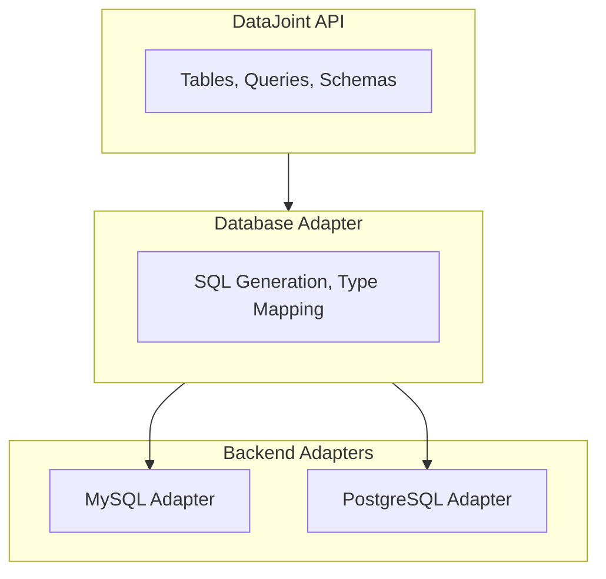

# Database Backends Specification

!!! version-added "New in 2.1"
    PostgreSQL support was introduced in DataJoint 2.1.

DataJoint supports multiple database backends through a unified adapter architecture.

## Supported Backends

| Backend | Minimum Version | Default Port | Status |
|---------|-----------------|--------------|--------|
| MySQL | 8.0 | 3306 | Production |
| PostgreSQL | 15 | 5432 | Production |

## Configuration

Select the backend via configuration:

```python
import datajoint as dj

dj.config['database.backend'] = 'mysql'      # Default
dj.config['database.backend'] = 'postgresql' # PostgreSQL
```

Or via environment variable:

```bash
export DJ_BACKEND=postgresql
```

## Adapter Architecture

DataJoint uses database adapters to generate backend-specific SQL while maintaining a consistent API.



## Backend Compatibility

### Fully Compatible

The following features work identically across all backends:

- **Table definitions**: Same definition syntax for all backends
- **Core types**: `int32`, `float64`, `varchar`, `datetime`, etc.
- **Codec types**: `<blob>`, `<attach>`, `<object@>`, etc.
- **Query operations**: Restriction, projection, join, aggregation
- **Foreign keys**: Inheritance, nullable, unique modifiers
- **Indexes**: Single-column, composite, unique
- **Auto-populate**: Jobs queue, distributed computation

### Backend-Specific Behavior

| Feature | MySQL | PostgreSQL |
|---------|-------|------------|
| Default port | 3306 | 5432 |
| Schema = Database | Yes | Yes (uses schemas) |
| JSON operators | `->`, `->>` | `->`, `->>` |
| BLOB storage | `LONGBLOB` | `BYTEA` |
| Boolean type | `TINYINT(1)` | `BOOLEAN` |

### String Quoting

MySQL and PostgreSQL handle quotes differently in SQL:

| Quote Type | MySQL | PostgreSQL |
|------------|-------|------------|
| Single quotes `'...'` | String literals | String literals |
| Double quotes `"..."` | String literals | **Identifiers** (column names) |
| Backticks `` `...` `` | Identifiers | Not supported |

This affects restriction strings. MySQL accepts both quote styles for string values, but PostgreSQL interprets double quotes as identifier (column) references.

```python
# MySQL only - double quotes work as string literals
Table & 'name = "Alice"'

# Both backends - single quotes for string literals
Table & "name = 'Alice'"
```

**PostgreSQL migration:** Replace double quotes with single quotes inside SQL restriction strings:

```python
# Before (MySQL)
Table & 'strain = "C57BL/6"'
Table & 'date > "2024-01-01"'

# After (PostgreSQL compatible)
Table & "strain = 'C57BL/6'"
Table & "date > '2024-01-01'"
```

Dictionary restrictions handle quoting automatically but only support equality:

```python
Table & {'name': 'Alice'}  # Equality only - backend-agnostic
```

For range comparisons (`>`, `<`, `LIKE`, etc.), use string restrictions with single-quoted values.

### SQL Function Translation

DataJoint automatically translates certain SQL functions between backends, allowing portable code:

| Function | MySQL | PostgreSQL |
|----------|-------|------------|
| String aggregation | `GROUP_CONCAT(col)` | `STRING_AGG(col, ',')` |
| String aggregation with separator | `GROUP_CONCAT(col SEPARATOR ';')` | `STRING_AGG(col, ';')` |

You can use either syntax in your code—DataJoint translates to the appropriate form:

```python
# Both work on both backends
Person.aggr(Proficiency, languages='GROUP_CONCAT(lang_code)')
Person.aggr(Proficiency, languages="STRING_AGG(lang_code, ',')")
```

The translation is bidirectional:

- **On PostgreSQL**: `GROUP_CONCAT(col)` → `STRING_AGG(col::text, ',')`
- **On MySQL**: `STRING_AGG(col, ',')` → `GROUP_CONCAT(col)`

## Type Mapping

DataJoint core types map to native database types:

| Core Type | MySQL | PostgreSQL |
|-----------|-------|------------|
| `int8` | `TINYINT` | `SMALLINT` |
| `int16` | `SMALLINT` | `SMALLINT` |
| `int32` | `INT` | `INTEGER` |
| `int64` | `BIGINT` | `BIGINT` |
| `float32` | `FLOAT` | `REAL` |
| `float64` | `DOUBLE` | `DOUBLE PRECISION` |
| `bool` | `TINYINT(1)` | `BOOLEAN` |
| `varchar(n)` | `VARCHAR(n)` | `VARCHAR(n)` |
| `char(n)` | `CHAR(n)` | `CHAR(n)` |
| `date` | `DATE` | `DATE` |
| `datetime` | `DATETIME` | `TIMESTAMP` |
| `datetime(n)` | `DATETIME(n)` | `TIMESTAMP(n)` |
| `json` | `JSON` | `JSONB` |
| `uuid` | `BINARY(16)` | `UUID` |
| `bytes` | `LONGBLOB` | `BYTEA` |

## Connection Management

Both backends support the same connection patterns:

```python
# Singleton connection (default)
conn = dj.conn()

# Context manager (explicit lifecycle)
with dj.Connection(**creds) as conn:
    schema = dj.Schema('my_schema', connection=conn)

# Reset connection
conn = dj.conn(reset=True)
```

## Testing Against Multiple Backends

For development and CI/CD, you can test against both backends:

```bash
# Test MySQL only
DJ_BACKEND=mysql pytest tests/

# Test PostgreSQL only
DJ_BACKEND=postgresql pytest tests/
```

## Migration Between Backends

DataJoint does not provide automatic migration between backends. To migrate data:

1. Export data using `fetch()` and pandas DataFrames
2. Create new schemas on the target backend
3. Import data using `insert()`

Schema definitions are portable—the same Python class definitions work on both backends.

## See Also

- [Configure Database](../../how-to/configure-database.md/) — Connection setup
- [Type System](type-system.md) — Core type definitions
- [Table Declaration](table-declaration.md) — Definition syntax
