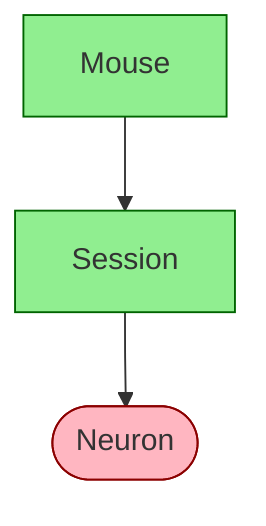

# Diagram Specification

Schema visualization as directed acyclic graphs.

## Overview

`dj.Diagram` visualizes DataJoint schemas as directed graphs showing tables and their foreign key relationships. It provides multiple output formats including SVG, PNG, and Mermaid syntax.

## Design Principles

1. **Multiple output formats**: Graphviz (SVG/PNG) and Mermaid for different use cases
2. **Graph algebra**: Combine and filter diagrams with set operators
3. **Visual encoding**: Table tiers distinguished by shape and color
4. **Flexible layout**: Configurable direction and schema grouping

---

## API Reference

### Constructor

```python
dj.Diagram(source, context=None)
```

| Parameter | Type | Default | Description |
|-----------|------|---------|-------------|
| `source` | Table, Schema, module | — | Source to visualize |
| `context` | dict | None | Namespace for class name resolution |

### Layout Direction

Layout direction is controlled via configuration:

```python
# Check current direction
dj.config.display.diagram_direction  # "TB" or "LR"

# Set globally
dj.config.display.diagram_direction = "LR"

# Override temporarily
with dj.config.override(display__diagram_direction="LR"):
    dj.Diagram(schema).draw()
```

| Value | Description |
|-------|-------------|
| `"TB"` | Top to bottom (default) |
| `"LR"` | Left to right |

### Class Method

```python
dj.Diagram.from_sequence(sequence)
```

Create a combined diagram from multiple sources. Equivalent to `Diagram(a) + Diagram(b) + ...`.

---

## Operators

Diagrams support set algebra for combining and filtering:

| Operator | Description | Example |
|----------|-------------|---------|
| `diag + n` | Expand n levels downstream (children) | `dj.Diagram(Mouse) + 2` |
| `diag - n` | Expand n levels upstream (parents) | `dj.Diagram(Neuron) - 2` |
| `diag1 + diag2` | Union of two diagrams | `dj.Diagram(Mouse) + dj.Diagram(Session)` |
| `diag1 - diag2` | Difference (remove nodes) | `dj.Diagram(schema) - dj.Diagram(Lookup)` |
| `diag1 * diag2` | Intersection | `dj.Diagram(schema1) * dj.Diagram(schema2)` |

### Common Patterns

```python
# Show table with immediate parents and children
dj.Diagram(MyTable) + 1 - 1

# Show entire schema
dj.Diagram(schema)

# Show all tables downstream of a source
dj.Diagram(SourceTable) + 10

# Show ancestry of a computed table
dj.Diagram(ComputedTable) - 10
```

**Note:** Order matters. `diagram + 1 - 1` may differ from `diagram - 1 + 1`.

---

## Output Methods

### Graphviz Output

| Method | Returns | Description |
|--------|---------|-------------|
| `make_svg(group_by_schema=False)` | `IPython.SVG` | SVG for Jupyter display |
| `make_png(group_by_schema=False)` | `BytesIO` | PNG image bytes |
| `make_image(group_by_schema=False)` | `ndarray` | NumPy array (matplotlib) |
| `make_dot(group_by_schema=False)` | `pydot.Dot` | Graphviz DOT object |

### Mermaid Output

```python
make_mermaid(direction=None) -> str
```

Generates [Mermaid](https://mermaid.js.org/) flowchart syntax for embedding in Markdown, GitHub, or web documentation.

| Parameter | Type | Default | Description |
|-----------|------|---------|-------------|
| `direction` | str | None | Override layout direction |

### Display Methods

| Method | Description |
|--------|-------------|
| `draw(group_by_schema=False)` | Display with matplotlib |
| `_repr_svg_()` | Jupyter notebook auto-display |

### File Output

```python
save(filename, format=None, group_by_schema=False)
```

| Parameter | Type | Description |
|-----------|------|-------------|
| `filename` | str | Output file path |
| `format` | str | `"png"`, `"svg"`, or `"mermaid"`. Inferred from extension if None. |
| `group_by_schema` | bool | Group nodes by database schema (Graphviz only) |

**Supported extensions:** `.png`, `.svg`, `.mmd`, `.mermaid`

---

## Visual Encoding

### Table Tiers

Each table tier has a distinct visual style:

| Tier | Shape | Fill Color | Font Color |
|------|-------|------------|------------|
| **Manual** | rectangle | green | dark green |
| **Lookup** | plain text | gray | black |
| **Computed** | ellipse | red | dark red |
| **Imported** | ellipse | blue | dark blue |
| **Part** | plain text | transparent | black |

### Edge Styles

| Style | Meaning |
|-------|---------|
| Solid line | Primary foreign key |
| Dashed line | Non-primary foreign key |
| Thick line | Master-Part relationship |
| Thin line | Multi-valued foreign key |

### Node Labels

- **Underlined**: Table introduces new primary key attributes
- **Plain**: Table inherits all primary key attributes from parents

---

## Schema Grouping

When `group_by_schema=True`, nodes are grouped into visual clusters by their database schema. This is useful when visualizing multi-schema pipelines.

```python
# Group by schema in display
dj.Diagram(schema1) + dj.Diagram(schema2)
diag.draw(group_by_schema=True)

# Group by schema in saved file
diag.save("pipeline.svg", group_by_schema=True)
```

---

## Examples

### Basic Usage

```python
import datajoint as dj

# Diagram from a single table
dj.Diagram(Mouse)

# Diagram from entire schema
dj.Diagram(schema)

# Diagram from module
dj.Diagram(my_pipeline_module)
```

### Layout Direction

```python
# Horizontal layout using config override
with dj.config.override(display__diagram_direction="LR"):
    dj.Diagram(schema).draw()

# Or set globally
dj.config.display.diagram_direction = "LR"
dj.Diagram(schema).save("pipeline.svg")
```

### Saving Diagrams

```python
diag = dj.Diagram(schema)

# Save as SVG
diag.save("pipeline.svg")

# Save as PNG
diag.save("pipeline.png")

# Save as Mermaid
diag.save("pipeline.mmd")

# Explicit format
diag.save("output.txt", format="mermaid")
```

### Mermaid Output

```python
print(dj.Diagram(schema).make_mermaid())
```

Output:


### Combining Diagrams

```python
# Union of schemas
combined = dj.Diagram(schema1) + dj.Diagram(schema2)

# Intersection
common = dj.Diagram(schema1) * dj.Diagram(schema2)

# From sequence
combined = dj.Diagram.from_sequence([schema1, schema2, schema3])
```

---

## Dependencies

Diagram visualization requires optional dependencies:

```bash
pip install matplotlib pygraphviz
```

If dependencies are missing, `dj.Diagram` displays a warning and provides a stub class.

---

## See Also

- [How to Read Diagrams](../../how-to/read-diagrams.ipynb)
- [Query Algebra](query-algebra.md)
- [Table Declaration](table-declaration.md)
