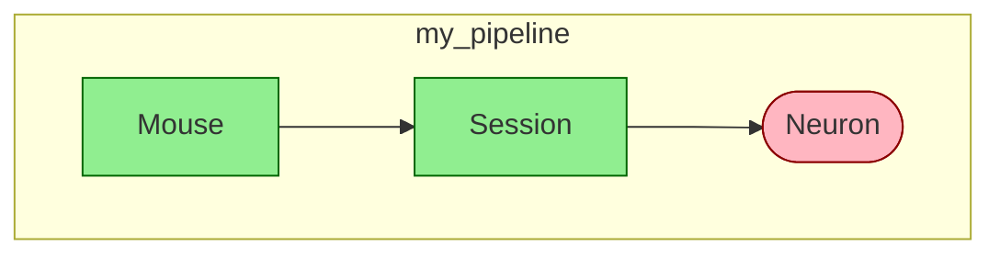

# Diagram Specification

Schema visualization as directed acyclic graphs.

## Overview

`dj.Diagram` visualizes DataJoint schemas as directed graphs showing tables and their foreign key relationships. It provides multiple output formats including SVG, PNG, and Mermaid syntax.

## Design Principles

1. **Multiple output formats**: Graphviz (SVG/PNG) and Mermaid for different use cases
2. **Graph algebra**: Combine and filter diagrams with set operators
3. **Visual encoding**: Table tiers distinguished by shape and color
4. **Flexible layout**: Configurable direction and schema grouping

---

## API Reference

### Constructor

```python
dj.Diagram(source, context=None)
```

| Parameter | Type | Default | Description |
|-----------|------|---------|-------------|
| `source` | Table, Schema, module | — | Source to visualize |
| `context` | dict | None | Namespace for class name resolution |

### Layout Direction

!!! version-added "New in 2.1"
    Configurable layout direction was added in DataJoint 2.1.

Layout direction is controlled via configuration:

```python
# Check current direction
dj.config.display.diagram_direction  # "TB" or "LR"

# Set globally
dj.config.display.diagram_direction = "LR"

# Override temporarily
with dj.config.override(display__diagram_direction="LR"):
    dj.Diagram(schema).draw()
```

| Value | Description |
|-------|-------------|
| `"TB"` | Top to bottom (default) |
| `"LR"` | Left to right |

### Class Method

```python
dj.Diagram.from_sequence(sequence)
```

Create a combined diagram from multiple sources. Equivalent to `Diagram(a) + Diagram(b) + ...`.

---

## Operators

Diagrams support set algebra for combining and filtering:

| Operator | Description | Example |
|----------|-------------|---------|
| `diag + n` | Expand n levels downstream (children) | `dj.Diagram(Mouse) + 2` |
| `diag - n` | Expand n levels upstream (parents) | `dj.Diagram(Neuron) - 2` |
| `diag1 + diag2` | Union of two diagrams | `dj.Diagram(Mouse) + dj.Diagram(Session)` |
| `diag1 - diag2` | Difference (remove nodes) | `dj.Diagram(schema) - dj.Diagram(Lookup)` |
| `diag1 * diag2` | Intersection | `dj.Diagram(schema1) * dj.Diagram(schema2)` |

### Common Patterns

```python
# Show table with immediate parents and children
dj.Diagram(MyTable) + 1 - 1

# Show entire schema
dj.Diagram(schema)

# Show all tables downstream of a source
dj.Diagram(SourceTable) + 10

# Show ancestry of a computed table
dj.Diagram(ComputedTable) - 10
```

**Note:** Order matters. `diagram + 1 - 1` may differ from `diagram - 1 + 1`.

### Collapsing Schemas

!!! version-added "New in 2.1"
    The `collapse()` method was added in DataJoint 2.1.

```python
diag.collapse()
```

Mark a diagram for collapsing when combined with other diagrams. Collapsed schemas appear as single nodes showing the table count.

```python
# Show schema1 expanded, schema2 as a single collapsed node
dj.Diagram(schema1) + dj.Diagram(schema2).collapse()
```

**"Expanded wins" rule:** If a node appears in both a collapsed and non-collapsed diagram, it stays expanded. This allows you to show specific tables from a schema while collapsing the rest.

```python
# Subject is expanded, rest of analysis schema is collapsed
dj.Diagram(Subject) + dj.Diagram(analysis).collapse()
```

---

## Operational Methods

!!! version-added "New in 2.2"
    Operational methods (`cascade`, `restrict`, `delete`, `drop`, `preview`) were added in DataJoint 2.2.

Diagrams can propagate restrictions through the dependency graph and execute data operations (delete, drop) using the graph structure. These methods turn Diagram from a visualization tool into an operational component.

### `cascade()`

```python
diag.cascade(table_expr, part_integrity="enforce")
```

Apply a cascade restriction and propagate it downstream through the dependency graph. Uses **OR** semantics at convergence — a child row is affected if *any* restricted ancestor reaches it. Designed for delete operations.

| Parameter | Type | Default | Description |
|-----------|------|---------|-------------|
| `table_expr` | QueryExpression | — | A restricted table expression (e.g., `Session & 'subject_id=1'`) |
| `part_integrity` | str | `"enforce"` | Master-part integrity policy |

**Returns:** New `Diagram` with cascade restrictions applied.

**Constraints:**

- `cascade()` can only be called **once** on an unrestricted Diagram
- Cannot be mixed with `restrict()` — the two modes are mutually exclusive
- `table_expr.full_table_name` must be a node in the diagram

**`part_integrity` values:**

| Value | Behavior |
|-------|----------|
| `"enforce"` | Error if parts would be deleted before masters |
| `"ignore"` | Allow deleting parts without masters |
| `"cascade"` | Also delete masters when parts are deleted |

```python
# Build a cascade from a restricted table
diag = dj.Diagram(schema)
restricted = diag.cascade(Session & {'subject_id': 'M001'})
```

### `restrict()`

```python
diag.restrict(table_expr)
```

Apply a restrict condition and propagate it downstream. Uses **AND** semantics at convergence — a child row is included only if it satisfies *all* restricted ancestors. Designed for data subsetting and export operations.

| Parameter | Type | Default | Description |
|-----------|------|---------|-------------|
| `table_expr` | QueryExpression | — | A restricted table expression |

**Returns:** New `Diagram` with restrict conditions applied.

**Constraints:**

- Cannot be called on a cascade-restricted Diagram (mutually exclusive with `cascade()`)
- `table_expr.full_table_name` must be a node in the diagram
- **Can be chained** — call `restrict()` multiple times to add conditions from different tables

```python
# Chain multiple restrictions (AND semantics)
diag = dj.Diagram(schema)
restricted = (diag
    .restrict(Subject & {'species': 'mouse'})
    .restrict(Session & 'session_date > "2024-01-01"'))
```

### `delete()`

```python
diag.delete(transaction=True, prompt=None)
```

Execute a cascading delete using previously applied cascade restrictions. Tables are deleted in reverse topological order (leaves first) to maintain referential integrity.

| Parameter | Type | Default | Description |
|-----------|------|---------|-------------|
| `transaction` | bool | `True` | Wrap in atomic transaction |
| `prompt` | bool or None | `None` | Prompt for confirmation. Default: `dj.config['safemode']` |

**Returns:** Number of rows deleted from the root table.

**Requires:** `cascade()` must be called first.

```python
diag = dj.Diagram(schema)
restricted = diag.cascade(Session & {'subject_id': 'M001'})
restricted.preview()   # inspect what will be deleted
restricted.delete()    # execute the delete
```

### `drop()`

```python
diag.drop(prompt=None, part_integrity="enforce")
```

Drop all tables in the diagram in reverse topological order.

| Parameter | Type | Default | Description |
|-----------|------|---------|-------------|
| `prompt` | bool or None | `None` | Prompt for confirmation. Default: `dj.config['safemode']` |
| `part_integrity` | str | `"enforce"` | `"enforce"` or `"ignore"` |

**Note:** Unlike `delete()`, `drop()` does not use cascade restrictions. It drops all tables in the diagram.

### `preview()`

```python
diag.preview()
```

Show affected tables and row counts without modifying data. Works with both `cascade()` and `restrict()` restrictions.

**Returns:** `dict[str, int]` — mapping of full table names to affected row counts.

**Requires:** `cascade()` or `restrict()` must be called first.

```python
diag = dj.Diagram(schema)
restricted = diag.cascade(Session & {'subject_id': 'M001'})
counts = restricted.preview()
# {'`lab`.`session`': 3, '`lab`.`trial`': 45, '`lab`.`processed_data`': 45}
```

### Restriction Propagation

When `cascade()` or `restrict()` propagates a restriction from a parent table to a child table, one of three rules applies depending on the foreign key relationship:

**Rule 1 — Direct copy:** When the foreign key is non-aliased and the restriction attributes are a subset of the child's primary key, the restriction is copied directly to the child.

**Rule 2 — Aliased projection:** When the foreign key uses attribute renaming (e.g., `subject_id` → `animal_id`), the parent is projected with the attribute mapping to match the child's column names.

**Rule 3 — Full projection:** When the foreign key is non-aliased but the restriction uses attributes not in the child's primary key, the parent is projected (all attributes) and used as a restriction on the child.

**Convergence behavior:**

When a child table has multiple restricted ancestors, the convergence rule depends on the mode:

- **`cascade()` (OR):** A child row is affected if *any* path from a restricted ancestor reaches it. This is appropriate for delete — if any reason exists to delete a row, it should be deleted.
- **`restrict()` (AND):** A child row is included only if *all* restricted ancestors match. This is appropriate for export — only rows satisfying every condition are selected.

---

## Output Methods

### Graphviz Output

| Method | Returns | Description |
|--------|---------|-------------|
| `make_svg()` | `IPython.SVG` | SVG for Jupyter display |
| `make_png()` | `BytesIO` | PNG image bytes |
| `make_image()` | `ndarray` | NumPy array (matplotlib) |
| `make_dot()` | `pydot.Dot` | Graphviz DOT object |

### Mermaid Output

!!! version-added "New in 2.1"
    Mermaid output was added in DataJoint 2.1.

```python
make_mermaid() -> str
```

Generates [Mermaid](https://mermaid.js.org/) flowchart syntax for embedding in Markdown, GitHub, or web documentation. Tables are grouped into subgraphs by schema.

### Display Methods

| Method | Description |
|--------|-------------|
| `draw()` | Display with matplotlib |
| `_repr_svg_()` | Jupyter notebook auto-display |

### File Output

```python
save(filename, format=None)
```

| Parameter | Type | Description |
|-----------|------|-------------|
| `filename` | str | Output file path |
| `format` | str | `"png"`, `"svg"`, or `"mermaid"`. Inferred from extension if None. |

**Supported extensions:** `.png`, `.svg`, `.mmd`, `.mermaid`

---

## Visual Encoding

### Table Tiers

Each table tier has a distinct visual style:

| Tier | Shape | Fill Color | Font Color |
|------|-------|------------|------------|
| **Manual** | rectangle | green | dark green |
| **Lookup** | plain text | gray | black |
| **Computed** | ellipse | red | dark red |
| **Imported** | ellipse | blue | dark blue |
| **Part** | plain text | transparent | black |

### Edge Styles

| Style | Meaning |
|-------|---------|
| Solid line | Primary foreign key |
| Dashed line | Non-primary foreign key |
| Thick line | Master-Part relationship |
| Thin line | Multi-valued foreign key |

### Node Labels

- **Underlined**: Table introduces new primary key attributes
- **Plain**: Table inherits all primary key attributes from parents

---

## Schema Grouping

!!! version-added "New in 2.1"
    Automatic schema grouping was added in DataJoint 2.1.

Tables are automatically grouped into visual clusters by their database schema. The cluster label shows the Python module name when available (following the DataJoint convention of one module per schema), otherwise the database schema name.

```python
# Multi-schema diagram - tables automatically grouped
combined = dj.Diagram(schema1) + dj.Diagram(schema2)
combined.draw()

# Save with grouping
combined.save("pipeline.svg")
```

This is useful when visualizing multi-schema pipelines to see which tables belong to which module.

---

## Examples

### Basic Usage

```python
import datajoint as dj

# Diagram from a single table
dj.Diagram(Mouse)

# Diagram from entire schema
dj.Diagram(schema)

# Diagram from module
dj.Diagram(my_pipeline_module)
```

### Layout Direction

```python
# Horizontal layout using config override
with dj.config.override(display__diagram_direction="LR"):
    dj.Diagram(schema).draw()

# Or set globally
dj.config.display.diagram_direction = "LR"
dj.Diagram(schema).save("pipeline.svg")
```

### Saving Diagrams

```python
diag = dj.Diagram(schema)

# Save as SVG
diag.save("pipeline.svg")

# Save as PNG
diag.save("pipeline.png")

# Save as Mermaid
diag.save("pipeline.mmd")

# Explicit format
diag.save("output.txt", format="mermaid")
```

### Mermaid Output

```python
print(dj.Diagram(schema).make_mermaid())
```

Output:


### Combining Diagrams

```python
# Union of schemas
combined = dj.Diagram(schema1) + dj.Diagram(schema2)

# Intersection
common = dj.Diagram(schema1) * dj.Diagram(schema2)

# From sequence
combined = dj.Diagram.from_sequence([schema1, schema2, schema3])
```

---

## Dependencies

Operational methods (`cascade`, `restrict`, `delete`, `drop`, `preview`) use `networkx`, which is always installed as a core dependency.

Diagram **visualization** requires optional dependencies:

```bash
pip install matplotlib pygraphviz
```

If visualization dependencies are missing, `dj.Diagram` displays a warning and provides a stub class. Operational methods remain available regardless.

---

## See Also

- [How to Read Diagrams](../../how-to/read-diagrams.ipynb/)
- [Delete Data](../../how-to/delete-data.md/) — Diagram-level delete workflow
- [What's New in 2.2](../../explanation/whats-new-22.md/) — Motivation and design
- [Data Manipulation](data-manipulation.md) — Insert, update, delete specification
- [Query Algebra](query-algebra.md)
- [Table Declaration](table-declaration.md)
