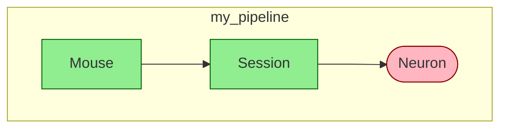

# Diagram Specification

Schema visualization as directed acyclic graphs.

## Overview

`dj.Diagram` visualizes DataJoint schemas as directed graphs showing tables and their foreign key relationships. It provides multiple output formats including SVG, PNG, and Mermaid syntax.

## Design Principles

1. **Multiple output formats**: Graphviz (SVG/PNG) and Mermaid for different use cases
2. **Graph algebra**: Combine and filter diagrams with set operators
3. **Visual encoding**: Table tiers distinguished by shape and color
4. **Flexible layout**: Configurable direction and schema grouping

---

## API Reference

### Constructor

```python
dj.Diagram(source, context=None)
```

| Parameter | Type | Default | Description |
|-----------|------|---------|-------------|
| `source` | Table, Schema, module | — | Source to visualize |
| `context` | dict | None | Namespace for class name resolution |

### Layout Direction

!!! version-added "New in 2.1"
    Configurable layout direction was added in DataJoint 2.1.

Layout direction is controlled via configuration:

```python
# Check current direction
dj.config.display.diagram_direction  # "TB" or "LR"

# Set globally
dj.config.display.diagram_direction = "LR"

# Override temporarily
with dj.config.override(display__diagram_direction="LR"):
    dj.Diagram(schema).draw()
```

| Value | Description |
|-------|-------------|
| `"TB"` | Top to bottom (default) |
| `"LR"` | Left to right |

### Class Method

```python
dj.Diagram.from_sequence(sequence)
```

Create a combined diagram from multiple sources. Equivalent to `Diagram(a) + Diagram(b) + ...`.

---

## Operators

Diagrams support set algebra for combining and filtering:

| Operator | Description | Example |
|----------|-------------|---------|
| `diag + n` | Expand n levels downstream (children) | `dj.Diagram(Mouse) + 2` |
| `diag - n` | Expand n levels upstream (parents) | `dj.Diagram(Neuron) - 2` |
| `diag1 + diag2` | Union of two diagrams | `dj.Diagram(Mouse) + dj.Diagram(Session)` |
| `diag1 - diag2` | Difference (remove nodes) | `dj.Diagram(schema) - dj.Diagram(Lookup)` |
| `diag1 * diag2` | Intersection | `dj.Diagram(schema1) * dj.Diagram(schema2)` |

### Common Patterns

```python
# Show table with immediate parents and children
dj.Diagram(MyTable) + 1 - 1

# Show entire schema
dj.Diagram(schema)

# Show all tables downstream of a source
dj.Diagram(SourceTable) + 10

# Show ancestry of a computed table
dj.Diagram(ComputedTable) - 10
```

**Note:** Order matters. `diagram + 1 - 1` may differ from `diagram - 1 + 1`.

### Collapsing Schemas

!!! version-added "New in 2.1"
    The `collapse()` method was added in DataJoint 2.1.

```python
diag.collapse()
```

Mark a diagram for collapsing when combined with other diagrams. Collapsed schemas appear as single nodes showing the table count.

```python
# Show schema1 expanded, schema2 as a single collapsed node
dj.Diagram(schema1) + dj.Diagram(schema2).collapse()
```

**"Expanded wins" rule:** If a node appears in both a collapsed and non-collapsed diagram, it stays expanded. This allows you to show specific tables from a schema while collapsing the rest.

```python
# Subject is expanded, rest of analysis schema is collapsed
dj.Diagram(Subject) + dj.Diagram(analysis).collapse()
```

---

## Operational Methods

!!! version-added "New in 2.2"
    Operational methods (`Diagram.cascade()`, `restrict`, `counts`, `prune`) were added in DataJoint 2.2.

Diagrams can propagate restrictions through the dependency graph and inspect affected data using the graph structure. These methods turn Diagram from a visualization tool into a graph computation and inspection component. All mutation operations (delete, drop) are executed by `Table.delete()` and `Table.drop()`, which use Diagram internally.

### `Diagram.cascade()` (class method)

```python
dj.Diagram.cascade(table_expr, part_integrity="enforce")
```

Create a cascade diagram for delete. Builds a complete dependency graph from the table expression, includes all descendants across all loaded schemas, propagates the restriction downstream using **OR** semantics — a descendant row is marked for deletion if *any* ancestor path reaches it — and **trims** to the cascade subgraph.

| Parameter | Type | Default | Description |
|-----------|------|---------|-------------|
| `table_expr` | QueryExpression | — | A restricted table expression (e.g., `Session & 'subject_id=1'`) |
| `part_integrity` | str | `"enforce"` | Master-part integrity policy |

**Returns:** New `Diagram` containing only the seed table and its descendants, with cascade restrictions applied.

**`part_integrity` values:**

| Value | Behavior |
|-------|----------|
| `"enforce"` | Default. The preview itself never errors; master-part integrity is enforced by `Table.delete()`'s post-check, which rolls back the delete if part rows would be removed without their masters (see [Cascade Spec](cascade.md#part_integrity-modes)). |
| `"ignore"` | Allow deleting parts without masters |
| `"cascade"` | Propagate restriction upward from part to master, then re-propagate downstream to all sibling parts |

With `"cascade"`, the restriction flows **upward** from a part table to its master: the restricted part rows identify which master rows are affected, those masters receive a restriction, and that restriction propagates back downstream through the normal cascade — deleting the entire compositional unit (master + all parts), not just the originally matched part rows.

```python
# Preview cascade impact across all loaded schemas
dj.Diagram.cascade(Session & {'subject_id': 'M001'}).counts()
```

`part_integrity` accepts only `"enforce"`, `"ignore"`, or `"cascade"`; any other value raises `ValueError`.

### `Diagram.trace()` (class method)

```python
dj.Diagram.trace(table_expr)
```

The **upstream mirror of `cascade()`**. Where `cascade()` walks downstream to every descendant, `trace()` walks **upstream** from a (possibly restricted) table expression to every ancestor across all loaded schemas, propagating the restriction along the way. Like `cascade()`, convergence is **OR** — an ancestor is included if reachable through *any* FK path from the seed.

| Parameter | Type | Default | Description |
|-----------|------|---------|-------------|
| `table_expr` | QueryExpression | — | A restricted table expression whose ancestry is traced |

**Returns:** New `Diagram` containing the seed and its ancestors, each pre-restricted through the FK join path.

Access a pre-restricted ancestor by indexing the trace:

```python
trace = dj.Diagram.trace(MyChild & key)
session = trace[Session]              # Session restricted to ancestors of MyChild & key
session.fetch1('session_date')
```

`trace()` reuses the same **upward propagation rules** (U1/U2/U3) documented in the [Cascade Spec](cascade.md#upward-propagation-child-parent). The [Upstream Trace Specification §1](trace.md#1-diagramtracetable_expr) is the normative spec for its API and semantics; inside `make()`, `self.upstream` is the per-`key` instance of a trace.

### `restrict()`

```python
diag.restrict(table_expr)
```

Select a subset of data for export or inspection. Starting from a restricted table expression, propagate the restriction downstream through all descendants using **AND** semantics — a descendant row is included only if *all* restricted ancestors match. The full diagram is preserved (ancestors, unrelated tables) so that `restrict()` can be called again from a different seed table, building up a multi-condition subset incrementally.

| Parameter | Type | Default | Description |
|-----------|------|---------|-------------|
| `table_expr` | QueryExpression | — | A restricted table expression |

**Returns:** New `Diagram` with restrict conditions applied. The graph is not trimmed.

**Constraints:**

- **Chainable** — call multiple times to add conditions from different seed tables
- Cannot be called on a Diagram produced by `Diagram.cascade()`
- `table_expr.full_table_name` must be a node in the diagram

```python
# Chain multiple restrictions (AND semantics)
diag = dj.Diagram(schema)
restricted = (diag
    .restrict(Subject & {'species': 'mouse'})
    .restrict(Session & 'session_date > "2024-01-01"'))
```

### `counts()`

```python
diag.counts()
```

Return affected row counts per table without modifying data. Works with both `cascade()` and `restrict()` restrictions.

**Returns:** `dict[str, int]` — mapping of full table names to affected row counts.

**Requires:** `Diagram.cascade()` or `restrict()` must be called first.

```python
counts = dj.Diagram.cascade(Session & {'subject_id': 'M001'}).counts()
# {'`lab`.`session`': 3, '`lab`.`trial`': 45, '`lab`.`processed_data`': 45}
```

### `prune()`

```python
diag.prune()
```

Remove tables with zero matching rows from the diagram view. This only affects the diagram object — no tables or data are modified in the database. Without prior restrictions, removes physically empty tables from the diagram. After `restrict()`, removes tables where the restricted query yields zero rows.

**Returns:** New `Diagram` with empty tables removed.

**Constraints:** Cannot be used on a Diagram produced by `Diagram.cascade()`. Cascade diagrams must retain all descendant tables because a table empty at cascade time could have rows by the time `delete()` executes.

**Note:** Queries the database to determine row counts. The underlying graph structure is preserved — subsequent `restrict()` calls can still seed at any table in the schema.

```python
# Export workflow: restrict, prune, visualize
export = (dj.Diagram(schema)
    .restrict(Subject & {'species': 'mouse'})
    .restrict(Session & 'session_date > "2024-01-01"')
    .prune())

export.counts()    # only tables with matching rows
export             # visualize the export subgraph
```

### Iteration

Diagrams support iteration in topological order:

| Method | Order | Use Case |
|--------|-------|----------|
| `for ft in diagram` | Parents first | Data export, inspection |
| `for ft in reversed(diagram)` | Leaves first | Cascade delete, drop |

Each iteration yields a `FreeTable` with any cascade or restrict conditions applied. Alias nodes are skipped. Only nodes in the diagram's visible set (`nodes_to_show`) are yielded.

`Table.delete()` and `Table.drop()` use `reversed(diagram)` internally to execute mutations in safe dependency order.

### Restriction Propagation

When `cascade()` or `restrict()` propagates a restriction from a parent table to a child table, one of three rules applies depending on the foreign key relationship:

**Rule 1 — Direct copy:** When the foreign key is non-renamed and the restriction attributes are a subset of the child's primary key, the restriction is copied directly to the child.

**Rule 2 — Renamed projection:** When the foreign key uses attribute renaming (e.g., `subject_id` → `animal_id`), the parent is projected with the attribute mapping to match the child's column names.

**Rule 3 — Full projection:** When the foreign key is non-renamed but the restriction uses attributes not in the child's primary key, the parent is projected (all attributes) and used as a restriction on the child.

**Convergence behavior:**

When a child table has multiple restricted ancestors, the convergence rule depends on the mode:

- **`cascade()` (OR):** A child row is affected if *any* path from a restricted ancestor reaches it. This is appropriate for delete — if any reason exists to delete a row, it should be deleted.
- **`restrict()` (AND):** A child row is included only if *all* restricted ancestors match. This is appropriate for export — only rows satisfying every condition are selected.

**Multiple foreign keys to the same parent:**

When a child table references the same parent through multiple foreign keys (e.g., `source_mouse` and `target_mouse` both referencing `Mouse`), these paths always combine with **OR** regardless of the propagation mode. Each foreign key path is an independent reason for the child row to be affected — this is structural, not operation-dependent.

**Unloaded schemas:**

If a descendant table lives in a schema that hasn't been activated (loaded into the dependency graph), the graph-driven delete won't know about it. The final `DELETE` on the parent will fail with a foreign key error. DataJoint catches this and produces an actionable error message identifying which schema needs to be activated.

---

## Output Methods

### Graphviz Output

| Method | Returns | Description |
|--------|---------|-------------|
| `make_svg()` | `IPython.SVG` | SVG for Jupyter display |
| `make_png()` | `BytesIO` | PNG image bytes |
| `make_image()` | `ndarray` | NumPy array (matplotlib) |
| `make_dot()` | `pydot.Dot` | Graphviz DOT object |

### Mermaid Output

!!! version-added "New in 2.1"
    Mermaid output was added in DataJoint 2.1.

```python
make_mermaid() -> str
```

Generates [Mermaid](https://mermaid.js.org/) flowchart syntax for embedding in Markdown, GitHub, or web documentation. Tables are grouped into subgraphs by schema.

### Display Methods

| Method | Description |
|--------|-------------|
| `draw()` | Display with matplotlib |
| `_repr_svg_()` | Jupyter notebook auto-display |

### File Output

```python
save(filename, format=None)
```

| Parameter | Type | Description |
|-----------|------|-------------|
| `filename` | str | Output file path |
| `format` | str | `"png"`, `"svg"`, or `"mermaid"`. Inferred from extension if None. |

**Supported extensions:** `.png`, `.svg`, `.mmd`, `.mermaid`

---

## Visual Encoding

### Table Tiers

Each table tier has a distinct visual style:

| Tier | Shape | Fill Color | Font Color |
|------|-------|------------|------------|
| **Manual** | rectangle | green | dark green |
| **Lookup** | plain text | gray | black |
| **Computed** | ellipse | red | dark red |
| **Imported** | ellipse | blue | dark blue |
| **Part** | plain text | transparent | black |

### Edge Styles

| Style | Meaning |
|-------|---------|
| Solid line | Primary foreign key |
| Dashed line | Non-primary foreign key |
| Thick line | Master-Part relationship |
| Thin line | Multi-valued foreign key |

### Node Labels

- **Underlined**: Table introduces new primary key attributes
- **Plain**: Table inherits all primary key attributes from parents

---

## Schema Grouping

!!! version-added "New in 2.1"
    Automatic schema grouping was added in DataJoint 2.1.

Tables are automatically grouped into visual clusters by their database schema. The cluster label shows the Python module name when available (following the DataJoint convention of one module per schema), otherwise the database schema name.

```python
# Multi-schema diagram - tables automatically grouped
combined = dj.Diagram(schema1) + dj.Diagram(schema2)
combined.draw()

# Save with grouping
combined.save("pipeline.svg")
```

This is useful when visualizing multi-schema pipelines to see which tables belong to which module.

---

## Examples

### Basic Usage

```python
import datajoint as dj

# Diagram from a single table
dj.Diagram(Mouse)

# Diagram from entire schema
dj.Diagram(schema)

# Diagram from module
dj.Diagram(my_pipeline_module)
```

### Layout Direction

```python
# Horizontal layout using config override
with dj.config.override(display__diagram_direction="LR"):
    dj.Diagram(schema).draw()

# Or set globally
dj.config.display.diagram_direction = "LR"
dj.Diagram(schema).save("pipeline.svg")
```

### Saving Diagrams

```python
diag = dj.Diagram(schema)

# Save as SVG
diag.save("pipeline.svg")

# Save as PNG
diag.save("pipeline.png")

# Save as Mermaid
diag.save("pipeline.mmd")

# Explicit format
diag.save("output.txt", format="mermaid")
```

### Mermaid Output

```python
print(dj.Diagram(schema).make_mermaid())
```

Output:

```mermaid
flowchart TB
    classDef manual fill:#90EE90,stroke:#006400
    classDef lookup fill:#D3D3D3,stroke:#696969
    classDef computed fill:#FFB6C1,stroke:#8B0000
    classDef imported fill:#ADD8E6,stroke:#00008B
    classDef part fill:#FFFFFF,stroke:#000000

    subgraph my_pipeline
        Mouse[Mouse]:::manual
        Session[Session]:::manual
        Neuron([Neuron]):::computed
    end
    Mouse --> Session
    Session --> Neuron
```

### Combining Diagrams

```python
# Union of schemas
combined = dj.Diagram(schema1) + dj.Diagram(schema2)

# Intersection
common = dj.Diagram(schema1) * dj.Diagram(schema2)

# From sequence
combined = dj.Diagram.from_sequence([schema1, schema2, schema3])
```

---

## Dependencies

Operational methods (`cascade`, `restrict`, `counts`, `prune`) use `networkx`, which is always installed as a core dependency.

Diagram **visualization** requires optional dependencies:

```bash
pip install matplotlib pygraphviz
```

If visualization dependencies are missing, `dj.Diagram` displays a warning and provides a stub class. Operational methods remain available regardless.

---

## Design Rationale

`Diagram.cascade`, `Diagram.trace`, and `Diagram.restrict` (with `self.upstream` inside `make()` being a form of `trace`) are usually met one at a time — delete impact, lineage, export — and can look like three unrelated features. They are not: all three are **one propagation engine aimed in different directions**, and their rules — which convergence they use, when they walk up from a part to its master, when a restriction must be frozen to literal keys — are *derived* from two things: the operational meaning of the master–part relationship, and whether the operation reads or mutates. This section records that derivation so the implementation can be re-derived from it. The normative rule tables live in the [Cascade spec](cascade.md) (forward F1–F3, upward U1–U3) and are referenced, not duplicated, here.

!!! note "Lineage here means data lineage"
    Throughout, *lineage* refers to the derivation of rows through the pipeline (what `trace` recovers), as in [Comparison to Provenance Systems](../../explanation/comparison-to-provenance-systems.md). This is distinct from the *attribute lineage* used by [Semantic Matching](../../explanation/semantic-matching.md) to trace a column to its defining table.

### First principle: the master–part relationship

A part table declares `-> master` in its primary key, so a part row's key is the master's key plus additional attributes. A part row is therefore a *refinement* of a master row's identity, and — by the foreign key's `ON DELETE RESTRICT` — a part row cannot exist without its master row. The [Master-Part spec](master-part.md) states this as **existence, cohesion, and atomicity**.

The consequence the rest of this rationale rests on is:

> **A dependency on a master is a dependency on all of its parts.** The master and its parts are declared and populated as one atomic unit (a single `make()` writes the master row and its part rows in one transaction), so referencing a master presupposes its whole part-group. Symmetrically, a part implies its master (the foreign key).

This forces a distinction between two integrity notions that are easy to conflate:

| Integrity | Guarantee | Scope |
|---|---|---|
| **Referential** | Every foreign key resolves to an existing parent row. | Local, pairwise (one edge). |
| **Compositional** | A master together with **all** of its parts forms one entity. | Global to the unit. |

Referential integrity is necessary but **not sufficient** for compositional integrity. A master row that has lost one of its parts, or survives with none, can still satisfy every foreign key yet no longer represent a valid entity — a recording missing some of its channels. That gap is exactly where the open items below live.

!!! note "Compositional nesting is one level by declaration"
    A part table is not declared *inside* another part table, so the master→parts grouping is one level deep as declared. Foreign-key *chains* that pass through a part table (a part referenced as a parent by a further table) still exist in the graph and are walked as ordinary edges — the "Part-of-Part chain" the [Cascade](cascade.md) and [Trace](trace.md) specs handle — not a contradiction of the one-level declaration rule.

### The three operations are one engine

Each operation starts from a **seed** (a restricted table expression), propagates a set-membership predicate along foreign-key edges of the dependency DAG, and then either returns the trimmed diagram (`trace`, `restrict`) or drives deletes (`cascade`). They differ along exactly three axes:

| Operation | Direction | Convergence | Reads or mutates | Question it answers |
|---|---|---|---|---|
| `cascade` | downstream (descendants) | **OR** | drives `delete` | "What is affected if these rows are deleted?" |
| `trace` | upstream (ancestors) | **OR** | read-only | "What contributed to these rows?" |
| `restrict` | downstream (descendants) | **AND** | read-only | "What subset satisfies all of these conditions?" |
| `self.upstream` | upstream | OR | read-only | *is* `trace(self & key)` inside `make()` |

Everything else follows from these axes.

#### Why OR for cascade and trace, AND for restrict

The convergence is fixed by whether the operation computes a **closure** or a **selection**.

- `cascade` and `trace` compute *inclusion closures*. Delete-impact must miss nothing: a row is affected if **any** restricted ancestor taints it. Lineage must miss nothing: an ancestor contributed if it lies on **any** foreign-key path. A closure that must be complete is a **union → OR**.
- `restrict` computes a *selection*: "narrow this diagram to the rows meeting every stated condition," so a row survives only if it satisfies **all** conditions reaching it. A selection is an **intersection → AND**.

Making `cascade` conjunctive would let it miss affected rows; making `restrict` disjunctive would return a union no one asked for.

#### Why cascade/trace trim the diagram but restrict preserves it

`cascade` and `trace` *are* their reachable sets — the trimmed subgraph (seed + descendants, or seed + ancestors) is the answer. `restrict` instead *narrows an existing diagram* and is **chainable**: you can `restrict` again from a different seed to build a multi-condition subset, so it must keep the full graph. This is why `restrict` and `cascade` are **mutually exclusive on one diagram** — OR-convergence and AND-convergence cannot coexist in a single propagation without an ill-defined meaning at a node reached by both.

### Derived rule 1 — propagation across an edge

Across one foreign-key edge `parent → child`, the child inherits the parent's restriction *mapped through the foreign key*. The three concrete forms are the forward rules **F1–F3** (and their upstream duals **U1–U3**); see the [Cascade spec](cascade.md). The **master → part edge is just a downstream foreign key** whose parent (master) primary key is a subset of the child (part) primary key — rule F1, a direct copy. This is the mechanism behind the first principle: restricting or including a master automatically restricts/includes **every** part row whose master key matches. No special master-part logic is needed on the way *down*.

### Derived rule 2 — when to walk up from part to master

Part → master is an **upstream** step. A purely downstream operation never traverses it, so we ask, per operation, whether it needs to:

- **Read-only downstream flow (`restrict`, cascade *preview*).** Propagation visits nodes in topological order, so a master is reached **before** its parts and its whole part-group is included by rule 1. Nothing is mutated. **No upward walk is required.**
- **Mutating downstream flow (`cascade` *delete*).** Deletion runs in **reverse** topological order (leaves first), so parts are deleted **before** their master. Deleting part rows without deleting their master — and its sibling parts — would leave a compositionally broken unit. The engine must walk **up** from each restricted part to its master, then re-propagate that master restriction **down** to all siblings. This is the sole place a downstream operation walks upward, enabled by `part_integrity="cascade"`; the `"enforce"` (post-hoc check) and `"ignore"` alternatives are in the [Cascade spec](cascade.md).

The asymmetry is the point: **`restrict` needs no part→master walk because it does not mutate; `cascade` delete needs one because it does.**

### Derived rule 3 — when a restriction must be materialized

A restriction defines a set of rows *relative to a database state*:

> A restriction may remain lazy if evaluated against a **stable** state. It must be **materialized** — frozen to literal primary-key values — if the **same operation** will delete rows it depends on **before** it is evaluated.

Read-only operations (`trace`, `restrict`, cascade preview/`counts`) see a stable state, so restrictions stay lazy. For `cascade` delete (reverse-topological order):

- A restriction referencing an **ancestor** (deleted *later*) is still valid live → **no materialization**.
- A restriction referencing a **descendant** (deleted *earlier*) goes stale → **must be materialized** first.

Two restrictions reference a descendant and must be materialized: (1) the engine-created part → master inversion (rule 2 — the master's keys are frozen at plan time, while the part still exists); and (2) a user-supplied seed that semijoins a descendant, e.g. `(Session & (Analysis & 'flag="bad"')).delete()`, where `Analysis` is deleted first and the live subquery would empty.

!!! warning "MySQL error 1093 is a symptom, not the reason"
    On MySQL the self-referential sub-case trips error 1093 ("can't reference the target table in a subquery"), but that is incidental. The requirement is backend-independent: PostgreSQL permits the self-referential DELETE and strands the row **silently**. Materialization must **never** be made conditional on the backend.

### Composability

- **`restrict ∘ restrict`** accumulates with AND, chainable from different seeds; the intersection is order-independent.
- **`cascade` and `trace`** are closure operations — monotone and idempotent: re-applying adds nothing.
- **`cascade` and `restrict` do not compose** on one diagram (incompatible convergence).
- **`trace` is the upstream dual of `cascade`**, and **`self.upstream` is `trace(self & key)`** — the read channel the framework builds inside each `make()`.

### Conformance and open items

The implementation (`datajoint-python`, `src/datajoint/diagram.py`; the dependency graph is an `nx.MultiDiGraph` as of the 2.4 line) conforms to this derivation except on three points, each an open design question with a filed issue — the places where **referential integrity holds but compositional integrity is not yet guaranteed**.

**Conforms:**

| Derived rule | Status in the implementation |
|---|---|
| cascade = downstream, OR | ✅ seed + all descendants; OR store (`_cascade_restrictions`) |
| trace = upstream, OR | ✅ seed + all ancestors; separate upstream walk, OR |
| restrict = downstream, AND | ✅ AND store (`_restrict_conditions`); chainable |
| master→part pulls the whole group (rule 1, F1) | ✅ ordinary downstream edge |
| part→master walk only for mutating cascade (rule 2) | ✅ gated on `part_integrity="cascade"` **and** cascade mode |
| engine materializes the master inversion before delete (rule 3) | ✅ master keys frozen at plan time, on every backend |
| cascade ⊕ restrict mutually exclusive | ✅ enforced |
| read-only ops stay lazy | ✅ trace/restrict/preview do not materialize |

**Open — not yet meeting the derivation:**

- **Seed restriction referencing a descendant is not materialized** ([#1496](https://github.com/datajoint/datajoint-python/issues/1496)). Rule 3 requires materializing (or uniformly refusing) the seed case above. Today the seed stays a live subquery: MySQL fails closed (error 1093), while PostgreSQL can **silently strand** the seed row. The 2.4 direction is to materialize any restriction referencing an earlier-deleted table; a safe minimum is a legible guard with guidance to pre-materialize (`keys = (A & (B & cond)).fetch("KEY"); (A & keys).delete()`).
- **`restrict` can produce partial part-groups** ([#1501](https://github.com/datajoint/datajoint-python/issues/1501)). Because `restrict` never lifts a part condition to its master, a chain like `Diagram(s).restrict(Master & 'm=1').restrict(Master.Part & 'p>3')` keeps the master whole but only a subset of its parts — referential integrity intact, **compositional integrity broken**. The read-only analogue of cascade's delete-atomicity: a condition on a part should lift **existentially** to its master and bring in **all** of that master's parts. Deferred to 2.4; blast radius is small (`Diagram.restrict` has no internal callers).
- **`trace` does not descend from an ancestor master into its parts** ([#1481](https://github.com/datajoint/datajoint-python/issues/1481)). The first principle says a dependency on a master is a dependency on all its parts, so `trace`/`self.upstream` arguably should surface an ancestor master's parts. Today `trace` includes such a part only when it is *itself* on a foreign-key path to the seed (see the [Trace spec](trace.md)). This is a deliberate current contract — a test pins the non-descending behavior — with the fuller capability tracked for a later release.

All three share a root: they are the points where referential integrity holds but compositional integrity is not yet guaranteed. The derivation predicts exactly these as the places the operators need to grow.

---

## See Also

- [How to Read Diagrams](../../how-to/read-diagrams.ipynb)
- [Delete Data](../../how-to/delete-data.md) — Cascade inspection and delete workflow
- [What's New in 2.2](../../about/whats-new-22.md) — Motivation and design
- [Data Manipulation](data-manipulation.md) — Insert, update, delete specification
- [Query Algebra](query-algebra.md)
- [Table Declaration](table-declaration.md)
