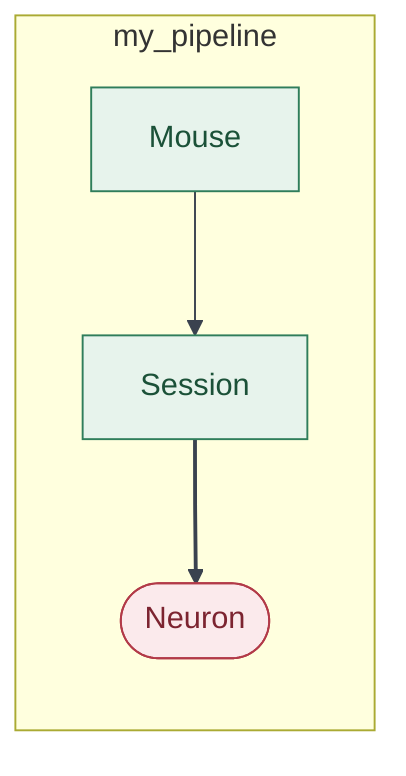

# Diagram Specification

Schema visualization as directed acyclic graphs.

## Overview

`dj.Diagram` visualizes DataJoint schemas as directed graphs showing tables and their foreign key relationships. It provides multiple output formats including SVG, PNG, and Mermaid syntax.

## Design Principles

1. **Multiple output formats**: Graphviz (SVG/PNG) and Mermaid for different use cases
2. **Graph algebra**: Combine and filter diagrams with set operators
3. **Visual encoding**: Table tiers distinguished by shape and color
4. **Flexible layout**: Configurable direction and schema grouping

---

## API Reference

### Constructor

```python
dj.Diagram(source, context=None)
```

| Parameter | Type | Default | Description |
|-----------|------|---------|-------------|
| `source` | Table, Schema, module | — | Source to visualize |
| `context` | dict | None | Namespace for class name resolution |

### Layout Direction

!!! version-added "New in 2.1"
    Configurable layout direction was added in DataJoint 2.1.

Layout direction is controlled via configuration:

```python
# Check current direction
dj.config.display.diagram_direction  # "TB" or "LR"

# Set globally
dj.config.display.diagram_direction = "LR"

# Override temporarily
with dj.config.override(display__diagram_direction="LR"):
    dj.Diagram(schema).draw()
```

| Value | Description |
|-------|-------------|
| `"TB"` | Top to bottom (default) |
| `"LR"` | Left to right |

### Class Method

```python
dj.Diagram.from_sequence(sequence)
```

Create a combined diagram from multiple sources. Equivalent to `Diagram(a) + Diagram(b) + ...`.

---

## Operators

Diagrams support set algebra for combining and filtering:

| Operator | Description | Example |
|----------|-------------|---------|
| `diag + n` | Expand n levels downstream (children) | `dj.Diagram(Mouse) + 2` |
| `diag - n` | Expand n levels upstream (parents) | `dj.Diagram(Neuron) - 2` |
| `diag1 + diag2` | Union of two diagrams | `dj.Diagram(Mouse) + dj.Diagram(Session)` |
| `diag1 - diag2` | Difference (remove nodes) | `dj.Diagram(schema) - dj.Diagram(Lookup)` |
| `diag1 * diag2` | Intersection | `dj.Diagram(schema1) * dj.Diagram(schema2)` |

### Common Patterns

```python
# Show table with immediate parents and children
dj.Diagram(MyTable) + 1 - 1

# Show entire schema
dj.Diagram(schema)

# Show all tables downstream of a source
dj.Diagram(SourceTable) + 10

# Show ancestry of a computed table
dj.Diagram(ComputedTable) - 10
```

**Note:** Order matters. `diagram + 1 - 1` may differ from `diagram - 1 + 1`.

### Collapsing Schemas

!!! version-added "New in 2.1"
    The `collapse()` method was added in DataJoint 2.1.

```python
diag.collapse()
```

Mark a diagram for collapsing when combined with other diagrams. Collapsed schemas appear as single nodes showing the table count.

```python
# Show schema1 expanded, schema2 as a single collapsed node
dj.Diagram(schema1) + dj.Diagram(schema2).collapse()
```

**"Expanded wins" rule:** If a node appears in both a collapsed and non-collapsed diagram, it stays expanded. This allows you to show specific tables from a schema while collapsing the rest.

```python
# Subject is expanded, rest of analysis schema is collapsed
dj.Diagram(Subject) + dj.Diagram(analysis).collapse()
```

---

## Operational Methods

!!! version-added "New in 2.2"
    Operational methods (`Diagram.cascade()`, `restrict`, `counts`, `prune`) were added in DataJoint 2.2.

Diagrams can propagate restrictions through the dependency graph and inspect affected data using the graph structure. These methods turn Diagram from a visualization tool into a graph computation and inspection component. All mutation operations (delete, drop) are executed by `Table.delete()` and `Table.drop()`, which use Diagram internally.

### `Diagram.cascade()` (class method)

```python
dj.Diagram.cascade(table_expr, part_integrity="enforce")
```

Create a cascade diagram for delete. Builds a complete dependency graph from the table expression, includes all descendants across all loaded schemas, propagates the restriction downstream using **OR** semantics — a descendant row is marked for deletion if *any* ancestor path reaches it — and **trims** to the cascade subgraph.

| Parameter | Type | Default | Description |
|-----------|------|---------|-------------|
| `table_expr` | QueryExpression | — | A restricted table expression (e.g., `Session & 'subject_id=1'`) |
| `part_integrity` | str | `"enforce"` | Master-part integrity policy |

**Returns:** New `Diagram` containing only the seed table and its descendants, with cascade restrictions applied.

**`part_integrity` values:**

| Value | Behavior |
|-------|----------|
| `"enforce"` | Default. The preview itself never errors; master-part integrity is enforced by `Table.delete()`'s post-check, which rolls back the delete if part rows would be removed without their masters (see [Cascade Spec](cascade.md#part_integrity-modes)). |
| `"ignore"` | Allow deleting parts without masters |
| `"cascade"` | Propagate restriction upward from part to master, then re-propagate downstream to all sibling parts |

With `"cascade"`, the restriction flows **upward** from a part table to its master: the restricted part rows identify which master rows are affected, those masters receive a restriction, and that restriction propagates back downstream through the normal cascade — deleting the entire compositional unit (master + all parts), not just the originally matched part rows.

```python
# Preview cascade impact across all loaded schemas
dj.Diagram.cascade(Session & {'subject_id': 'M001'}).counts()
```

`part_integrity` accepts only `"enforce"`, `"ignore"`, or `"cascade"`; any other value raises `ValueError`.

### `Diagram.trace()` (class method)

```python
dj.Diagram.trace(table_expr)
```

The **upstream mirror of `cascade()`**. Where `cascade()` walks downstream to every descendant, `trace()` walks **upstream** from a (possibly restricted) table expression to every ancestor across all loaded schemas, propagating the restriction along the way. Like `cascade()`, convergence is **OR** — an ancestor is included if reachable through *any* FK path from the seed.

| Parameter | Type | Default | Description |
|-----------|------|---------|-------------|
| `table_expr` | QueryExpression | — | A restricted table expression whose ancestry is traced |

**Returns:** New `Diagram` containing the seed and its ancestors, each pre-restricted through the FK join path.

Access a pre-restricted ancestor by indexing the trace:

```python
trace = dj.Diagram.trace(MyChild & key)
session = trace[Session]              # Session restricted to ancestors of MyChild & key
session.fetch1('session_date')
```

`trace()` reuses the same **upward propagation rules** (U1/U2/U3) documented in the [Cascade Spec](cascade.md#upward-propagation-child-parent). The [Upstream Trace Specification §1](trace.md#1-diagramtracetable_expr) is the normative spec for its API and semantics; inside `make()`, `self.upstream` is the per-`key` instance of a trace.

### `restrict()`

```python
diag.restrict(table_expr)
```

Select a subset of data for export or inspection. Starting from a restricted table expression, propagate the restriction downstream through all descendants using **AND** semantics — a descendant row is included only if *all* restricted ancestors match. The full diagram is preserved (ancestors, unrelated tables) so that `restrict()` can be called again from a different seed table, building up a multi-condition subset incrementally.

| Parameter | Type | Default | Description |
|-----------|------|---------|-------------|
| `table_expr` | QueryExpression | — | A restricted table expression |

**Returns:** New `Diagram` with restrict conditions applied. The graph is not trimmed.

**Constraints:**

- **Chainable** — call multiple times to add conditions from different seed tables
- Cannot be called on a Diagram produced by `Diagram.cascade()`
- `table_expr.full_table_name` must be a node in the diagram

```python
# Chain multiple restrictions (AND semantics)
diag = dj.Diagram(schema)
restricted = (diag
    .restrict(Subject & {'species': 'mouse'})
    .restrict(Session & 'session_date > "2024-01-01"'))
```

### `counts()`

```python
diag.counts()
```

Return affected row counts per table without modifying data. Works with both `cascade()` and `restrict()` restrictions.

**Returns:** `dict[str, int]` — mapping of full table names to affected row counts.

**Requires:** `Diagram.cascade()` or `restrict()` must be called first.

```python
counts = dj.Diagram.cascade(Session & {'subject_id': 'M001'}).counts()
# {'`lab`.`session`': 3, '`lab`.`trial`': 45, '`lab`.`processed_data`': 45}
```

### `prune()`

```python
diag.prune()
```

Remove tables with zero matching rows from the diagram view. This only affects the diagram object — no tables or data are modified in the database. Without prior restrictions, removes physically empty tables from the diagram. After `restrict()`, removes tables where the restricted query yields zero rows.

**Returns:** New `Diagram` with empty tables removed.

**Constraints:** Cannot be used on a Diagram produced by `Diagram.cascade()`. Cascade diagrams must retain all descendant tables because a table empty at cascade time could have rows by the time `delete()` executes.

**Note:** Queries the database to determine row counts. The underlying graph structure is preserved — subsequent `restrict()` calls can still seed at any table in the schema.

```python
# Export workflow: restrict, prune, visualize
export = (dj.Diagram(schema)
    .restrict(Subject & {'species': 'mouse'})
    .restrict(Session & 'session_date > "2024-01-01"')
    .prune())

export.counts()    # only tables with matching rows
export             # visualize the export subgraph
```

### Iteration

Diagrams support iteration in topological order:

| Method | Order | Use Case |
|--------|-------|----------|
| `for ft in diagram` | Parents first | Data export, inspection |
| `for ft in reversed(diagram)` | Leaves first | Cascade delete, drop |

Each iteration yields a `FreeTable` with any cascade or restrict conditions applied. Only nodes in the diagram's visible set (`nodes_to_show`) are yielded.

`Table.delete()` and `Table.drop()` use `reversed(diagram)` internally to execute mutations in safe dependency order.

### Restriction Propagation

When `cascade()` or `restrict()` propagates a restriction from a parent table to a child table, one of three rules applies depending on the foreign key relationship:

**Rule 1 — Direct copy:** When the foreign key is non-renamed and the restriction attributes are a subset of the child's primary key, the restriction is copied directly to the child.

**Rule 2 — Renamed projection:** When the foreign key uses attribute renaming (e.g., `subject_id` → `animal_id`), the parent is projected with the attribute mapping to match the child's column names.

**Rule 3 — Full projection:** When the foreign key is non-renamed but the restriction uses attributes not in the child's primary key, the parent is projected (all attributes) and used as a restriction on the child.

**Convergence behavior:**

When a child table has multiple restricted ancestors, the convergence rule depends on the mode:

- **`cascade()` (OR):** A child row is affected if *any* path from a restricted ancestor reaches it. This is appropriate for delete — if any reason exists to delete a row, it should be deleted.
- **`restrict()` (AND):** A child row is included only if *all* restricted ancestors match. This is appropriate for export — only rows satisfying every condition are selected.

**Multiple foreign keys to the same parent:**

When a child table references the same parent through multiple foreign keys (e.g., `source_mouse` and `target_mouse` both referencing `Mouse`), these paths always combine with **OR** regardless of the propagation mode. Each foreign key path is an independent reason for the child row to be affected — this is structural, not operation-dependent.

**Unloaded schemas:**

If a descendant table lives in a schema that hasn't been activated (loaded into the dependency graph), the graph-driven delete won't know about it. The final `DELETE` on the parent will fail with a foreign key error. DataJoint catches this and produces an actionable error message identifying which schema needs to be activated.

---

## Traversal algebra

This design rationale derives the traversal operations from first principles. The operational methods above (`cascade` and `trace`) are not separate features — they are the two directions of **one traversal**, `expand`, over the dependency graph, derived here so the *rules*, not just the API, are the specification. The model is a single operation `expand(seed, direction)` — `cascade` is the downstream case, `trace` the upstream case — built on **two rules**: an edge rule (R1) and a group rule (R2).

### 1. The one primitive: propagating a restriction across a foreign key

A **restriction** on a table is a subset of its rows, written as a condition.

Every foreign key `child -> parent` defines a function: each child row references exactly one parent row. Propagating a restriction across that edge is itself a **restriction** — restrict the neighbor by the restricted table, matched on the foreign-key attributes (`&` with a query expression). It works in either direction:

- **downstream** (a restriction on the parent, carried to the child): `child & parent_restricted` — the child rows whose parent is in the restricted set.
- **upstream** (a restriction on the child, carried to the parent): `parent & child_restricted` — the parent rows referenced by the restricted child.

Downstream and upstream are the *same* operation pointed opposite ways along the same foreign key. This is the whole engine; everything below is how the edge rule degenerates, what parts add, and how you accumulate across many edges.

### 2. The edge rule (R1, referential)

**Base case — the foreign key is the whole primary key, not renamed, no parts.** The parent's primary key is embedded verbatim in the child's, with the same column names. A primary-key restriction on the parent is a predicate on exactly those columns, which the child also has, by the same names. So: **carry the restriction unchanged** — the identical predicate that selects the parent rows already selects the matching child rows. This is why the same primary-key restriction rides the whole diagram.

**Complication A — secondary foreign key.** The parent's key lands in the child's *secondary* (non-primary) attributes. A raw predicate still selects the right child rows, but the restriction is no longer a statement about the child's *identity*, so it cannot be promoted to the child's primary key and ridden further. Keep it relational: project the restricted parent to its key and restrict the child by it, matched on the foreign-key columns.

**Complication B — renamed foreign key.** The referencing columns have different names in the child. The parent's predicate names columns the child lacks. Fix, mechanically: rename the restriction's columns through the foreign key's attribute map before restricting (reverse the rename going upstream).

> **R1 (edge rule):** propagate a restriction across a foreign-key edge by **restricting** the neighbor by the restricted table (`&`), projected/renamed onto the shared foreign-key columns. When the foreign key is the whole primary key and unrenamed, the projection is the identity and the restriction collapses to "apply the same predicate."

### 3. The group rule (R2, compositional)

Part tables add **compositional** integrity on top of referential integrity: a master and its parts are one entity, created and deleted all-or-nothing.

- **master -> part** needs nothing new — a part carries `-> master` in its primary key, so R1 already sweeps in all parts of a restricted master.
- **part -> master** is the new rule. A restriction landing on part rows satisfies referential integrity by touching just those rows, but leaves a fragment of an entity. So it must **lift existentially to the master** (the master is in if *any* of its parts is), and the master re-expands to **all** its parts.

> **R2 (group rule):** a restriction touching any part of a master's group brings the whole group — existential lift part -> master, then expand master -> all parts.

R2 is a closure over the master–part grouping, which is exactly why foreign-key restrictions alone cannot express it.

### 4. The one operation: expand

There is one traversal. Seed a single restricted table and grow outward by R1 + R2, accumulating reachable rows by **union** (a table is reached if reachable via any path). It is directional, `direction="down" | "up" | "both"` (default `"down"`):

- `direction="down"` — descendants: the **delete blast radius**. This is `cascade`.
- `direction="up"` — ancestors: the **valid query sources** a `make()` may read under the reproducibility contract. This is `trace`; inside `make()`, `self.upstream` is `expand(self & key, direction="up")`.
- `direction="both"` — a referentially-consistent **export region** around the seed: everything the seed rows depend on and everything derived from them.

A single-seed closure is always consistent and never needs an intersection: tracing up pulls exactly the referenced ancestors, cascading down pulls exactly the dependents. Every requirement is a case of `expand`: blast radius (`down`), `make()` sources (`up`), and "all data for this entity" / consistent export (`both`).

**Multiple conditions do not need a second operation.** A filter over several *independent* tables (e.g. "data for `subject_id=5` **and** `method_id=5`") is still `expand`. Either the conditions share a common descendant that inherits both keys — seed that descendant with the combined condition and `expand(both)` — or they do not, in which case no table is downstream of both, there is nothing to intersect, and the result is the union of the individual expansions. A per-table "conjunction of upstream conditions" carving is a UI-layer composition of `expand`s (a Navigator concern), not a core operation.

### 5. Why this is the whole story

- **It is pure reachability.** A restriction reaches a table if it reaches it via *any* foreign-key path, so convergence is always **union** — there is no intersection to reason about and no second, subtractive operation.
- **One data structure.** A diagram is a set of tables, each holding one row-set; `expand` unions reachable rows into it as it grows.
- **Materialization is a delete-time concern, not part of traversal.** Freezing a group's keys before deleting (delete runs parts-before-masters) matters only when a traversal feeds `delete`; the read-only closures never pay for it.

### 6. Renamed foreign keys and the seed restriction

Each time a restriction crosses a foreign key it must be re-expressed in the neighbor's attribute names. Renaming is the only thing that changes names across an edge, so it is the only place this needs care, and the *shape* of the seed restriction decides how. A restriction is one of three kinds:

- **materialized** — a dict of primary-key values, or a sequence of them (literal `attr: value` rows, e.g. `A.keys()`);
- **subquery** — a query expression (another table, possibly restricted);
- **string** — a raw SQL predicate over attribute names, e.g. `'weight > 10'`.

Only the materialized kind is *frozen literal values*; the other two are *live* (evaluated against current data). This split decides whether a renamed edge is crossed by simply relabelling or must be crossed relationally.

**Kind 1 — materialized (relabel fast-path).** Crossing a renamed foreign key, the neighbor's restriction is obtained by **renaming the dict's keys through the edge, values unchanged**: keep the referenced attributes (relabelled) and drop any key field that does not exist on the neighbor. Going upstream this drops the child's own identity attributes, leaving exactly the parent's key; going downstream nothing is dropped and the child's own key attributes stay unconstrained (a partial key). Renamings chain, so a key relabels edge by edge. This is exact because the renaming is pure (values and types preserved) and attribute identity across the edge is fixed by the edge's pairing, not by coincidental name matches. A sequence of dicts (e.g. `A.keys()`) is the OR of its members and relabels element by element; the walk stays symbolic — no subqueries — and, being frozen literals, is stable and delete-safe.

*Which attributes cross an edge:* an attribute propagates across an edge iff that edge **carries** it (the foreign key references it). A data attribute (`weight`) is carried by no edge and never propagates — a key containing one is really an `A & cond` case (Kind 2/3), reducible to Kind 1 by materializing to keys first, `(A & cond).keys()`. A *secondary* foreign-key attribute propagates along its own edge even though it is not part of the primary key. So the test is per edge — *does the key cover the attributes this edge carries?* — not a global "is the key primary-key-only?".

*Direction, because a foreign key is a function:* **down** (parent to children) is the preimage — a parent key relabels to a partial child key and always suffices. **Up** (child to parent) is the image — to name the referenced parent by relabelling, the key must include the parent's **full primary key** (in the child's names). When it doesn't, the relabel fast-path cannot fire and `expand` **materializes** — queries the child for the actual referenced parent keys — and continues.

**Kinds 2 & 3 — live (restrict-then-project).** A subquery or string restriction has no literal values to relabel; cross the edge **relationally** — restrict `A` by the condition, project it onto the neighbor's referenced attributes (renamed), and restrict the neighbor. A string cannot cross as text (it may name attributes the foreign key doesn't carry, and rewriting SQL to the neighbor's names is not reliable); only its *effect* crosses, through the referenced-attribute values of the surviving `A` rows. Any live restriction becomes relabel-able (and delete-safe) the moment it is materialized to keys, `(A & r).keys()` — which is exactly what `cascade` does at plan time.

### 7. The group rule and the relabel fast-path

R2 needs **no new key machinery** — it is the relabel fast-path run twice, with the part-specific attribute deliberately lost in between. For a master `Session` (primary key `session_id`) and part `Session.Trial` (primary key `(session_id, trial_id)`):

- **master to part (down):** the ordinary relabel — `Session & {'session_id': 5}` becomes the partial key `{'session_id': 5}` on `Session.Trial`, selecting *every* trial of session 5. "All parts follow the master" falls straight out of the down rule.
- **part to master (up), the existential lift:** relabel-drop — `Session.Trial & {'session_id': 5, 'trial_id': 2}` keeps `session_id`, drops the part-specific `trial_id`, giving `{'session_id': 5}`. A sequence of part keys across many trials all drop to the same master key and de-duplicate, so the OR-over-siblings is free.
- **master to all parts (re-expansion):** *not* a relabel of the seed — a fresh downstream step from the recovered master key, `{'session_id': 5}` on `Session` relabels down to `{'session_id': 5}` on `Session.Trial`, which drops the `trial_id` constraint and so *widens* from "trial 2" to all trials.

**The signature: a key that reaches a part via its master carries no part-specific constraint.** The lift *narrows* the key to the master; the re-expansion *widens* it to all parts; the part-specific attribute is destroyed by the lift and cannot be recovered. That loss *is* compositional atomicity in key terms — the whole part-group comes along precisely because the returning key no longer distinguishes one part from its siblings.

Corollaries: a materialized-key seed stays materialized through the whole part -> master -> parts round trip, so it is delete-safe for free (the delete-order materialization only ever fires for *live* seeds); and the same mechanism serves both directions — the mutating part->master cascade (`expand` down feeding a delete) and the upstream `trace` (`expand` up) that surfaces an ancestor master's parts.

### Summary

| direction | operation | serves |
|---|---|---|
| `down` | `expand(seed, "down")` = `cascade` | delete blast radius |
| `up` | `expand(seed, "up")` = `trace` | `make()` sources (`self.upstream`) |
| `both` | `expand(seed, "both")` | consistent export region / "all data for this entity" |

One operation, one data structure, two rules — R1 (edge restriction) and R2 (group). `cascade` and `trace` are the downstream and upstream cases of `expand`; a filter over several independent tables composes `expand`s rather than adding a new operation.

---

## Output Methods

### Graphviz Output

| Method | Returns | Description |
|--------|---------|-------------|
| `make_svg()` | `IPython.SVG` | SVG for Jupyter display |
| `make_png()` | `BytesIO` | PNG image bytes |
| `make_image()` | `ndarray` | NumPy array (matplotlib) |
| `make_dot()` | `pydot.Dot` | Graphviz DOT object |

### Mermaid Output

!!! version-added "New in 2.1"
    Mermaid output was added in DataJoint 2.1.

```python
make_mermaid() -> str
```

Generates [Mermaid](https://mermaid.js.org/) flowchart syntax for embedding in Markdown, GitHub, or web documentation. Tables are grouped into subgraphs by schema.

### Display Methods

| Method | Description |
|--------|-------------|
| `draw()` | Display with matplotlib |
| `_repr_svg_()` | Jupyter notebook auto-display |

### File Output

```python
save(filename, format=None)
```

| Parameter | Type | Description |
|-----------|------|-------------|
| `filename` | str | Output file path |
| `format` | str | `"png"`, `"svg"`, or `"mermaid"`. Inferred from extension if None. |

**Supported extensions:** `.png`, `.svg`, `.mmd`, `.mermaid`

---

## Visual Encoding

### Table Tiers

Each table tier has a distinct visual style:

| Tier | Shape | Fill | Stroke | Text |
|------|-------|------|--------|------|
| **Manual** | rounded box | green `#E8F0E9` | `#3E7A52` | `#28513A` |
| **Lookup** | rounded box | gray `#F0F0F1` | `#808285` | `#5A5C5F` |
| **Imported** | ellipse | blue `#E0F4FC` | `#00A0DF` | `#00537A` |
| **Computed** | ellipse | orange `#FFEDE5` | `#FF5113` | `#B23200` |
| **Part** | rounded box (smaller, muted) | white `#FFFFFF` | `#B9BBBE` | `#55585C` |

The dark theme derives by rule (same hue per tier, fills inverted toward navy-tinted
darks, text brightened to WCAG AA); the adaptive SVG embeds both via a
`prefers-color-scheme` block.

### Edge Styles

| Style | Meaning |
|-------|---------|
| Solid line | Primary foreign key (in the child's primary key) |
| Dashed line | Secondary foreign key (below the `---`) |
| Thick line | **1:1** dependency — the foreign key constitutes the child's *entire* primary key |
| Thin line | **Multi-valued** dependency — the child has primary-key attributes beyond those the foreign key contributes |
| Orange line | Renamed foreign key (via `.proj()`) — hover the edge for the column-rename tooltip |

**Line weight encodes cardinality, and only cardinality — it is binary.** A
thick edge is a one-to-one dependency: the parent's key fills the child's entire
primary key. A thin edge is one-to-many: the child adds primary-key attributes of
its own — whether newly declared (e.g. `scan_number`) or inherited from *another*
foreign key (a key composed from two parents). This is rename-safe: what matters
is whether the foreign key covers the child's whole primary key, not whether the
attribute names match, so a **renamed** foreign key can still be 1:1 (thick).

Master-part is **not** a weight. A part almost always adds a key attribute, so a
master→part edge is **thin** under this same rule. The weight rule is the same
fact as the [underline rule](#node-labels) viewed from the edge: a table that
introduces a new key attribute is exactly a table whose incoming dependency is
multi-valued.

### Node Labels

- **Underlined**: Table introduces new primary key attributes
- **Plain**: Table inherits all primary key attributes from parents

---

## Schema Grouping

!!! version-added "New in 2.1"
    Automatic schema grouping was added in DataJoint 2.1.

Tables are automatically grouped into visual clusters by their database schema. The cluster label shows the Python module name when available (following the DataJoint convention of one module per schema), otherwise the database schema name.

```python
# Multi-schema diagram - tables automatically grouped
combined = dj.Diagram(schema1) + dj.Diagram(schema2)
combined.draw()

# Save with grouping
combined.save("pipeline.svg")
```

This is useful when visualizing multi-schema pipelines to see which tables belong to which module.

---

## Examples

### Basic Usage

```python
import datajoint as dj

# Diagram from a single table
dj.Diagram(Mouse)

# Diagram from entire schema
dj.Diagram(schema)

# Diagram from module
dj.Diagram(my_pipeline_module)
```

### Layout Direction

```python
# Horizontal layout using config override
with dj.config.override(display__diagram_direction="LR"):
    dj.Diagram(schema).draw()

# Or set globally
dj.config.display.diagram_direction = "LR"
dj.Diagram(schema).save("pipeline.svg")
```

### Saving Diagrams

```python
diag = dj.Diagram(schema)

# Save as SVG
diag.save("pipeline.svg")

# Save as PNG
diag.save("pipeline.png")

# Save as Mermaid
diag.save("pipeline.mmd")

# Explicit format
diag.save("output.txt", format="mermaid")
```

### Mermaid Output

```python
print(dj.Diagram(schema).make_mermaid())
```

Output:

```mermaid
flowchart LR
    classDef manual fill:#E7F3EC,stroke:#2F7D5B,color:#1B5138
    classDef lookup fill:#F2F4F7,stroke:#A9B1BD,color:#495261
    classDef computed fill:#FBEAEC,stroke:#B23A48,color:#7C2430
    classDef imported fill:#E2ECFA,stroke:#2A5FA5,color:#123A6D
    classDef part fill:#FFFFFF,stroke:#9AA6B8,color:#46536B

    subgraph my_pipeline["my_pipeline"]
        Mouse[Mouse]:::manual
        Session[Session]:::manual
        Neuron([Neuron]):::computed
    end
    Mouse --> Session
    Session --> Neuron
    linkStyle 0 stroke:#3A424F,stroke-width:1px
    linkStyle 1 stroke:#3A424F,stroke-width:2px
```

### Combining Diagrams

```python
# Union of schemas
combined = dj.Diagram(schema1) + dj.Diagram(schema2)

# Intersection
common = dj.Diagram(schema1) * dj.Diagram(schema2)

# From sequence
combined = dj.Diagram.from_sequence([schema1, schema2, schema3])
```

---

## Dependencies

Operational methods (`cascade`, `restrict`, `counts`, `prune`) use `networkx`, which is always installed as a core dependency.

Diagram **visualization** additionally requires:

- **Graphviz** — the `dot` executable. The default notebook display, `_repr_svg_()`, goes through
  `make_svg()` → `make_dot()` → pydot → `dot`, so this is the path nearly all usage hits. `pydot`
  ships with DataJoint, but Graphviz itself is a system package that `pip` cannot install
  (`brew install graphviz`, `sudo apt-get install graphviz`). Without it, rendering raises
  `FileNotFoundError` — see
  [Installation → Troubleshooting](../../how-to/installation.md#djdiagram-raises-filenotfounderror).
- **matplotlib** — only for `Diagram.draw()`, a separate `make_image()` path that most usage never
  touches: `pip install datajoint[viz]`.

Operational methods remain available regardless.

---

## See Also

- [How to Read Diagrams](../../how-to/read-diagrams.ipynb)
- [Delete Data](../../how-to/delete-data.md) — Cascade inspection and delete workflow
- [What's New in 2.2](../../about/whats-new-22.md) — Motivation and design
- [Data Manipulation](data-manipulation.md) — Insert, update, delete specification
- [Query Algebra](query-algebra.md)
- [Table Declaration](table-declaration.md)
