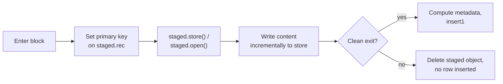

# Staged Insert Specification

This document specifies the staged-insert contract for the `<object@>` codec: the lifecycle, the path and metadata contracts, and the atomicity and concurrency model. For the user-facing how-to, see [Staged Insert](../../how-to/staged-insert.md).

## Overview

A **staged insert** is an atomic insert flow that writes a multi-file object directly to object storage as the row is being built. Inside a `staged_insert1` context manager, the caller obtains a write handle pointing at object storage, writes content to it incrementally, and exits the block. On clean exit, the database row is inserted with metadata referencing the stored object. On exception, the staged object is removed and no row is inserted.



Staged insert applies to content formats that are **written incrementally** — directory layouts like Zarr or HDF5 written from a streaming source, multi-file dataset artifacts, ad-hoc file collections — where ordinary `insert1` would require materializing the entire payload as a single Python value first. For values that fit in memory and have a single-shot codec, ordinary `insert1` is simpler and is the right tool.

## Scope

**In scope.** A single codec: `<object@>` — schema-addressed multi-file objects.

**Out of scope.** All other codecs. Each excludes itself for a different reason, but the common thread is the absence of an incremental-write path through the codec:

| Codec | Reason staged insert does not apply |
|---|---|
| `<blob@>`     | Atomic byte sequence; `BlobCodec.encode` serializes a materialized Python object. No streaming serialization API. |
| `<hash@>`     | Same as `<blob@>`. |
| `<npy@>`      | `np.save` writes from a materialized array; no chunked-write entry point. |
| `<attach@>`   | The file already exists on disk; ordinary `insert1` is sufficient. |
| `<filepath@>` | Registers an external file as a reference; no copy and a different lifecycle. |
| `<blob>`, `<attach>` (in-table) | No object storage involved. |

A future specification will revisit staged insert for codecs whose formats grow incremental-write APIs (see [Future work](#future-work)).

## Lifecycle

A `staged_insert1` block has four phases:

1. **Setup.** The caller enters the `with` block; the context manager yields a `StagedInsert` session bound to one row of the target table.
2. **Drafting.** The caller populates `staged.rec` with attribute values, including the full primary key, and obtains a write handle for the `<object@>` field via:
    - `staged.store(field, ext='')` — returns an `fsspec.FSMap` at the canonical object path (used for Zarr-style directory writes and for arbitrary multi-file collections).
    - `staged.open(field, ext='', mode='wb')` — returns a file-like handle for single-file writes inside the same object directory (used for HDF5 or raw binary).
3. **Finalization.** On clean block exit, the session inspects the staged object to compute metadata (size, manifest, timestamp, …) and inserts the row via `Table.insert1(staged.rec)` with the metadata dict assigned to the `<object@>` field. The caller does **not** assign anything to `staged.rec[field]` for the staged field — the framework computes the value.
4. **Unwinding.** If any exception propagates out of the block (including from the final `insert1`), the session deletes the staged object (best-effort) and re-raises. No row is inserted.

Only one row is inserted per block. For many rows, the caller loops over `with` blocks.

The primary key must be fully set on `staged.rec` before `staged.store()` or `staged.open()` is called — the canonical object path is derived from the primary key. Calling either method before the primary key is set raises `DataJointError`.

## Path construction (normative)

Staged objects are written at the canonical schema-addressed path from the first byte. There is no intermediate staging location: the object exists at its final path during the write and is deleted from there if the block exits with an exception.

```
{location}/{schema}/{table}/{pk_serialized}/{field}_{token}{ext}
```

Built by `storage.build_object_path`. `{location}` is the configured store base, `{token}` is a random suffix of `token_length` characters (default 8, per the store spec), `{pk_serialized}` is the serialized primary key, and partitioning follows the store's `partition_pattern`.

## Metadata contract

On clean exit, the framework computes a metadata dict structurally equal to what `ObjectCodec.encode` (`builtin_codecs/object.py:166-174`) would produce for the same content, and assigns it to `staged.rec[field]` before `insert1`:

```
{path, store, size, ext, is_dir, item_count, timestamp}
```

This dict is the **single source of truth** for the column value: a row produced by `staged_insert1` and a row produced by ordinary `insert1` carrying the same final content yield structurally equal column values, modulo `timestamp` (which reflects materialization time).

## Atomicity model

Staged insert is **at-most-once with cleanup**, not transactional in the database sense:

| Failure mode | Object storage | Database row |
|---|---|---|
| Exception inside the `with` block | Staged object deleted (best-effort) | Not inserted |
| Database insert fails on exit (e.g., duplicate PK) | Staged object deleted | Not inserted |
| Storage backend unreachable mid-finalize | Exception propagates; cleanup runs best-effort | Not inserted |
| `KeyboardInterrupt`, `SystemExit`, segfault mid-write | Staged object may be left behind | Not inserted |

Only `Exception` subclasses are caught by the context manager. `BaseException` subclasses (`KeyboardInterrupt`, `SystemExit`) propagate without cleanup. Orphans from any failure mode that leaves artifacts behind are reclaimed by the [garbage collector](../../how-to/garbage-collection.md), which scans schema-addressed canonical paths and removes those with no live row references.

Database-side atomicity is guaranteed only for the final `insert1` step. The object write is not protected by the database's transaction system — bytes hit the store as soon as they are written.

## Concurrency

- **Same primary key, different sessions.** Both sessions write to the same canonical path; the second writer may overwrite the first. The duplicate-PK `insert1` will fail on whichever session reaches it second, and that session's cleanup will then delete the canonical path the other session just committed. **Callers must serialize staged inserts to the same primary key externally.**
- **Different primary keys.** Independent canonical paths; no interaction.
- **Inside an outer DB transaction.** The final `insert1` participates in the outer transaction, but the object write does not. If the outer transaction rolls back after the staged-insert block completes, the staged object is not reclaimed automatically — the garbage collector reclaims it once no live row references it.

## Configuration

Staged insert requires the same storage configuration as ordinary `<object@>` inserts. See [Object Store Configuration](object-store-configuration.md).

- The effective store is resolved from the field's type spec: `<object@>` uses `stores.default`; `<object@local>` uses `stores.local`.
- If the resolved store is not configured, `staged.store()` raises `DataJointError("Storage is not configured. ...")` on the first call.
- Partitioning (`partition_pattern`) and token length (`token_length`) are taken from the resolved store spec.

## Example

A Zarr array written incrementally into an `<object@>` directory from a streaming source:

```python
import datajoint as dj
import zarr

schema = dj.Schema('imaging')

@schema
class ImagingSession(dj.Manual):
    definition = """
    subject_id : int32
    session_id : int32
    ---
    n_frames   : int32
    frame_rate : float32
    frames     : <object@>
    """

with ImagingSession.staged_insert1 as staged:
    staged.rec['subject_id'] = 1
    staged.rec['session_id'] = 1

    z = zarr.open(staged.store('frames', '.zarr'), mode='w',
                  shape=(1000, 512, 512), chunks=(1, 512, 512), dtype='uint16')
    for i in range(1000):
        z[i] = acquire_frame()

    staged.rec['n_frames'] = 1000
    staged.rec['frame_rate'] = 30.0
```

On clean exit, the framework computes `{path, store, size, ext, is_dir, item_count, timestamp}` for the staged Zarr directory and inserts the row with that dict assigned to the `frames` field. On exception, the partially written Zarr directory is deleted and no row is inserted.

## Future work

Listed to clarify scope, not specified by this document:

- **Staged insert for other codecs.** Codecs whose content formats grow incremental-write APIs may opt into a generalized staged-write protocol. Candidates: `<zarr@>` (currently `insert1(array)`-only via `dj-zarr-codecs`; would require the codec to expose chunked-write entry points), a hypothetical `<hdf5@>`, columnar formats with appenders. A separate spec will define the generalized protocol when a second codec actually needs it.
- **Hash-addressed staged insert.** A streaming pattern in which the canonical path is computed from the content hash after the write completes (write to staging path, hash on finalize, move to canonical, dedup against existing objects). Plausible but not currently needed by any codec.
- **Multi-row staged insert.** Many rows in one block, each with its own object writes.
- **Resumable staged inserts.** Checkpointing inside the block so a crash mid-write can be resumed rather than rolled back.

## References

- [Codec API Specification](codec-api.md)
- [Data Manipulation Specification](data-manipulation.md)
- [Type System Specification](type-system.md)
- [Object Store Configuration](object-store-configuration.md)
- [How-To: Staged Insert](../../how-to/staged-insert.md)
- [How-To: Clean Up Storage](../../how-to/garbage-collection.md)
