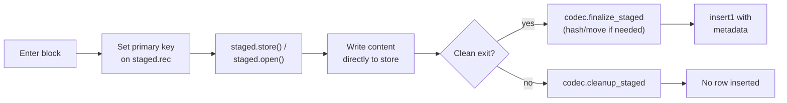

# Staged Insert Specification

!!! info "Implementation status"

    This is a **forward-looking specification**. The single-codec implementation in `datajoint-python` master (gated to `<object@>` only via `staged_insert.py:100-101`) predates this spec; the generalized protocol described here (codec-side `staged_handle` / `finalize_staged` / `cleanup_staged`, the `HashAddressedCodec` base class, shape convergence between `encode()` and `finalize_staged`) lands in a reference implementation PR against `datajoint-python` and is then validated against `dj-zarr-codecs`. Until that PR merges, the only path described here that works against shipped code is `<object@>` via the existing `<object@>`-only gate. Cross-reference the source line numbers cited inline (e.g., `staged_insert.py:100-101`, `hash_registry.py:51-67`, `builtin_codecs/object.py:166-174`) for the as-shipped state.

This document specifies the staged-insert contract for DataJoint: the lifecycle, the codec-side protocol that participating codecs must implement, the path and metadata contracts for each addressing scheme, and the atomicity and concurrency model. For the user-facing how-to, see [Staged Insert](../../how-to/staged-insert.md). For the codec base classes referenced here, see the [Codec API Specification](codec-api.md).

## Overview

A **staged insert** is an atomic, write-direct-to-store insert flow for fields whose values are too large to round-trip through process memory. Inside a `staged_insert1` context manager, the caller obtains a write handle pointing at object storage, streams content to it, and exits the block. On clean exit, the database row is inserted with codec-computed metadata referencing the stored object. On exception, the staged object is removed and no row is inserted.



The pattern is intended for multi-GB arrays, Zarr/HDF5 datasets, streaming acquisitions, and large file attachments — workloads where copying through local storage is prohibitive or impossible.

## Scope

**In scope.** Any object-store codec that implements the [staged-write protocol](#the-staged-write-protocol). The four built-in copy-on-write codecs participate:

- `<object@>` — schema-addressed multi-file objects (Zarr, HDF5)
- `<npy@>` — schema-addressed NumPy `.npy` files
- `<blob@>` — hash-addressed binary blobs with deduplication
- `<attach@>` — hash-addressed file attachments with preserved filename

**Out of scope.** In-table codecs (no object storage involved — use ordinary `insert1`), reference codecs like `<filepath@>` (register a pointer to an external file; different lifecycle), and any custom codec that does not implement the protocol.

## Lifecycle

A `staged_insert1` block has four phases:

1. **Setup** — caller enters the `with` block; the context manager yields a `StagedInsert` session bound to one row of the target table.
2. **Drafting** — caller populates `staged.rec` with attribute values and obtains write handles for each object-typed field via `staged.store(field, ext)` or `staged.open(field, ext)`. Handles are obtained by delegation to `codec.staged_handle(...)`.
3. **Finalization** — on clean block exit, for each staged field the session calls `codec.finalize_staged(session, field)` and assigns the returned metadata dict to `staged.rec[field]`. The session then calls `Table.insert1(staged.rec)`.
4. **Unwinding** — if any exception propagates out of the block (including from the `insert1` in step 3), for each staged field the session calls `codec.cleanup_staged(session, field)` (best-effort) and the exception is re-raised.

Only one row is inserted per block; for many rows, the caller loops over `with` blocks.

## The staged-write protocol

A codec participates in staged insert by implementing three methods. The default implementation on the `Codec` base class raises `DataJointError`, so failure to implement is explicit (not silent).

```python
class Codec(ABC):
    def staged_handle(
        self,
        session: "StagedInsert",
        field: str,
        ext: str,
        *,
        mode: Literal["store", "open"],
    ) -> "fsspec.FSMap | IO":
        """Return a write handle for the given field.

        Codec decides whether the handle points at the codec's canonical
        storage path (schema-addressed) or a transient staging path
        (hash-addressed).
        """
        raise DataJointError(f"codec {self.name!r} does not support staged writes")

    def finalize_staged(self, session: "StagedInsert", field: str) -> dict:
        """Finalize the staged write and return the metadata dict.

        Called once per staged field after the with-block exits cleanly.
        Returned dict is assigned to staged.rec[field] before insert.
        Shape must match what this codec's encode() would have produced
        for the same content (see §Metadata contracts).
        """
        raise DataJointError(f"codec {self.name!r} does not support staged writes")

    def cleanup_staged(self, session: "StagedInsert", field: str) -> None:
        """Best-effort cleanup of any staged artifacts for this field.

        Called once per staged field on exception. Must not raise. May
        leave artifacts behind on storage error; orphans are reclaimed
        by the garbage collector.
        """
        raise DataJointError(f"codec {self.name!r} does not support staged writes")
```

The `session` argument is the `StagedInsert` instance. Codecs use it to read state:

- `session._table` — the target `Table` subclass.
- `session._rec` — the dict the caller is populating; primary key values must already be set for path construction.
- `session._backend` — the resolved `StorageBackend` for the configured store.
- `session._staged_objects[field]` — per-field bookkeeping (path, ext, token) used across `staged_handle` → `finalize_staged` → `cleanup_staged`.

Codecs that need to capture additional per-field metadata from the caller (e.g., the preserved filename for `<attach@>`) may extend the session API with documented helpers (see [Concrete protocol behavior](#concrete-protocol-behavior)).

## Two lifecycle variants

Two concrete implementations of the protocol are provided by the framework. Built-in codecs inherit from these; custom codecs may also inherit, or implement the protocol directly.

### Schema-addressed lifecycle

Implemented by `SchemaCodec` and inherited by `<object@>` and `<npy@>`.

| Phase | Behavior |
|---|---|
| `staged_handle` | Builds the canonical path `f(schema, table, field, primary_key, ext)` via the existing `storage.build_object_path`. Returns a handle pointing at the canonical path immediately. The path is final on the first byte written. |
| `finalize_staged` | Builds **base metadata** (size, is_dir, manifest for directories, ext, timestamp, path) by inspecting the now-written canonical location, then calls a codec-specific extension hook `_enrich_staged_metadata(base, session, field)` to produce the final dict. |
| `cleanup_staged` | Deletes the canonical path (or its enclosing directory, if `is_dir`). |

The extension hook lets each schema-addressed codec attach codec-specific fields (e.g., `dtype` and `shape` for `<npy@>`) without diverging from the shared lifecycle.

### Hash-addressed lifecycle

Implemented by `HashAddressedCodec` and inherited by `<blob@>`, `<attach@>`, and `<hash@>`.

| Phase | Behavior |
|---|---|
| `staged_handle` | Builds a **staging path** `_staging/{schema}/{table}/{field}_{token}{ext}` and returns a handle pointing there. The canonical hash-addressed path is not yet computable. |
| `finalize_staged` | Streams the staged file through `hash_registry.compute_hash` (MD5 + base32 → 26-char lowercase token; see [hash format below](#path-construction-normative)) to compute the content hash, derives the canonical path via `hash_registry.build_hash_path(content_hash, schema_name, subfolding)`, then: <br/>**(a)** if the canonical path already exists → deletes the staging copy (dedup hit);<br/>**(b)** else moves staging → canonical;<br/>**(c)** if the move fails because the destination concurrently appeared → falls through to (a) on the dedup-hit branch.<br/>Returns the codec's `encode()`-shaped metadata dict. |
| `cleanup_staged` | Deletes the staging path if it still exists. Never touches canonical paths (other rows may reference them). |

The framework does not delete canonical hash-addressed objects even when the row that produced them was rolled back — that is the garbage collector's responsibility and depends on what other rows reference the same content hash.

## Concrete protocol behavior

### `<object@>`

- Schema-addressed lifecycle.
- `staged_handle('store')` returns an `fsspec.FSMap` for direct Zarr / multi-file writes.
- `staged_handle('open')` returns a file-like handle for single-file writes (HDF5, raw binary).
- `_enrich_staged_metadata` returns the base metadata unchanged (the schema-addressed lifecycle's base shape *is* `<object@>`'s shape).

### `<npy@>`

- Schema-addressed lifecycle.
- `staged_handle('open')` is the supported entry; `mode='store'` is rejected with a clear error (`.npy` is a single file, not a Zarr-style mapping).
- `_enrich_staged_metadata` opens the staged `.npy` file and reads the header via `numpy.lib.format.read_magic` + `numpy.lib.format.read_array_header_*` (no array load); returns `{path, store, dtype, shape}` matching `NpyCodec.encode`.

### `<blob@>`

- Hash-addressed lifecycle.
- `staged_handle('open')` is the supported entry; `mode='store'` is rejected (blobs are atomic byte sequences, not browsable mappings).
- Returns `{hash, path, store, size}` matching `BlobCodec.encode`.

### `<attach@>`

- Hash-addressed lifecycle plus a filename-capture API.
- The caller declares the preserved filename via `staged.set_filename(field, 'report.pdf')` before block exit; without it, `finalize_staged` raises `DataJointError`.
- Returns `{hash, path, store, size, filename}` matching `AttachCodec.encode`.

### `<hash@>` (declared directly)

- Hash-addressed lifecycle.
- Rarely declared directly in table definitions; usually composed under other codecs. Listed here so plugin authors composing on top of `<hash@>` inherit staged-insert support.

### `<zarr@>` (from `dj-zarr-codecs`)

- Schema-addressed lifecycle. `<zarr@>` is a `SchemaCodec` subclass and inherits the protocol automatically.
- **Two distinct usage paths**, both supported:
    - *Ordinary `insert1` (canonical for in-memory arrays):* `Table.insert1({..., field: numpy_or_zarr_array})`. The codec serializes the materialized array to Zarr format synchronously in `encode()`. Use this whenever the array fits in memory — it is simpler and does not go through the staged-insert machinery at all.
    - *Staged insert (for arrays that don't fit in memory):* `with Table.staged_insert1 as staged: zarr.open(staged.store(field, '.zarr'), mode='w', shape=..., chunks=..., dtype=...)`. The caller drives the Zarr write chunk-by-chunk through the FSMap handle the codec hands them. The canonical schema-addressed path is fixed at handle creation.
- `staged_handle('store')` returns an `fsspec.FSMap` at the canonical `.zarr` path. `staged_handle('open')` is rejected (Zarr stores are directory-shaped, not single-file).
- `_enrich_staged_metadata` reads the just-written Zarr array's metadata (via `zarr.open(store, mode='r')`) to extract `shape`, `dtype`, `chunks`, and codec/compressor info; returns `{path, store, shape, dtype, provenance}` matching the shape `ZarrArrayCodec.encode` produces on the ordinary `insert1` path. The same metadata invariant holds across both paths: a staged Zarr insert and an ordinary insert of the same array produce structurally equal column values.

## Path construction (normative)

| Path role | Shape | Built by |
|---|---|---|
| Schema-addressed canonical | `{location}/{schema}/{table}/{pk_serialized}/{field}_{token}{ext}` | `storage.build_object_path` |
| Hash-addressed staging | `{location}/_staging/{schema}/{table}/{field}_{token}{ext}` | `HashAddressedCodec._build_staging_path` (new) |
| Hash-addressed canonical (flat) | `{location}/_hash/{schema}/{content_hash}` | `hash_registry.build_hash_path` |
| Hash-addressed canonical (subfolded) | `{location}/_hash/{schema}/{fold_1}/.../{fold_N}/{content_hash}` | `hash_registry.build_hash_path` (when the store config sets `subfolding`) |

`{content_hash}` is the 26-character lowercase base32-encoded MD5 of the content, produced by `hash_registry.compute_hash(data)` (`hash_registry.py:51-67`). The `{schema}` segment is load-bearing — it scopes hash-addressed objects to their owning schema for isolation. `{fold_i}` are derived from leading characters of the hash per the store spec's `subfolding` tuple (e.g., `(2, 2)` → two-level folding using the first two and next two hash characters).

`{token}` in the schema-addressed and staging paths is a random suffix per the store's `token_length` setting (default 8 chars). Partitioning is preserved as today via the store's `partition_pattern`.

The `_staging/` prefix is reserved by this spec. The garbage collector treats objects under `_staging/` as orphan candidates after a configurable grace period, since any object still under `_staging/` after a session has ended represents an aborted insert.

## Metadata contracts

Each codec's `finalize_staged` returns a dict that matches what the same codec's `encode()` would produce for equivalent content. These shapes are normative; tests assert that staged-insert metadata is structurally equal to encode-produced metadata for the same input.

| Codec | Returned metadata shape (normative) |
|---|---|
| `<object@>` | `{path, store, size, ext, is_dir, item_count, timestamp}` |
| `<npy@>`    | `{path, store, dtype, shape}` |
| `<blob@>`   | `{hash, path, store, size}` |
| `<attach@>` | `{hash, path, store, size, filename}` |

These shapes are the **single source of truth** for both the ordinary `insert1` path and the `staged_insert1` path — the codec's `finalize_staged` must produce a dict structurally equal to what `encode()` would produce for the same content, modulo `timestamp` which reflects materialization time.

**Note on convergence with today's source.** Today's source has three places where `<object@>`'s shape appears, with minor divergences:

1. `ObjectCodec.encode` (`builtin_codecs/object.py:166-174`) — `{path, store, size, ext, is_dir, item_count, timestamp}`. **This is the normative shape adopted by this spec.**
2. `StagedInsert._compute_metadata` — includes `hash: None`, sometimes `mime_type`, and omits `store`. The implementation PR will refactor this to converge on shape (1).
3. Earlier drafts of this spec — listed `hash: None` and `mime_type?` as part of the shape. Removed.

For `<blob@>` and `<attach@>`, today's `BlobCodec.encode` and `AttachCodec.encode` return raw `bytes` — the dict shape `{hash, path, store, size}` is produced by the chained `<hash@>` codec at storage time. The implementation PR refactors these codecs to return the dict shape directly when used as `<blob@>` / `<attach@>` (object-store mode), so the normative shape above is what `encode()` produces. `<hash@>`'s own metadata-dict shape will be consolidated to `{hash, path, store, size}` as part of the same refactor (currently documented three different ways in source).

## Atomicity model

Staged insert is **at-most-once with cleanup**, not transactional in the database sense. The boundary cases:

| Failure mode | Object storage | Database row |
|---|---|---|
| Exception inside the `with` block | All staged artifacts cleaned up (best-effort) | Not inserted |
| Database insert fails on exit (e.g., duplicate PK) | All staged artifacts cleaned up | Not inserted |
| Hash-collision rename fails because canonical path concurrently appeared | Staging file deleted; canonical path untouched | Inserted (dedup hit) |
| Storage backend unreachable mid-finalize | Exception propagates; cleanup runs best-effort | Not inserted |
| `KeyboardInterrupt`, `SystemExit`, segfault mid-write | Staging or canonical path may be left behind | Not inserted |

The only `Exception` subclasses are caught by the staged-insert context manager. `BaseException` subclasses (`KeyboardInterrupt`, `SystemExit`) propagate without cleanup. Orphans from any of the leftover-artifact cases are reclaimed by the [garbage collector](../../how-to/garbage-collection.md), which scans `_staging/` and matches `_hash/` and schema-addressed canonical paths against live row references.

Database-side atomicity is guaranteed only for the final `insert1` step. The object writes are not protected by the database's transaction system (they bypass the DB entirely).

## Concurrency

Defined behavior for concurrent use:

- **Same primary key, different sessions, schema-addressed codec.** Undefined — the two sessions write to the same canonical path; the second writer may overwrite the first. The duplicate-PK insert will fail on whichever session reaches `insert1` second, and that session will then attempt cleanup of the canonical path that the *other* session just committed. **Callers must serialize staged inserts to the same primary key externally.**
- **Same primary key, different sessions, hash-addressed codec.** Each session has its own staging path (different `{token}`), so the on-disk staging files don't collide. Both sessions will compute the same content hash if they wrote the same bytes; the second to finalize hits the dedup branch. The duplicate-PK insert still fails on whichever session is second, and its `cleanup_staged` will be a no-op (staging file already moved or deleted).
- **Different primary keys, same content, hash-addressed.** Both succeed. The canonical hash-addressed object exists exactly once; both rows reference it.
- **Inside an outer DB transaction.** The final `insert1` participates in the outer transaction, but the object writes do not — they hit the store as soon as bytes are written. If the outer transaction rolls back after the staged-insert block completes, staged objects are *not* reclaimed automatically. They will be reclaimed by the garbage collector once it detects no live row references them.

## Codec compatibility matrix

| Codec | Supported | Lifecycle | Notes |
|---|---|---|---|
| `<object@>`             | ✓ | Schema-addressed | Reference implementation |
| `<npy@>`                | ✓ | Schema-addressed | Inherits via `SchemaCodec` |
| `<blob@>`               | ✓ | Hash-addressed | Streams + hashes on finalize |
| `<attach@>`             | ✓ | Hash-addressed | Requires `staged.set_filename(...)` |
| `<hash@>` (direct)      | ✓ | Hash-addressed | Rarely declared directly |
| `<zarr@>` (from `dj-zarr-codecs`) | ✓ | Schema-addressed | First-class plugin codec. For in-memory arrays use ordinary `insert1` (simpler); for arrays too large to materialize use `staged_insert1` with `zarr.open(staged.store(field, '.zarr'))` |
| `<blob>` (in-table)     | ✗ | n/a | No object storage; use ordinary `insert1` |
| `<attach>` (in-table)   | ✗ | n/a | No object storage; use ordinary `insert1` |
| `<filepath@>`           | ✗ | n/a | Reference codec (no copy); different feature |
| Custom `SchemaCodec` subclass         | ✓ | Schema-addressed | Inherits automatically |
| Custom `HashAddressedCodec` subclass  | ✓ | Hash-addressed   | Inherits automatically |
| Other custom codec                    | conditional | n/a | Must implement the protocol explicitly |

An attempt to stage-insert into a field whose codec does not implement the protocol raises `DataJointError` from the default base-class method, with a message naming the codec.

## Configuration

Staged insert requires the same storage configuration as ordinary object-store inserts. See [Object Store Configuration](object-store-configuration.md).

- The codec's effective store is resolved from the field's type spec: `<object@>` uses `stores.default`; `<object@local>` uses `stores.local`.
- If the resolved store is not configured, `staged_handle` raises `DataJointError("Storage is not configured. ...")` on the first call.
- Partitioning (`partition_pattern`) and token length (`token_length`) are taken from the resolved store spec.

## Examples

### `<zarr@>` — Zarr array (from `dj-zarr-codecs`)

`<zarr@>` has two paths. For arrays that fit in memory, ordinary `insert1` is canonical — the codec serializes synchronously:

```python
import numpy as np

Recording.insert1({
    'recording_id': 1,
    'waveform': np.random.randn(1000, 32),     # codec writes Zarr internally
})
```

For arrays too large to materialize, use `staged_insert1` and drive the Zarr write directly through the FSMap handle. The codec inspects the written Zarr on finalization to record `shape`, `dtype`, `chunks`, and provenance in the metadata column. The resulting column value is structurally equal to what the in-memory `insert1` path would have produced for the same final array:

```python
import zarr

with ImagingSession.staged_insert1 as staged:
    staged.rec['subject_id'] = 1
    staged.rec['session_id'] = 1
    z = zarr.open(staged.store('frames', '.zarr'), mode='w',
                  shape=(1000, 512, 512), chunks=(1, 512, 512), dtype='uint16')
    for i in range(1000):
        z[i] = acquire_frame()
    staged.rec['n_frames'] = 1000
```

### `<object@>` — Generic multi-file directory

`<object@>` is the generic fallback for directory layouts without a format-aware codec — custom binary formats, mixed file collections, ad-hoc multi-file objects. The column metadata is generic (`{path, size, is_dir, manifest, ...}`); fetch returns an `ObjectRef`. Prefer a typed codec (`<zarr@>`, `<npy@>`, or a custom `SchemaCodec`) when one fits the data:

```python
import json

with Dataset.staged_insert1 as staged:
    staged.rec['dataset_id'] = 1
    fs = staged.store('artifact')                  # fsspec.FSMap at canonical path
    fs['data.bin']      = signal.tobytes()
    fs['metadata.json'] = json.dumps({'session': '2026-05-21'}).encode()
```

### `<npy@>` — NumPy array

```python
import numpy as np

with Recording.staged_insert1 as staged:
    staged.rec['recording_id'] = 42
    with staged.open('waveform', '.npy') as f:
        np.save(f, np.random.randn(1_000_000), allow_pickle=False)
```

### `<blob@>` — Large opaque blob

```python
with Artifact.staged_insert1 as staged:
    staged.rec['artifact_id'] = key
    with staged.open('payload', '.bin') as f:
        for chunk in producer:
            f.write(chunk)
```

### `<attach@>` — File with preserved filename

```python
with Document.staged_insert1 as staged:
    staged.rec['doc_id'] = doc_id
    staged.set_filename('report', 'final_report.pdf')
    with staged.open('report', '.pdf') as f:
        with open(local_pdf_path, 'rb') as src:
            shutil.copyfileobj(src, f)
```

## Future work

Not specified by this document; listed to clarify scope:

- **`<filepath@>` staged registration.** A different feature with a different lifecycle (register an external file pointer; no copy). Will require a separate spec.
- **Multi-row staged insert (`staged_insert`).** Streaming many rows in one block, each with its own object writes. The current single-row contract is preserved; a multi-row variant would extend it.
- **Resumable staged inserts.** Checkpointing inside the block so that a crash mid-write can be resumed rather than rolled back. Useful for hours-long acquisitions.

## References

- [Codec API Specification](codec-api.md)
- [Data Manipulation Specification](data-manipulation.md)
- [Type System Specification](type-system.md)
- [Object Store Configuration](object-store-configuration.md)
- [How-To: Staged Insert](../../how-to/staged-insert.md)
- [How-To: Clean Up Storage](../../how-to/garbage-collection.md)
