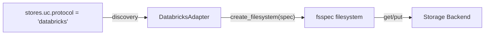

# Storage Adapter API Specification

This specification defines the DataJoint Storage Adapter plugin contract for adding new storage protocols.

For attribute-level codecs (e.g. NetworkX graphs, Parquet, Zarr), see [Codec API](codec-api.md).

!!! version-added "New in 2.2.3"
    The `datajoint.storage` entry-point group is now part of the public API for third-party adapters. (The built-in `file`, `s3`, `gcs`, and `azure` protocols continue to be served by `StorageBackend._create_filesystem()`; migrating them onto this contract is tracked separately.)

## Overview

A *storage adapter* maps a protocol name (e.g. `s3`, `databricks`) to an `fsspec` filesystem and tells DataJoint how to construct paths and validate per-store configuration.



Adapters are distributed as ordinary Python packages. DataJoint discovers them via the `datajoint.storage` [entry-point group](https://packaging.python.org/en/latest/specifications/entry-points/), so users install the adapter with `pip install <package>` and the new protocol becomes available immediately — no registration code, no explicit imports.

| Layer | Purpose | Configures via |
|-------|---------|----------------|
| Codec | Attribute-level (in-table) serialization for `<graph>`, `<parquet>`, etc. | `dj.Codec` subclass, `datajoint.codecs` entry point |
| **Storage adapter** | **Protocol-level (storage-backend) filesystem for `stores.<name>.protocol`** | **`dj.StorageAdapter` subclass, `datajoint.storage` entry point** |

## When to write a storage adapter

Write a `StorageAdapter` when DataJoint needs to talk to a new storage backend — Databricks Unity Catalog Volumes, a lab-specific archive system, an HTTP-based object store with bespoke auth, an on-prem deduplicated filesystem, etc.

You do **not** need an adapter for `s3`, `gcs`, `azure`, or `file` — those are built in. You also do not need an adapter to change *how* DataJoint serializes a Python value into bytes; that is a [codec](codec-api.md), not an adapter.

## The `StorageAdapter` Base Class

All storage adapters inherit from `dj.StorageAdapter`.

!!! note "Available in datajoint ≥ 2.2.4"
    The `dj.StorageAdapter` / `dj.get_storage_adapter()` shortcuts are exposed at the top-level in datajoint 2.2.4 and later. On 2.2.3, import them via `from datajoint.storage_adapter import StorageAdapter, get_storage_adapter`.

```python
from abc import abstractmethod
from typing import Any
import fsspec
import datajoint as dj


class StorageAdapter:
    """Base class for storage protocol adapters."""

    protocol: str
    required_keys: tuple[str, ...] = ()
    allowed_keys: tuple[str, ...] = ()

    @abstractmethod
    def create_filesystem(self, spec: dict[str, Any]) -> fsspec.AbstractFileSystem:
        """Return an fsspec filesystem instance for this protocol."""
        ...

    def validate_spec(self, spec: dict[str, Any]) -> None:
        """Validate protocol-specific config fields. Called once per store at load."""
        ...

    def full_path(self, spec: dict[str, Any], relpath: str) -> str:
        """Construct an absolute storage path from a relative path."""
        ...

    def get_url(self, spec: dict[str, Any], path: str) -> str:
        """Return a display URL for the stored object."""
        ...
```

### Required class attributes

| Attribute | Type | Purpose |
|-----------|------|---------|
| `protocol` | `str` | Identifier matched against `stores.<name>.protocol`. Must be unique across all installed adapters. |
| `required_keys` | `tuple[str, ...]` | Field names that must be present in the store spec (e.g. `("bucket", "endpoint")`). |
| `allowed_keys` | `tuple[str, ...]` | Field names the adapter accepts beyond the common keys. Other keys raise `DataJointError` at load time. |

**Common keys** are always allowed in addition to `allowed_keys`: `protocol`, `location`, `subfolding`, `partition_pattern`, `token_length`, `hash_prefix`, `schema_prefix`, `filepath_prefix`, `stage`. These come from the unified store schema (see [Object Store Configuration](object-store-configuration.md)).

### Required method: `create_filesystem`

```python
def create_filesystem(self, spec: dict[str, Any]) -> fsspec.AbstractFileSystem:
    """Return an fsspec filesystem instance for this protocol."""
```

Called once per store when DataJoint first accesses an object in that store. Receives the resolved store spec (a plain `dict[str, Any]` merged from `datajoint.json`, `DJ_STORES`, and `.secrets/`). Returns an [`fsspec.AbstractFileSystem`](https://filesystem-spec.readthedocs.io/) instance — DataJoint uses fsspec uniformly across all backends, so as long as your adapter returns a working fsspec filesystem, the standard DataJoint storage logic (hash-addressed, schema-addressed, filepath) just works.

### Default methods (override as needed)

`validate_spec` — runs `required_keys` and `allowed_keys` checks. Override only to add protocol-specific validation (e.g. URL format, mutually exclusive fields).

`full_path(spec, relpath) -> str` — returns `f"{spec['location']}/{relpath}"` by default. Override if your protocol needs a non-slash separator or a scheme-prefixed URL.

`get_url(spec, path) -> str` — returns `f"{self.protocol}://{path}"` by default. Override if your protocol's display URL has a different shape.

## Configuration shape

A store using a plugin-registered protocol is configured exactly like a built-in store:

```json
{
  "stores": {
    "uc": {
      "protocol": "databricks",
      "workspace_url": "https://my-workspace.cloud.databricks.com",
      "volume": "main.default.my_volume",
      "token": "dapibd...",
      "location": "experiments/2026"
    }
  }
}
```

Field names beyond the common keys are adapter-defined. The adapter's `required_keys` / `allowed_keys` enforce the schema at load time.

The same store can be configured via `DJ_STORES` (env-var-only deployments) — see [Configure Storage](../../how-to/configure-storage.md#configuring-stores-via-environment-variables).

Per-store secrets in `.secrets/stores.<name>.<attr>` use the adapter's field names (e.g. `.secrets/stores.uc.token`). *(new in 2.2.3 — previously only `access_key`/`secret_key` were honored.)*

## Plugin packaging

### Package layout

```
dj-databricks-storage/
├── pyproject.toml
└── src/
    └── dj_databricks_storage/
        ├── __init__.py
        └── adapter.py
```

### `pyproject.toml`

```toml
[project]
name = "dj-databricks-storage"
version = "0.1.0"
dependencies = ["datajoint>=2.2.3", "fsspec", "databricks-sdk"]

[project.entry-points."datajoint.storage"]
databricks = "dj_databricks_storage.adapter:DatabricksVolumesAdapter"
```

The entry-point **name** (`databricks`) is informational. The **`protocol` class attribute** on the adapter is what DataJoint matches against `stores.<name>.protocol`. Conventionally these match.

### Adapter implementation

```python
# src/dj_databricks_storage/adapter.py
from typing import Any
import fsspec
import datajoint as dj
from databricks.sdk import WorkspaceClient


class DatabricksVolumesAdapter(dj.StorageAdapter):
    protocol = "databricks"
    required_keys = ("workspace_url", "volume", "token")
    allowed_keys = ("workspace_url", "volume", "token")

    def create_filesystem(self, spec: dict[str, Any]) -> fsspec.AbstractFileSystem:
        client = WorkspaceClient(
            host=spec["workspace_url"],
            token=spec["token"],
        )
        # Return an fsspec-compatible filesystem backed by the client.
        # Implementation-specific; see your backend's fsspec integration.
        return _databricks_fs(client, volume=spec["volume"])

    def full_path(self, spec: dict[str, Any], relpath: str) -> str:
        # Unity Catalog Volume paths look like /Volumes/<catalog>/<schema>/<volume>/<path>
        return f"/Volumes/{spec['volume'].replace('.', '/')}/{spec['location']}/{relpath}"

    def get_url(self, spec: dict[str, Any], path: str) -> str:
        return f"databricks://{spec['volume']}/{path}"
```

### Discovery

DataJoint loads `datajoint.storage` entry points lazily, the first time it looks up a protocol it does not already have in its registry. Installation is all that is required:

```bash
pip install dj-databricks-storage
```

```python
import datajoint as dj

# protocol "databricks" is now resolvable
dj.config["stores"]["uc"] = {
    "protocol": "databricks",
    "workspace_url": "https://my-workspace.cloud.databricks.com",
    "volume": "main.default.my_volume",
    "token": "dapibd...",
    "location": "experiments/2026",
}
```

## Credential hygiene

For deployments where the container image must not carry credentials, configure plugin-adapter secrets via env vars instead of files:

```bash
export DJ_IGNORE_CONFIG_FILE=true   # skip datajoint.json and .secrets/
export DJ_STORES='{
  "uc": {
    "protocol": "databricks",
    "workspace_url": "https://my-workspace.cloud.databricks.com",
    "volume": "main.default.my_volume",
    "token": "dapibd...",
    "location": "experiments/2026"
  }
}'
```

See [Manage Secrets — Env-var-only deployments](../../how-to/manage-secrets.md#env-var-only-deployments).

## Error handling

| Error | Cause | Solution |
|-------|-------|----------|
| `Unknown protocol: <name>` | No adapter registered for the protocol | `pip install` the adapter package; check `[project.entry-points."datajoint.storage"]` |
| `<protocol> store is missing: <fields>` | Required key absent from store spec | Provide the missing field via `datajoint.json`, `DJ_STORES`, or `.secrets/` |
| `Invalid key(s) for <protocol>: <fields>` | Spec contains a field the adapter does not accept | Remove the field, or add it to `allowed_keys` in the adapter |
| `Failed to load storage adapter '<name>'` | Adapter class raised on import or instantiation | Check the warning's exception trace; usually a missing dependency in the adapter package |

## API Reference

```python
import datajoint as dj

# Inspect a registered adapter
adapter = dj.get_storage_adapter("s3")
print(adapter.protocol, adapter.required_keys, adapter.allowed_keys)

# Internal: force re-discovery (testing)
from datajoint.storage_adapter import _discover_adapters
_discover_adapters()
```

## See Also

- [Configure Object Storage](../../how-to/configure-storage.md) — Task-oriented setup guide
- [Manage Secrets](../../how-to/manage-secrets.md) — Credential hygiene, env-var-only deployments
- [Object Store Configuration](object-store-configuration.md) — Common store-config schema and precedence
- [Codec API](codec-api.md) — Attribute-level codecs (different layer)
- [datajoint-python PR #1452](https://github.com/datajoint/datajoint-python/pull/1452) — `DJ_STORES`, `DJ_IGNORE_CONFIG_FILE`, arbitrary-attr secrets
